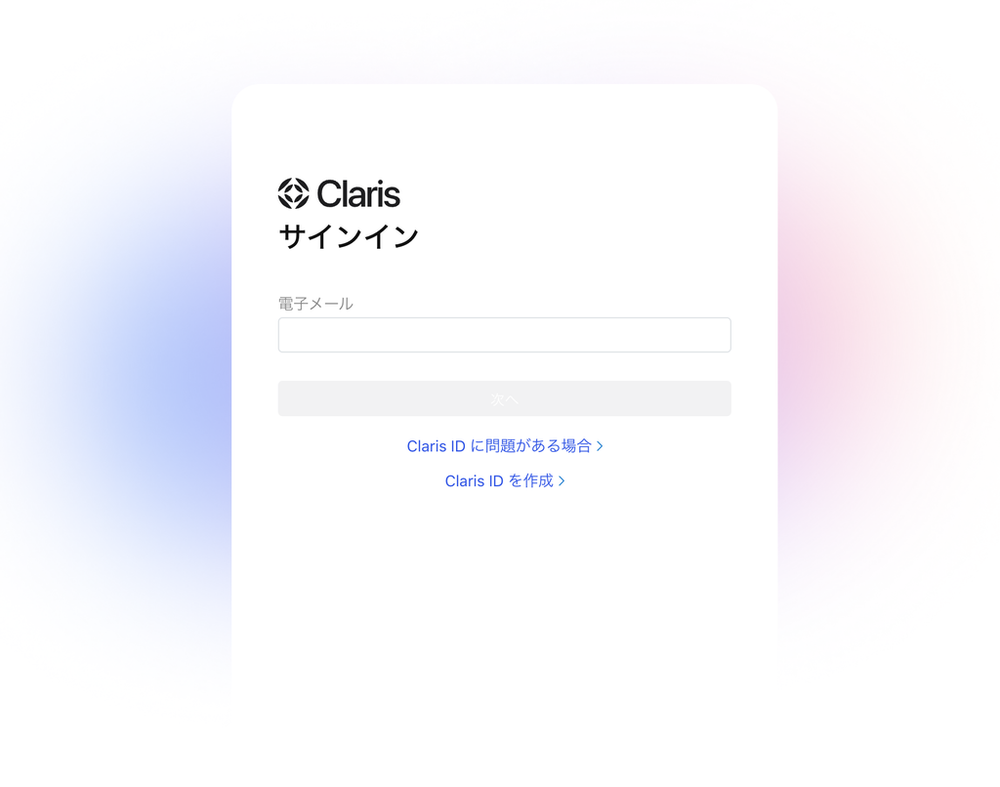
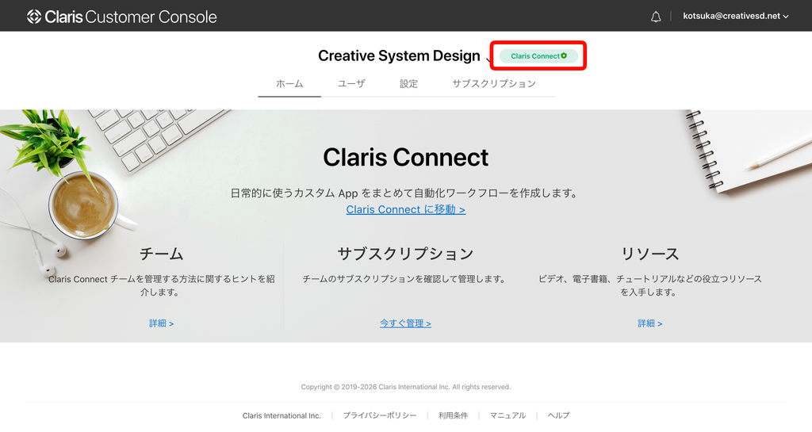
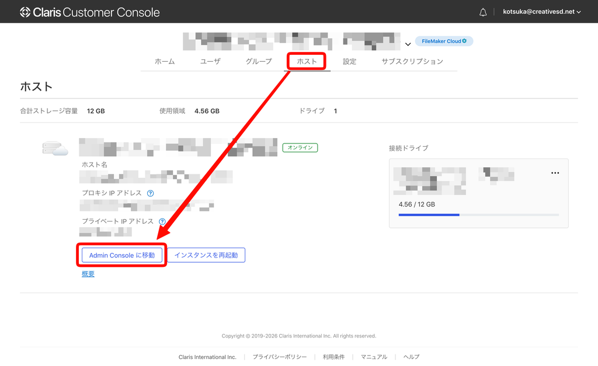
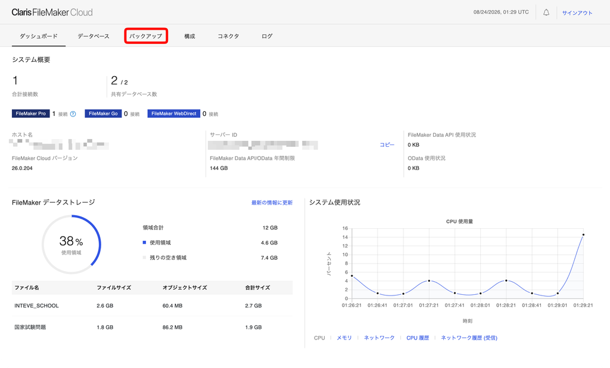
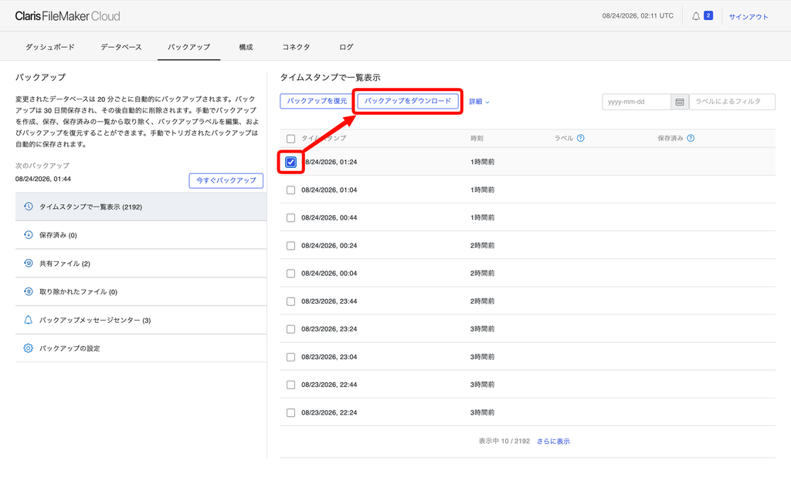
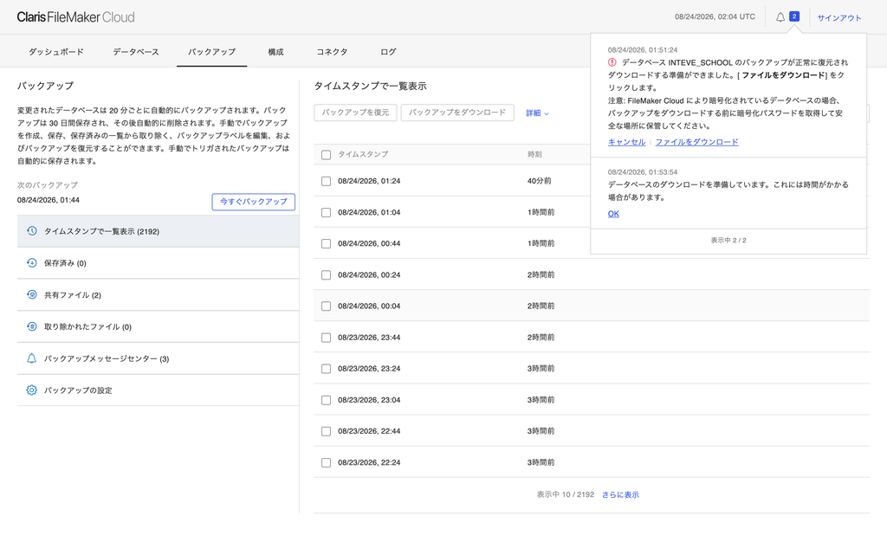
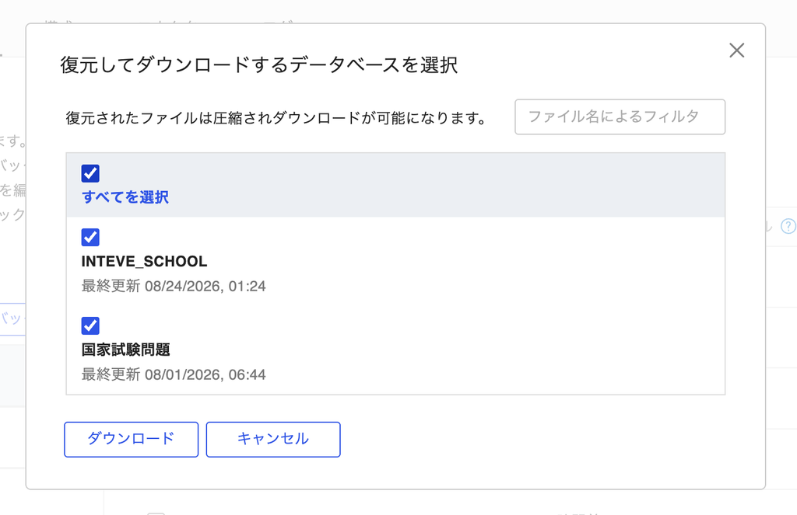

[← 基本的な使い方に戻る](基本的な使い方.md) | [メインページ](top.md)

# ☁️ FileMaker Cloud バックアップ手順ガイド

### 🛡️ はじめに（バックアップの必要性について）

FileMaker Cloud は世界最高水準の堅牢性を誇る AWS（Amazon Web Services）上で運用されているため、データが喪失するリスクは極めて低く、基本的にはそのままで「まずまず大丈夫」な非常に安心できるシステムです。

そのため、**日常的に毎回バックアップを取る必要はありません！** 「万が一の広域障害や有事に備えておきたい」「オフラインの手元にもデータを持っておくと安心」といった心配やこだわりがある場合のみ、必要に応じて本手順でローカル（PC）へ保存してください。

## 🚀 バックアップ取得の 6 ステップ

## **1️⃣ Claris ID でサインイン**

まずは [Claris Customer Console](https://console.claris.com/) へアクセスし、お持ちの **Claris ID（電子メール）** と **パスワード** を入力してサインインします。

## **2️⃣ 「サブスクリプション」または「ホスト」を選択**

ログイン後、上部メニューから **「サブスクリプション」** または **「ホスト」** を選択します。

## **3️⃣ Admin Console へジャンプ！**

 ホストの情報が表示されたら、右側にある **［Admin Console に移動］** ボタンをクリックして管理画面を開きます。

## **4️⃣ 「バックアップ」タブを選択**

Admin Console のダッシュボードが開いたら、上部ナビゲーションにある **「バックアップ」** タブをクリックします。

## **5️⃣ バックアップ日時を選んでダウンロード指示**

1. 20分ごとに自動保存されている一覧から、保存したい日時のデータに **☑️ チェック** を入れます。
2. 上部の操作メニューにある **［バックアップをダウンロード］** ボタンをクリックします。

## **7️⃣ 🔔（ベルマーク）からファイルを取得！【超重要】**

数分後、画面右上の **🔔（通知ベル）** に「準備ができました」と届くので、通知内の **［ファイルをダウンロード］** をクリックしてPCに保存すれば完了です！🎉

ボタンを押すと「ダウンロードを準備しています」と表示されます。

## 📢 **ワンポイントアドバイス！**

- **すぐ保存が始まらない？** ➔ クラウド側でファイルを生成中（数分かかります）です！あせらず右上の **🔔 マーク** を確認してみてくださいね。
- **保存されたファイルは？** ➔ Zip解凍すると、ローカルの FileMaker Pro でそのまま直接開ける `.fmp12` ファイルが入っています！

---
[← 基本的な使い方に戻る](基本的な使い方.md) | [メインページ](top.md)
