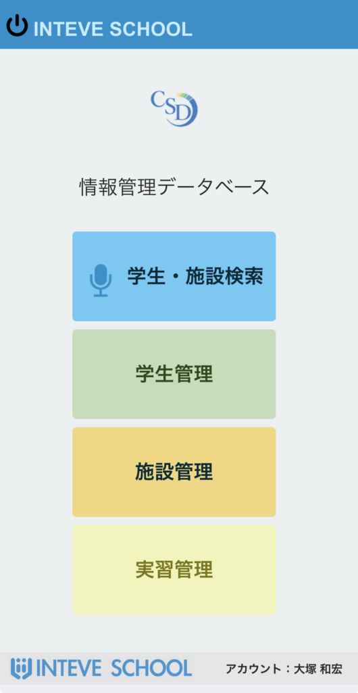
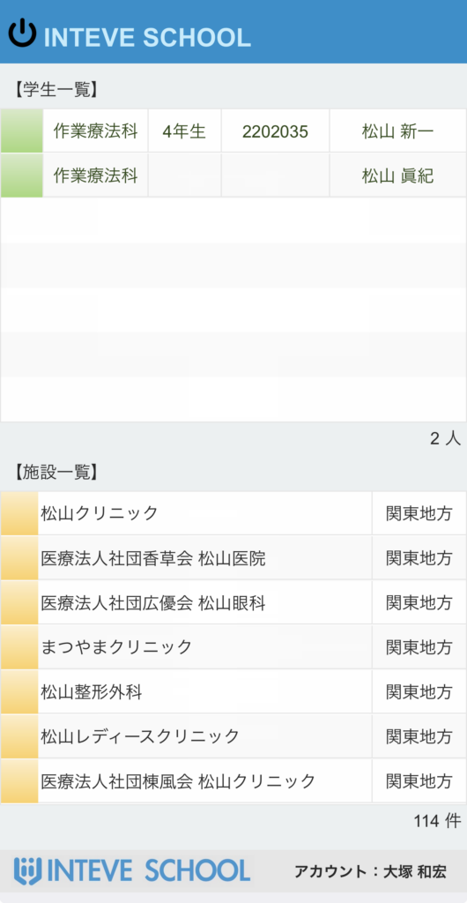
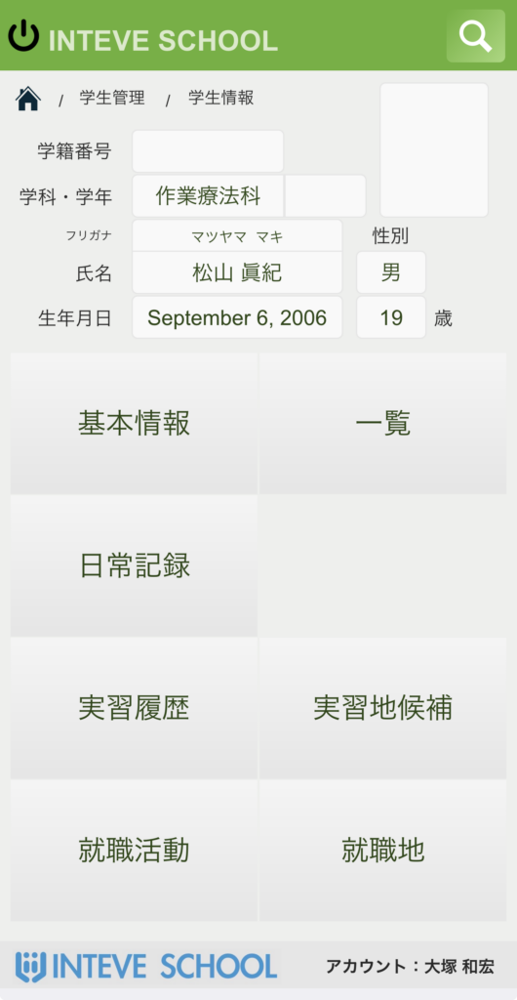
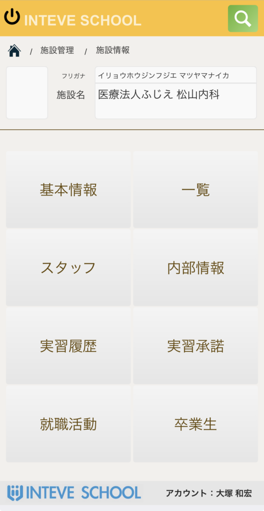
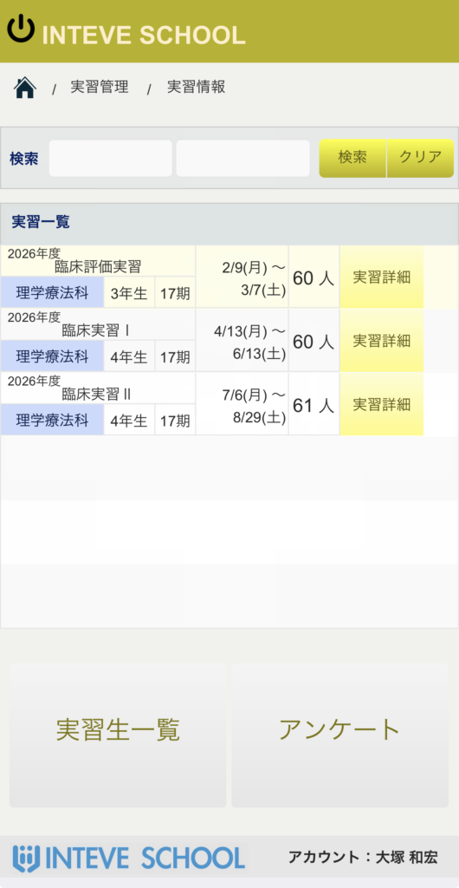

[← 基本的な使い方に戻る](基本的な使い方.md) | [メインページ](top.md)

# 📱 FileMaker Go ご利用ガイド

⚠️ 【ご利用にあたっての注意事項（セキュリティ・運用）】  
本モバイルレイアウトは、学内での運用方針やセキュリティガイドラインに沿ってご活用ください。

1. 閲覧端末・ネットワークの管理  
    ・個人の端末（BYOD：Bring Your Own Device）からアクセスする場合は、必ず学科・学校内の運用ルールに従ってください。  
    ・公共のフリーWi-Fi等、暗号化されていないネットワークからのアクセスはお控えください。
2. 画面ののぞき込み・離脱時の注意  
    ・学生との面談時や実習地訪問時、周囲（第三者）から画面が見えないようご配慮ください。  
    ・操作終了後は、必ずログアウトするかブラウザを閉じるようお願いいたします。
3. データの取り扱い  
    ・端末へのスクリーンショット保存や、個人端末内へのデータダウンロードは行わないでください。

## 1. はじめに（事前準備と注意点）

### 📲 アプリの入手方法（iPhone）

1. 以下のリンクから App Store のダウンロードページへアクセスします。
    - 🔗 [App Storeで FileMaker Go を入手](https://apps.apple.com/jp/app/claris-filemaker-go-2026/id6753665301) ※直接リンクから開けない場合は、App Storeで **「FileMaker Go」** と検索してください。
2. アプリ（無料）をダウンロードしてインストールします。

> ⚠️ **個人用スマートフォン（BYOD）で利用する際の注意点**
> 
> - **データの取り扱い：** 本システムでは学生や施設等の個人情報・重要データを扱います。画面のスクショ保存や外部へのデータ共有は固く禁止されています。
> - **端末のセキュリティ：** 必ずスマホ本体に画面ロック（Passcode / Face ID / Touch ID）を設定した状態で利用してください。
> - **紛失・盗難時：** 万が一、端末を紛失・盗難された場合は、速やかに管理者へご連絡ください。

### 1. トップ画面（メインメニュー）

- **音声横断検索**
    - 「音声一括検索」ボタンをタップし、キーボードの 🎤（マイク）マーク を押して音声入力すると、対象のデータを一括で高速検索できます。
    - 通常のテキスト入力での検索もできます。
- **各機能へのショートカット**
    - 「学生管理」「施設管理」などのボタンから、それぞれの管理画面へ直接アクセスできます。

### 2. 音声一括検索 結果画面

- **横断検索結果の確認**
    - 音声入力したキーワードに該当する「学生情報」と「施設情報」が、上下（または各エリア）のポータル一覧に瞬時に表示されます。
- **詳細画面への遷移**
    - 検索結果の一覧から確認したいレコードをタップすると、対象の学生や施設の詳細画面へ移動します。

### 3. 学生管理画面（詳細・メニュー）

- **学生情報の閲覧・編集**
    - 対象学生の基本情報や詳細な登録データを閲覧・更新できます。
- **関連機能・サブメニューへのアクセス**
    - 画面下部の各種ボタンから、当該学生に関連するメニュー（履歴、各種申請、連絡先など）へスムーズに移動できます。

### 4. 施設管理画面（詳細・メニュー）

- **施設情報の閲覧・編集**
    - 施設名や連絡先、所在地などの基本データを確認・変更できます。
- **施設関連機能の操作**
    - 施設に関連するサブ機能（実習先情報、担当者一覧など）へワンタップで切り替えが可能です。

### 5. 一覧・リスト画面

- **データの絞り込みとリスト表示**
    - 対象のデータ（学生一覧または施設一覧など）がリスト形式で表示され、全体の把握や目的のデータの探索が容易に行えます。
- **詳細確認・関連メニュー**
    - リスト内の各行から詳細データを開くことができるほか、画面下のボタンから関連する一覧やアンケート等の別機能へ移動できます。

---
[← 基本的な使い方に戻る](基本的な使い方.md) | [メインページ](top.md)
