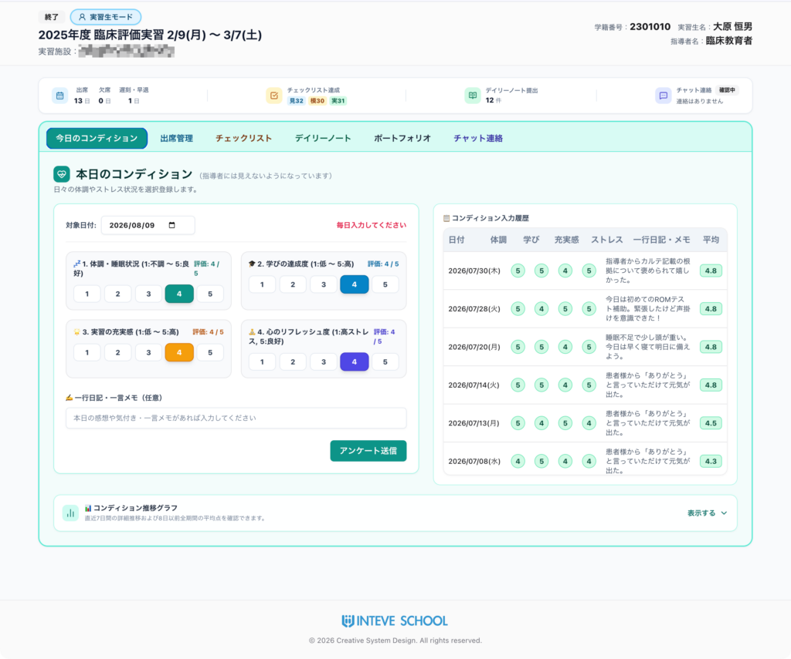
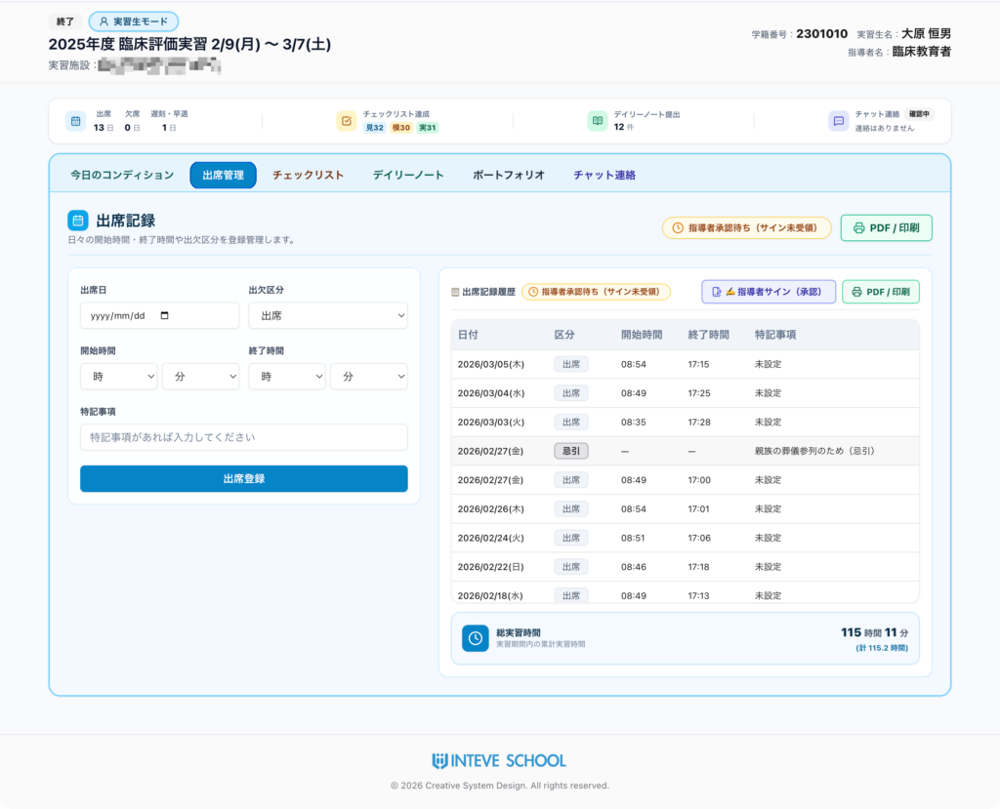
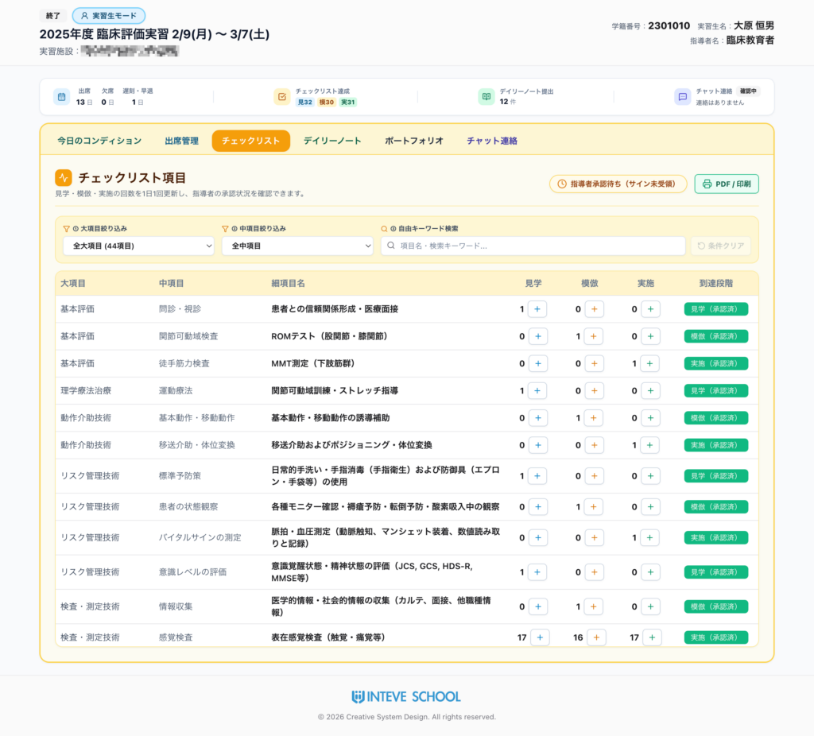
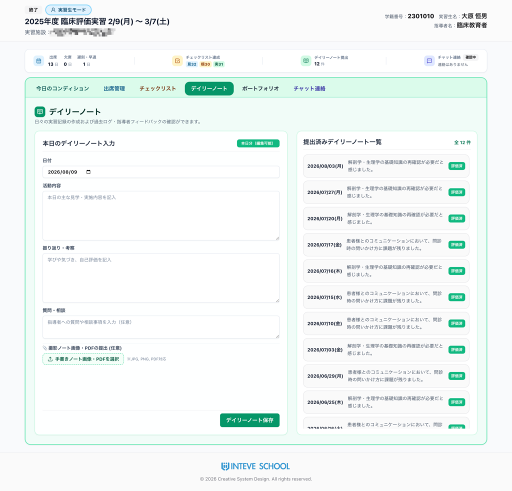
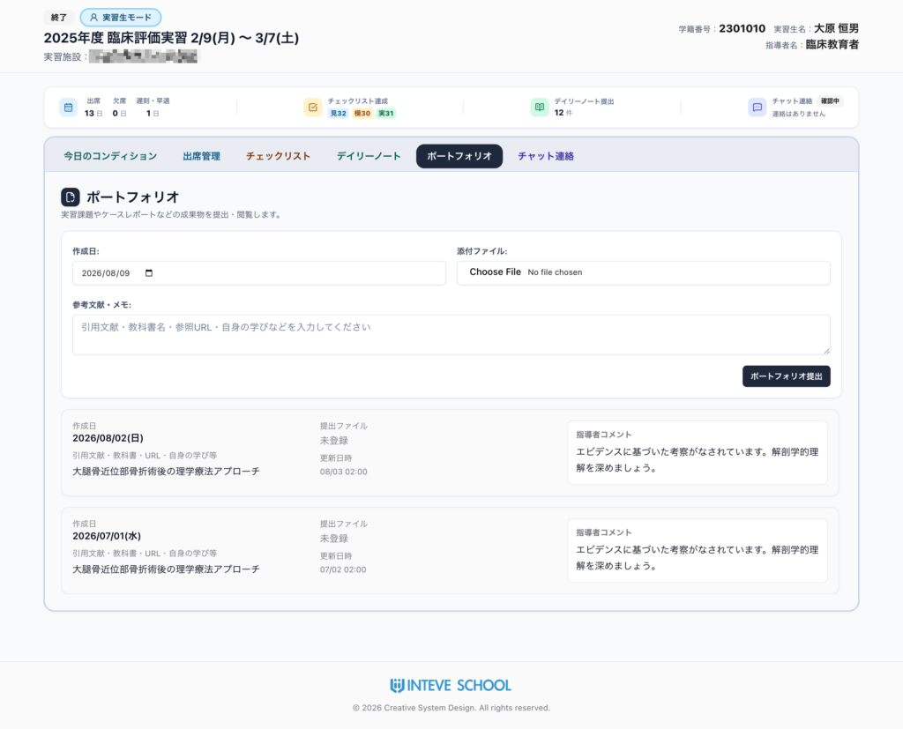
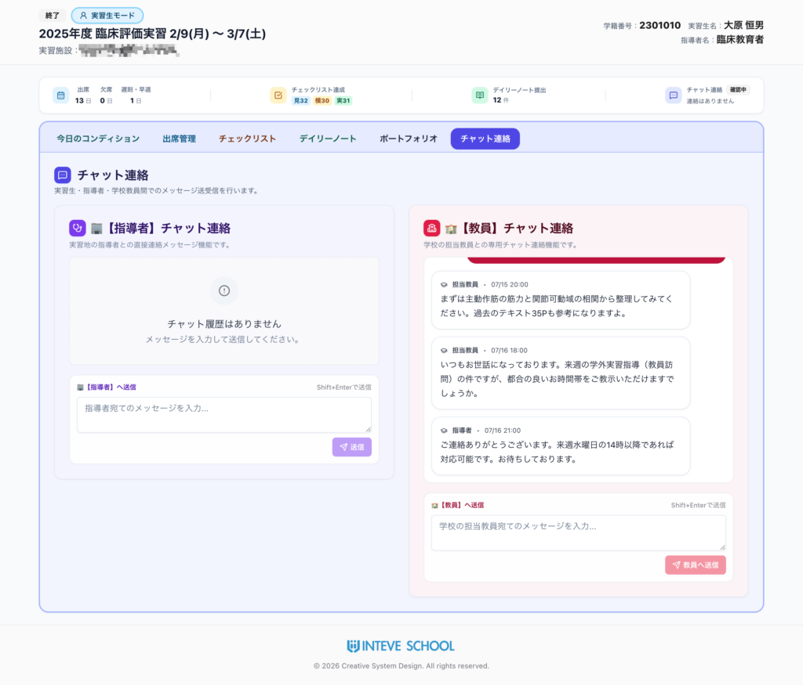
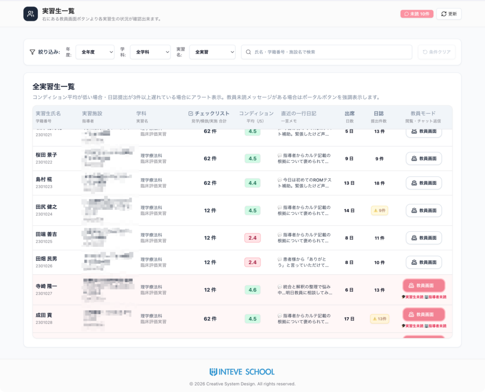

[← 実習管理ポータルに戻る](実習管理ポータル.md) | [メインページ](top.md)

# 《INTEVE LINK》三者をつなぐ臨床実習プラットフォーム

# INTEVE LINK Web操作マニュアル（実習生ページ）

## 🌟 【概要】INTEVE LINKとは？

**「実習生・臨床指導者・学校教員」の三者をリアルタイムでつなぐ臨床実習管理ポータル**です！ 従来の紙媒体によるやり取りをデジタル化し、PC・スマートフォン・タブレットから「同じデータ」を共有。教員22年の現場知に基づき、実習現場の「あったら便利！」をカタチにしました。

## 🛠 各機能の使い方と特徴

### 1. 💓 本日のコンディショニング（メンタル＆ヘルスケア）

毎日のコンディション（体調・学び・充実度・リフレッシュ度）を5段階でサクッと簡単入力。

- **履歴＆グラフ表示**: 日々の推移を可視化します。実習生の心理的負荷に配慮し、折れ線グラフは「直近1週間」と「それ以前の平均」のみを表示する安心設計です。
- **🛡 教員専用の安全情報**: この情報は**指導者には非開示**とし、教員側のみが確認可能。早期のストレス察知や離脱防止、個別のフォローに非常に有用です。

### 2. 📅 出席管理（時間算出＆手書きサイン）

- **⏳ 時間ベースの正確な管理**: 単純な出欠区分だけでなく、開始・終了時間の詳細入力に対応。累計の「総実習時間」も自動算出されます。
- **✍️ 指導者承認＆PDF化**: 実習最終日以降、指導者画面に「手書きサインボタン」が出現！電子サイン受領後にPDF出力することで、そのまま正式な提出書類として保管できます。

### 3. ☑️ チェックリスト（評価項目の可視化＆承認）

- **🏫 自校仕様に完全対応**: 学校で現在使用しているチェックリストをそのまま登録・運用可能です。豊富な項目からキーワード検索で素早く表示できます。
- **👣 日々のステップ管理**: 「見学・模倣・実施」の体験項目を登録し、指導者が項目単位で即座に承認できます。
- **📄 提出書類化**: 出席管理と同様、実習最終日以降に指導者の手書きサインを付与し、PDFとして一括出力・保存が可能です。

### 4. 📓 デイリーノート（日誌・デジタル＆手書き両対応）

- **📱 選べる入力スタイル**: フォーム形式での直接入力はもちろん、紙に書いたノートをスマホで撮影して**画像/PDFアップロード**することも可能です。
- **✒️ 指導者の赤入れ・評価**: 指導者画面で提出内容を確認し、フィードバックコメントや赤入れ画像の返送、承認印（またはサイン）の付与が行えます。
- **🖨 ワンクリックPDF化**: 実習生・教員画面から、日々の記録をいつでもきれいなレイアウトでPDF出力できます。

### 5. 📂 ポートフォリオ（成果物・ケースレポート管理）

- **📎 多角的な資料提出**: 文献の引用、参照WebページのURL登録に加え、スマホで撮影したレポート画像やPDFファイルの提出・共有が可能です。
- **💬 指導者からのコメント**: 提出された成果物に対し、指導者から具体的なアドバイスやフィードバックコメントを蓄積できます。

### 6. 💬 チャット連絡（三者間コミュニケーション）

- **🤝 スムーズな連絡基盤**: 「実習生 ↔ 指導者」「実習生・指導者 ↔ 担当教員」など、必要な相手へ即座にチャットメッセージを送信可能。電話やメールの手間を大幅に削減します。
- 📧 **メール通知機能**: 実習生・指導者・教員の「誰から誰へ」メッセージを送っても、受け取り側の登録メールアドレスへ新着通知を自動配信！ポータルを常に開いていなくても、大切な連絡の着信にすぐ気づくことができます。

## 👩‍🏫 【教員専用機能】実習生一覧ポータル

教員専用のサマリーページから、担当する全実習生の状況を一画面で把握・移動できます。

- **📊 概要のダッシュボード表示**: 各実習生の「コンディション平均」「出席日数」「日誌提出件数」「チェックリスト達成度」を一覧でパッと確認！
- **🚨 アラート＆未読通知**: コンディション低下や日誌提出の遅れをアラート表示。実習生・指導者からの**未読チャットがある場合は強調表示**され、対応漏れを防ぎます。

## 💡 システムの特長・補足事項（全体）

- **🔒 安全で頑強なクラウド基盤**: セキュリティは世界基準の **AWS（Amazon Web Services）** を採用。個人情報や実習データを強固に保護します。
- **🔗 ワンクリックアクセス（ログイン負担減）**: 実習生・指導者への専用アクセスリンクは「INTEVE SCHOOL」本体から自動生成。複雑なID・パスワード管理の手間なく、安全に一発で接続できます。
- **💻 マルチデバイス対応**: パソコンはもちろん、スマホやタブレットのブラウザからも最適化された画面で快適に閲覧・入力が可能です。
- **🛠 幅広い職種＆柔軟なカスタマイズ**: 理学療法（PT）・作業療法（OT）・言語聴覚士（ST）はもちろん、各種コメディカルや医療周辺職種の実習にも幅広く対応。学校ごとの独自運用に合わせた**カスタマイズのご要望にも柔軟に対応**いたします！

---
[← 実習管理ポータルに戻る](実習管理ポータル.md) | [メインページ](top.md)
