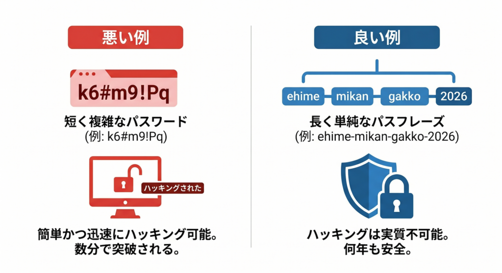

[← 基本的な使い方に戻る](基本的な使い方.md) | [メインページ](top.md)

# 【重要】学内運用におけるセキュリティとパスワードに関するガイドライン

**〜 学生情報とシステムを守るための絶対ルール 〜**

本システムは、外部のインターネットとは遮断された「学内LAN（ローカル環境）」で稼働しています。

しかし、ローカル運用における最大の脆弱性は、外部からのハッキングではなく「物理的な盗み見」や「関係者のパスワード管理の甘さ」です。学生の大切な個人情報や成績データを扱う以上、不正アクセスやデータの誤変を未然に防ぐため、以下のルールを必ず遵守してください。

## 🔒 1. 学内運用だからこそ、パスワードが重要な理由

「ネットに繋がっていないから、簡単なパスワードで使い回しても大丈夫」という考えは重大なセキュリティリスクを生みます。

ネットに繋がっていない環境では、「そのパソコンの前に座った人なら、誰でもデータにアクセスできてしまう」ことを意味します。

- 席を外した隙に、権限のない第三者が画面を操作・閲覧してしまうリスク
- 簡単なパスワードのせいで、誰がデータを書き換えたのか（責任の所在）が分からなくなるリスク

これらを防ぎ、システムの信頼性を担保するために、個人ごとの強固なパスワード管理が不可欠です。

## 💡 2. 破られないための「15文字以上」の絶対ルール

本システムでは、パスワードの複雑さよりも「長さ（文字数の多さ）」を最重視します。文字数が長いほど、当てずっぽうな入力や、背後からの盗み見に対して強力な抑止力になります。

### 🧠 忘れない、かつ強固な「パスワードの組み立て方」

覚えるのが難しい記号の羅列ではなく、日常的な「日本語の単語」を3つ以上、半角のハイフン（`-`）で繋いでください。

- **推奨例：** `ehime-mikan-gakkou-2026`（愛媛・みかん・学校・2026）
- **推奨例：** `kyoumu-kanri-system-100`（教務・管理・システム・100）

自分にとっては忘れない言葉ですが、他人にとっては突破不可能な長い暗号になります。

## 🛠️ 3. パスワード自動生成ツールを利用する場合

自分で長いパスワードを考えるのが難しい場合は、インターネット上の無料ツールを利用して作成してください。

検索サイト（GoogleやYahooなど）で、以下のキーワードで検索してください。

- 🔍 **検索キーワード：`パスワード生成 安全`**

大手のセキュリティ企業などが提供している無料ツールが表示されます。文字数を「16文字以上」に設定して作成してください。

### ⚠️ 記号に関する重要な注意制限

FileMakerのシステムでは記号も使用可能ですが、「必ず半角」**で入力する必要があります。 全角（日本語入力モード）のまま `＠` や `＿` を入力すると、見た目が同じでもログインエラーになります。「記号の入力ミスでログインできない」というトラブルを防ぐため、慣れない方は**「半角英数字と半角ハイフン（`-`）のみ」で構成することを強く推奨します。

## 💾 4. パスワードの保存・管理方法

### ❌ 【絶対厳禁】付箋（ふせん）の貼り付け・共有

パソコンのモニター、キーボードの裏、デスクの引き出しなど、他人の目に触れる場所にパスワードを書いた付箋を貼る行為は厳禁です。

### ❌ 【注意】共有PCでの「資格情報の保存」は行わない

教員室など、複数人で同じパソコンを共有して使用している場合、ログイン時に「パスワードを保存する」等のチェックボックスにチェックを入れないでください。あなた以外の人でも自動ログインできてしまう状態になり、非常に危険です。

### 💻 パソコン内に保存する際のカモフラージュ（推奨）

紛失を防ぐためにパソコン内にテキストファイル（メモ帳）として保存する場合は、ファイル名に工夫をしてください。「パスワード.txt」のような名称は避け、一見してシステムの設定ファイルに見えるような名前（例：`font-cache-setting.log` や `driver-update-memo.dat` など）に偽装して保存することを推奨します。

---
[← 基本的な使い方に戻る](基本的な使い方.md) | [メインページ](top.md)
