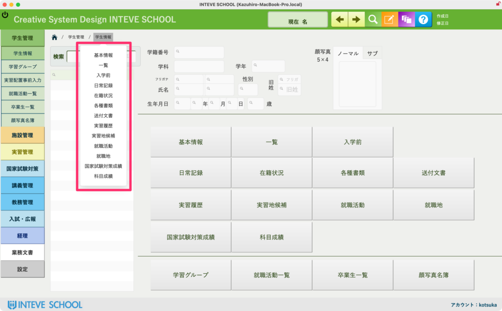
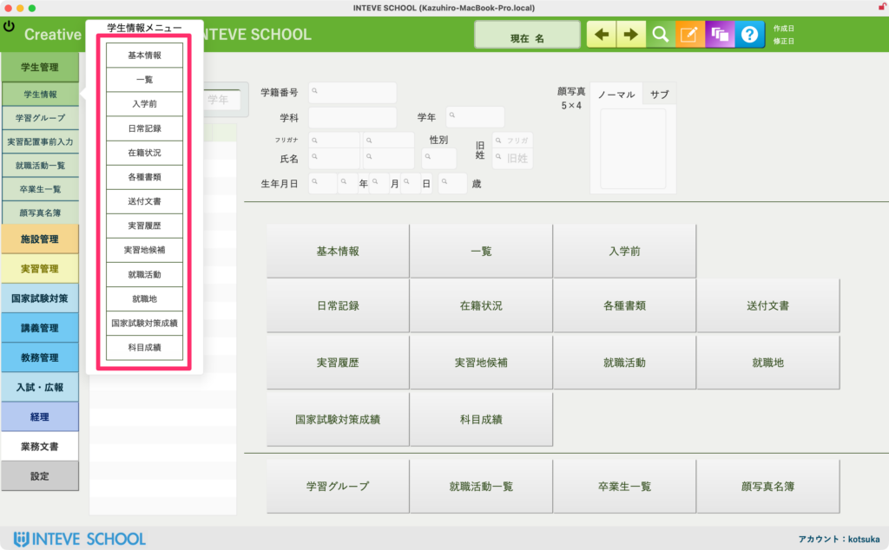
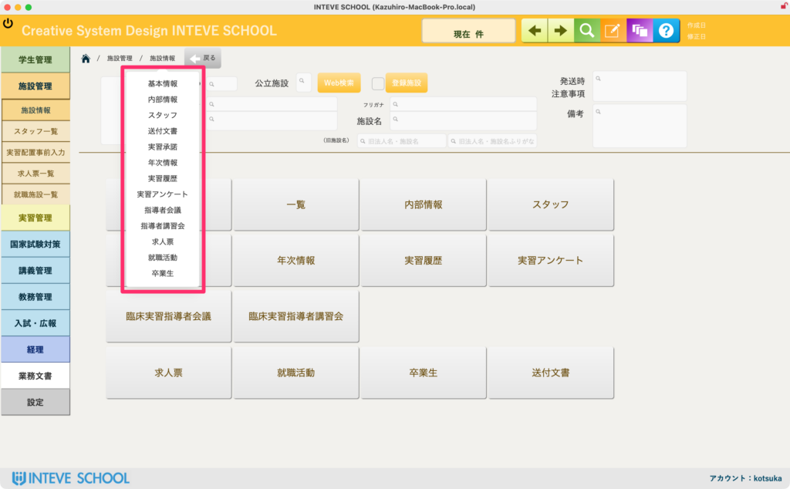
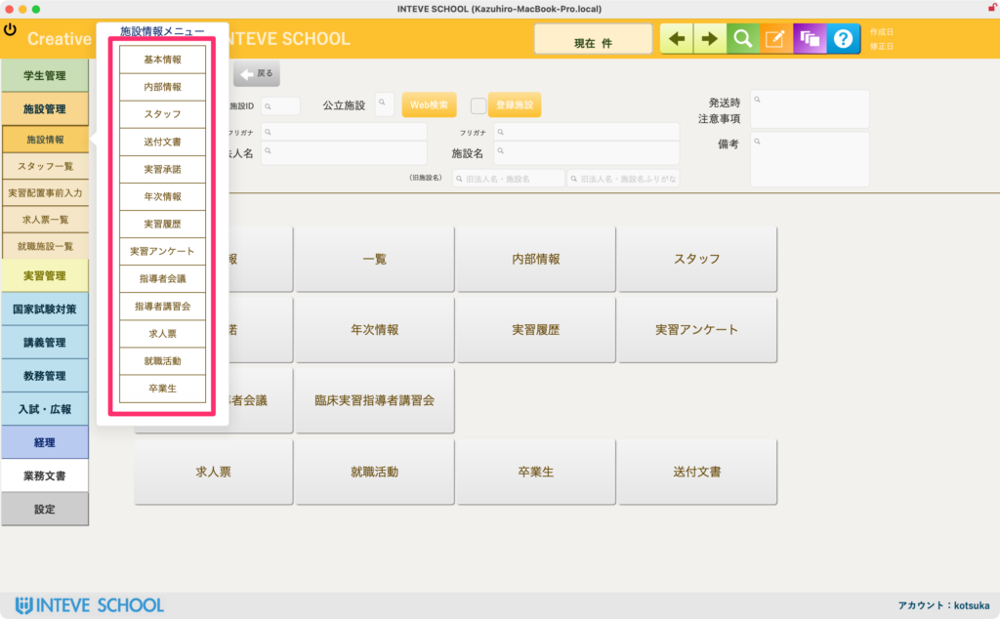
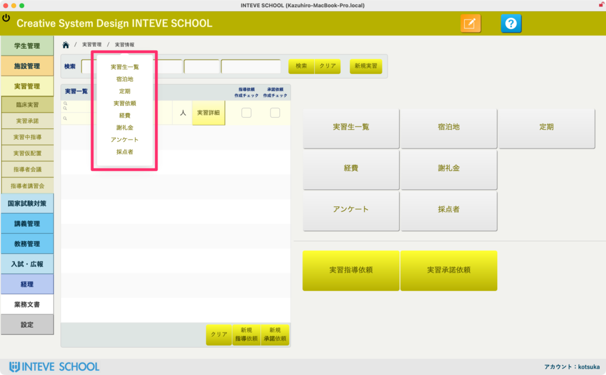
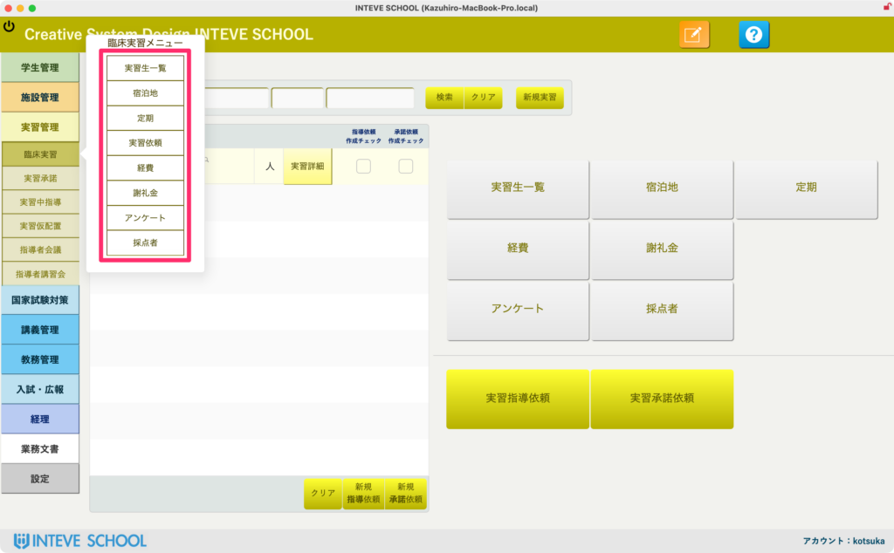

[← 基本的な使い方に戻る](基本的な使い方.md) | [メインページ](top.md)

# サブメニューの開き方

### 便利なショートカット機能（サブメニューの開き方）

画面の上部には、現在開いているページの位置を示す「パンくずリスト（ナビゲーション）」が表示されています（例： 🏠 ➔ 学生管理 ➔ 学生情報）。

INTEVE SCHOOLでは、このテキストが**「関連する細かい機能（サブメニュー）を一瞬で呼び出す便利なショートカットボタン」**になっています。左側のメインメニューに戻ることなく、目的の画面へ素早く切り替えることができます。

#### 🛠️ 操作方法と表示されるメニュー

画面上部にあるテキスト（ピンクの枠内）をカチッとクリックすると、その下に縦長のサブメニューがポップアップで表示されます。

1. **「学生情報」関連のサブメニュー（1、2枚目）**  
    学生の基本情報画面などでクリックすると、「基本情報」「一覧」「入学前」「日常記録」「在籍状況」「各種書類」など、その学生に紐づくすべてのカルテ画面へ一瞬で切り替えられます。
2. **「施設情報」関連のサブメニュー（3、4枚目）**  
    施設（病院など）の管理画面でクリックすると、「基本情報」「内部情報」「スタッフ」「指導者会議」など、実習地選定に必要な詳細メニューがズラリと表示されます。
3. **「実習管理」関連のサブメニュー（5、6枚目）**  
    実習配置の画面などでクリックすると、「実習生 一覧」「宿泊地」「定期」「アンケート」など、実習運営に関する専門機能へダイレクトにジャンプできます。

💡 画面を切り替えたくなった時は、左の大きなメニューを押し直す前に、まずは画面の上のテキスト（パンくずリスト）をポチッと押してみる癖をつけると、日々のデータ入力作業が圧倒的にスムーズになります！

---
[← 基本的な使い方に戻る](基本的な使い方.md) | [メインページ](top.md)
