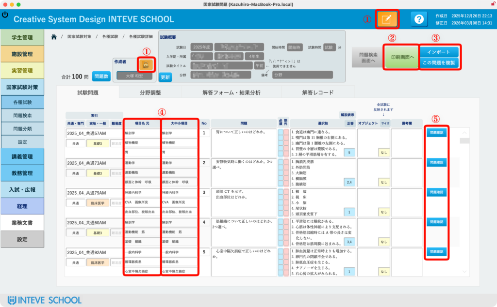
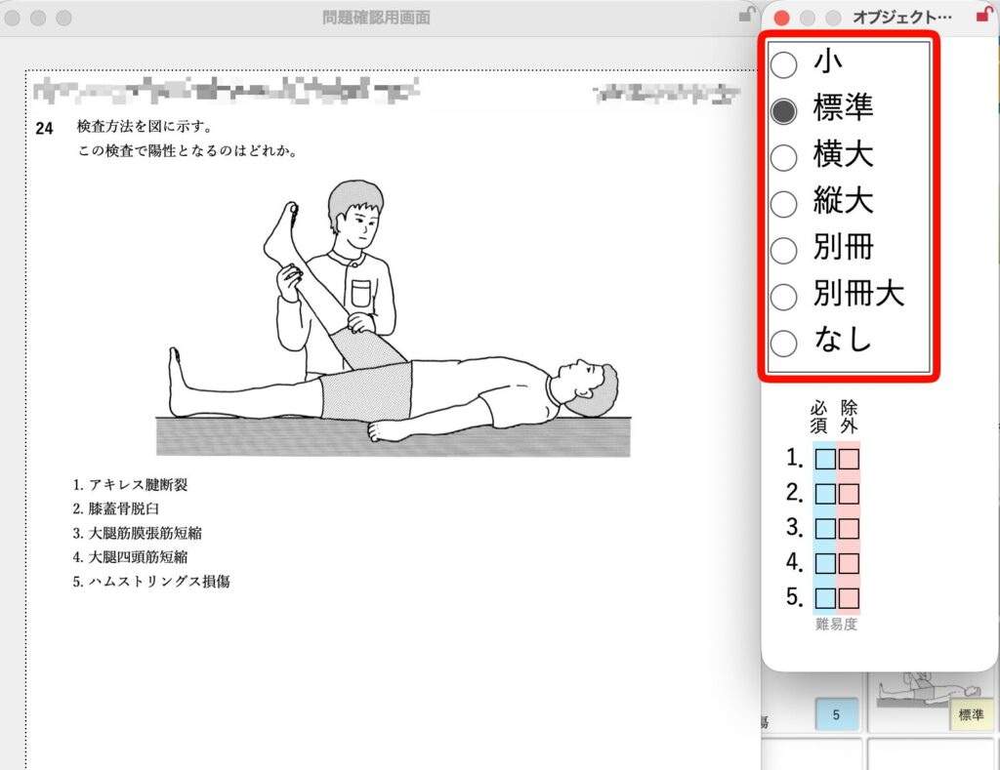
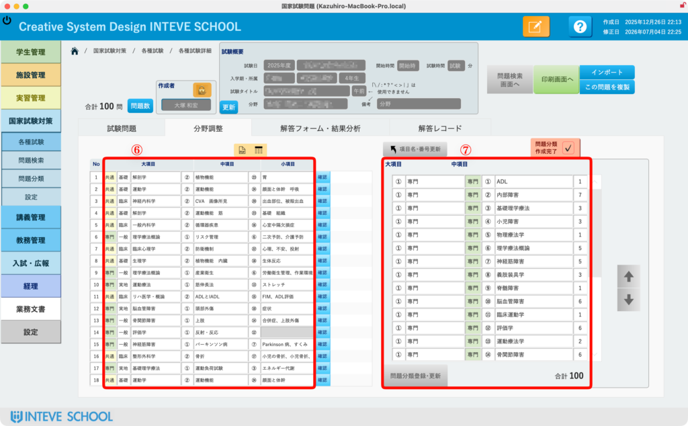
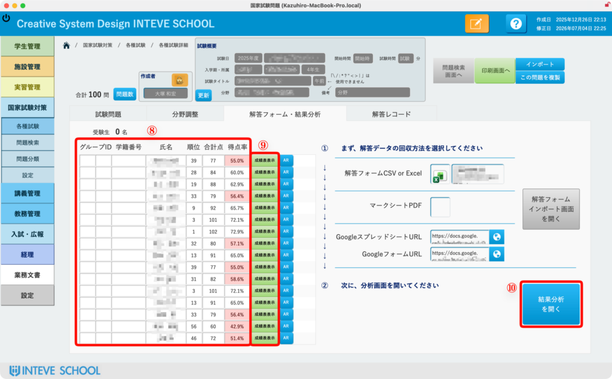
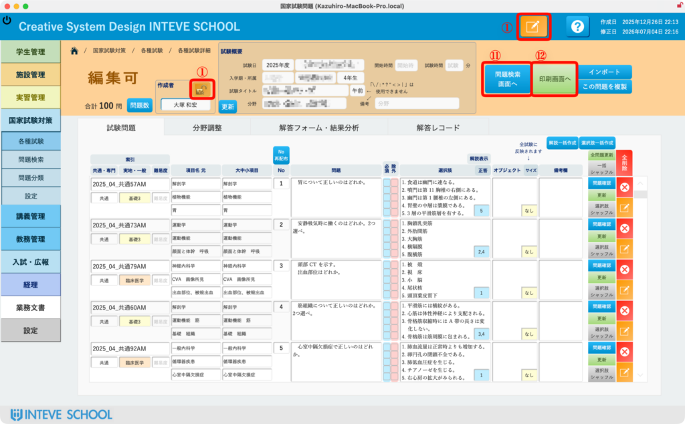

[← 国家試験対策ポータルに戻る](国家試験対策ポータル.md) | [メインページ](top.md)

# 各種試験 詳細

## 📋 各種試験詳細（問題管理・確認・分析）

各種試験の個別詳細画面では、試験問題の編集や追加、図表のサイズ調整、出題分類の整理、そして受験後の成績インポートや分析まで、試験運営に関するすべての実務を一元管理できます。

### 📝 1. 基本操作と問題管理

- **① 編集モードへの切り替え（編集ボタン）** 画面上部にある **\[編集（鉛筆アイコン）\]** ボタンをクリックすると、編集モードに切り替わります。
    - **💡 権限の安心設計：** 前画面と同様に、このボタンを押して編集ができるのは「試験の作成者（問題制作者）」「国家試験対策担当者」およびシステム管理者（開発者）のみに自動制御されています。
- **② 各種出力メニューへ** 試験問題冊子や解答用紙など、必要な形式を選択して印刷・データ出力を行う画面へジャンプします。
- **③ 問題のインポート・複製** 外部データから問題を一括インポートしたり、既存の試験問題をベースに複製（コピー）して新しい試験を作成したりできます。
- **④ 分類名（項目名）の自動連携と修正** 過去問マスタに登録されている元々の分類名（項目名）が、今回の試験用としてまずは自動で入ります。学校の出題意図に合わせて、この画面上で個別にキーワードを修正することも可能です。

### 🖼️ 2. 問題の個別確認と図表サイズ調整（2枚目の画像）

- **⑤ 個別問題のプレビュー表示** リストの右側にある **\[問題確認\]** ボタンをクリックすると、1問ごとの詳細な問題文や選択肢がポップアップで表示されます。
    - **🔍 オブジェクトサイズ自動調整機能（赤枠部分）：** 確認している過去問に「図やイラスト」が含まれている場合、ダイアログ内のオブジェクトサイズ（大・中・小など）の選択肢をクリックするたびにプレビューがリアルタイムに更新されます。印刷時や画面表示時に「ちょうど良い具合」に見えるサイズへ直感的に調整できます。

### 📊 3. 出題分類の整理と分析準備

- **⑥ 採用問題の分類一覧（左側ポータル）** 今回の試験に採用されている問題の分類（項目名一覧）を俯瞰して確認できます。
- **⑦ 分析用ソート順一覧（右側ポータル）** 出題された問題を、分析に最適な順番に並び替えて整理した一覧です。学生の弱点を発見するための「結果分析」を行う上で、非常に重要なベースデータとなります。※分析の詳細は別ページで解説します。

### 📈 4. 試験結果・成績分析タブの操作

試験実施後、学生の採点結果をシステムに反映した後の管理エリアです。

- **⑧ 学生リストと試験結果概要** 試験結果をインポートした対象の学生リストと、それぞれの得点や正答率などの概要が一覧表示されます。
- **⑨ 個人別成績表の出力** 学生一人ひとりに手渡すための、詳細な個人別成績表（フィードバックシート）を表示・印刷できます。※詳細は別ページで解説します。
- **⑩ 実際の分析結果画面へ** クラス全体の平均点や、問題ごとの正答率・識別度などを視覚的に解析した「本格的な分析画面」へと遷移します。※詳細は別ページで解説します。

**⑪ 問題検索画面へ（問題の追加）** 今回の試験に新しく採用する過去問を、データベースから検索して追加するための「問題検索画面」を開きます。

**⑫ 各種形式での出力メニュー** 成績データや分析結果を、用途に応じた様々なフォーマットで帳票出力・印刷する画面を表示します。

---
[← 国家試験対策ポータルに戻る](国家試験対策ポータル.md) | [メインページ](top.md)
