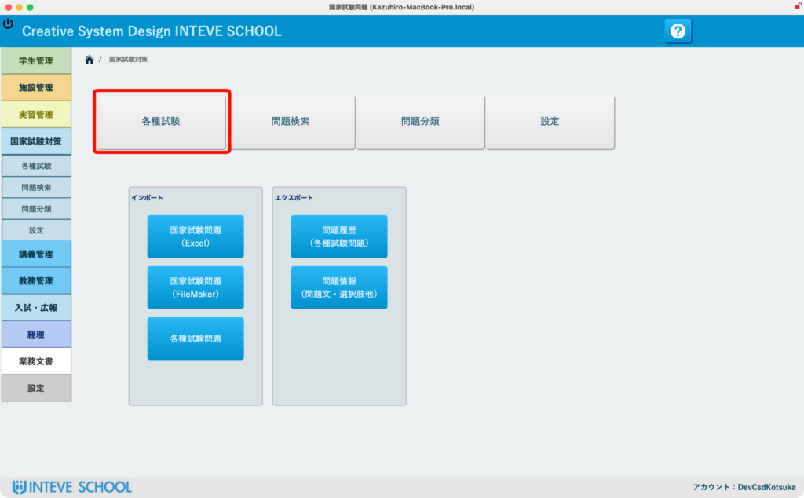
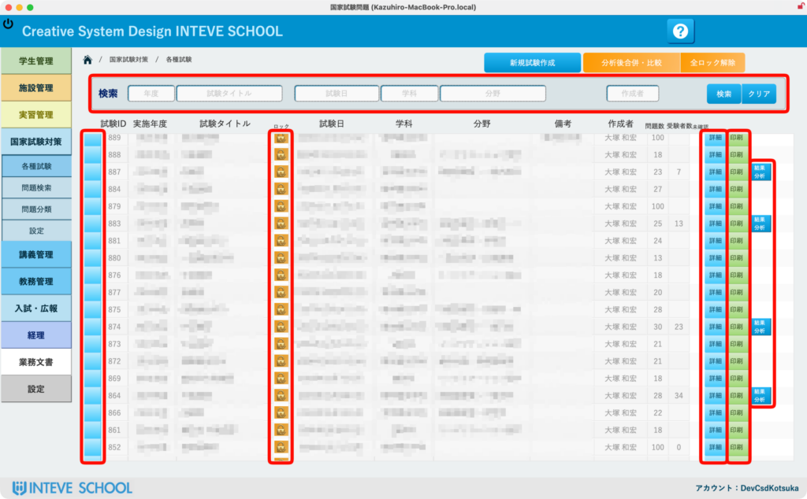
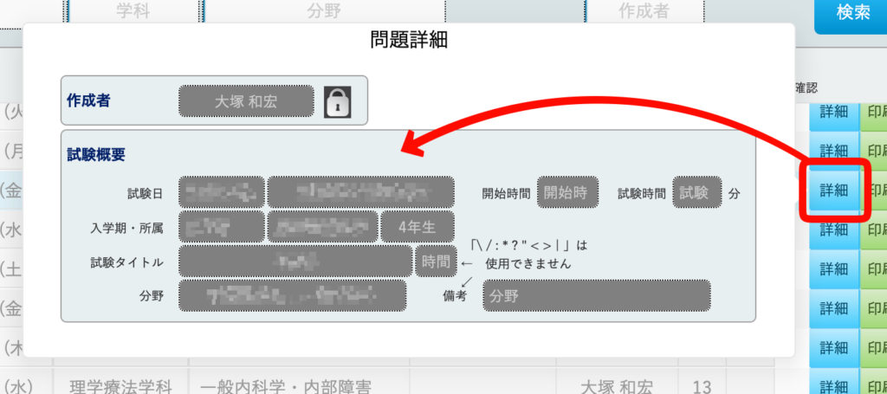

[← 国家試験対策ポータルに戻る](国家試験対策ポータル.md) | [メインページ](top.md)

# 各種試験

📌 本ページの見出し（目次）  
画面をスクロールするか、各リンクをクリックして目的の項目へ進んでください。

- 🆕 初めての方向け：[新規試験の作成手順ワークフロー](各種試験-新規作成.md)
- このページの見方：[各種試験メニューへのアクセス](#各種試験の見方)

## 📋 国家試験対策：各種試験（一覧と基本操作）

本システムには、蓄積された膨大な国家試験の過去問データベース（もちろんオリジナル問題の作成もできます）の中から、年度・科目・分野などの様々な条件で問題を抽出し、学内独自の「オリジナル練習試験」や「模擬試験」を自由に作成・出題できる強力な国家試験対策機能が備わっています。

ここでは、作成された試験を管理・検索する「各種試験一覧」の基本操作について解説します。

### 🚀 1. 各種試験メニューへのアクセス

画面左側のサイドメニューより **\[国家試験対策\]** を選択し、国試対策ポータル画面（1枚目の画像）を開きます。 画面左上にある **\[各種試験\]** ボタンをクリックします。

### 🔍 2. 試験一覧画面の見方と検索

これまでに学内で作成された試験が一覧で表示されます（2枚目の画像）。

- **上部検索フィールド：** 年度、試験タイトル、試験日、学科、分類などの条件を入力または選択するだけで、目的の試験をスピーディに自動絞り込み検索できます。
- **🟦 左端の青いボタン（[試験詳細レイアウトへ](レイアウト-各種試験-詳細.md)）：** クリックすると、その試験の「問題構成画面（出題する問題の選定や並び替え画面）」へと遷移します。

### 🔒 3. 編集ロックボタン（権限の自動制御）

一覧リストの「鍵マーク」の列にある **\[ロック（南京錠アイコン）\]** ボタンをクリックすると、試験内容の編集モードへと移行します。

- **💡 セキュリティ・権限の安心設計：** この編集ロック解除ボタンが操作できるのは、**「国家試験対策の全体担当者」**、**「その試験の作成者（問題制作者）」**、およびシステム管理者（開発者）のみに制限されています。他の教員が誤って問題を書き換えたり、設定を変更したりできないよう、安全に権限管理が行われています。

### 🛠️ 4. 右側アクションボタン（各種詳細・出力・分析）

各試験行の右側には、実務に合わせた3つのクイックアクションボタンが用意されています。

- **\[印刷\] ボタン：** 試験問題冊子、解答用紙、マークシート用フォーマットなど、用途に応じた様々な形式で帳票出力・印刷を行う画面を表示します。🔗 **詳しい使い方はこちら：** \[[試験問題・解答の各種印刷マニュアル](各種模試出力設定.md)\]
- **\[結果分析\] ボタン：** 学生が受験し、採点・分析が完了した試験に対して表示されます。クラス全体の正答率や、問題ごとの識別度などを確認できる分析画面へジャンプします。🔗 **詳しい使い方はこちら：** \[[試験結果のデータ分析・成績管理マニュアル](結果分析コントロール.md)\]

**\[詳細\] ボタン：** クリックすると、画面を切り替えずにその場で試験設定（名称、日付、作成者、分類など）の細かな情報をダイアログで確認・修正できます。

---
[← 国家試験対策ポータルに戻る](国家試験対策ポータル.md) | [メインページ](top.md)
