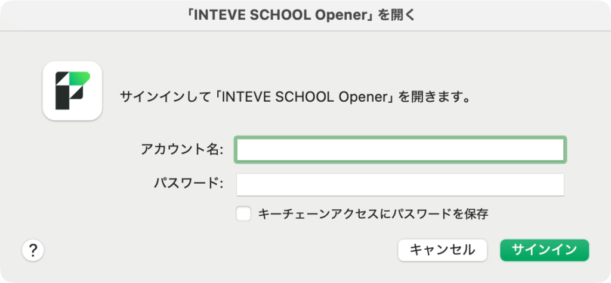
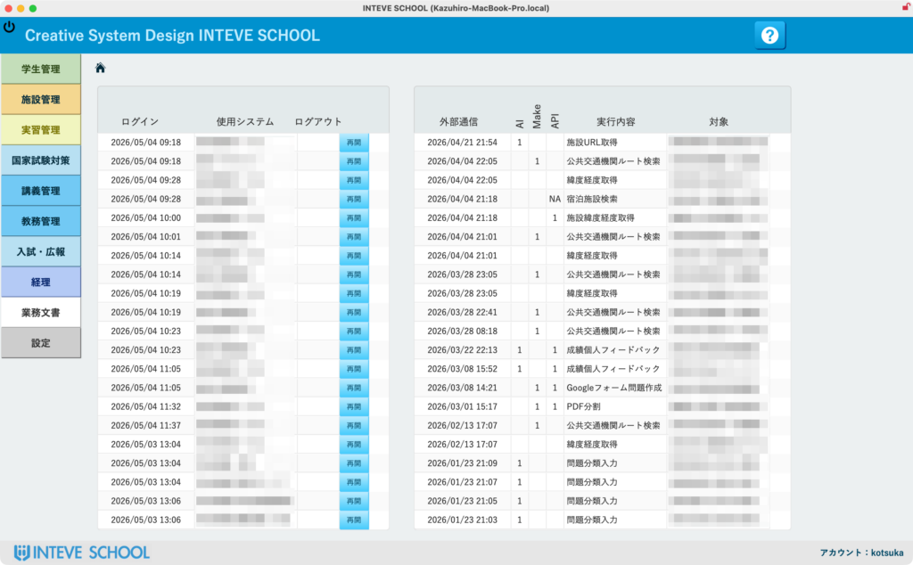

[← 基本的な使い方に戻る](基本的な使い方.md) | [メインページ](top.md)

# ログイン方法

指定されたアイコン（または「INTEVE SCHOOL Opener」のアプリ）をクリックします。

サインイン画面が表示されますので、あらかじめ配布されている「アカウント名」**と**「パスワード」**を入力し、右下の**［サインイン］ボタンをクリックします。

認証が成功すると、上のような「INTEVE SCHOOL」のポータル画面（メインメニュー）が表示されます。  
ここから、左側のメニューにある各管理機能（学生管理・施設管理など）を選択して、日々の業務、編集・入力を行ってください。

---
[← 基本的な使い方に戻る](基本的な使い方.md) | [メインページ](top.md)
