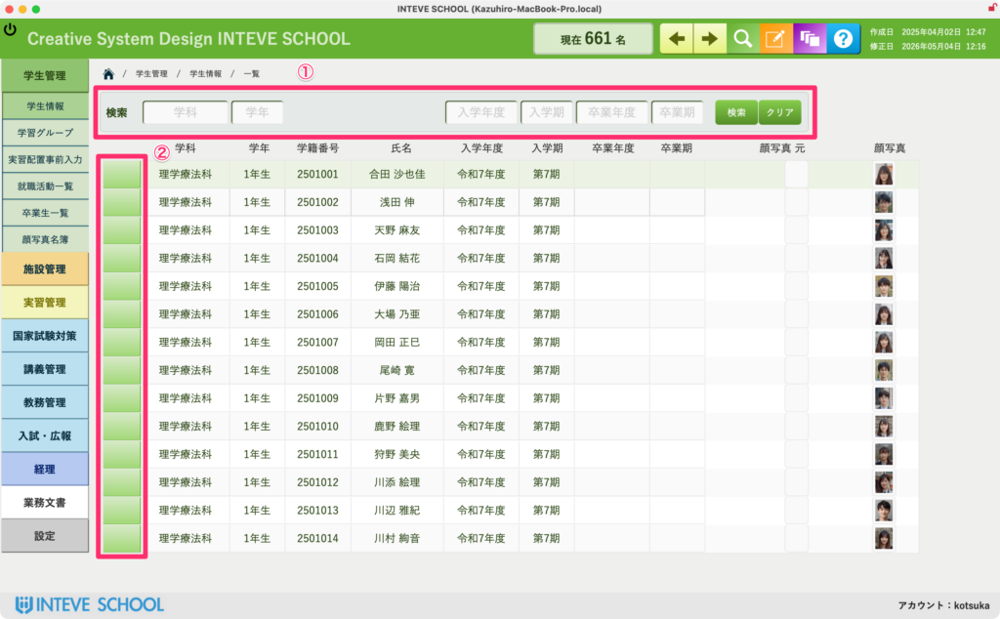

[← 学生管理ポータルに戻る](学生管理ポータル.md) | [メインページ](top.md)

# 学生情報 一覧

### 学生情報 一覧画面の使い方

この画面では、全学生の情報をリスト形式で一望できます。ここから条件に合う学生を素早く検索したり、各学生の個別データ（詳細画面）へダイレクトにアクセスすることができます。

#### ① クイック検索エリア（条件の絞り込み）

画面上部にあるピンクの枠内では、複数の条件を組み合わせて学生を自由に絞り込むことができます。

- **検索できる項目：** 「学科」「学年」「入学年度」「入学期」「卒業年度」「卒業期」
- **操作方法：** 条件（例：理学療法科 の 1年生）を入力・選択し、右側にある**「検索」ボタン**を押すと、該当する学生だけが下にズラリと表示されます。  
    ※別の条件で探し直したいときは、**「クリア」ボタン**を押すと入力がリセットされます。

#### ② 各学生の個別ページへの移動ボタン

一覧表の左端にある「緑色の縦長のボタン」は、**その学生の個人カルテ（詳細画面）を開くためのダイレクトリンクボタン**です。

- **操作方法：** 詳しくデータを確認・入力したい学生の行を見つけ、その左端にある**緑色ボタンをクリック**します。  
    クリックすると、該当する学生の「基本情報」画面へ一瞬でジャンプします。

---
[← 学生管理ポータルに戻る](学生管理ポータル.md) | [メインページ](top.md)
