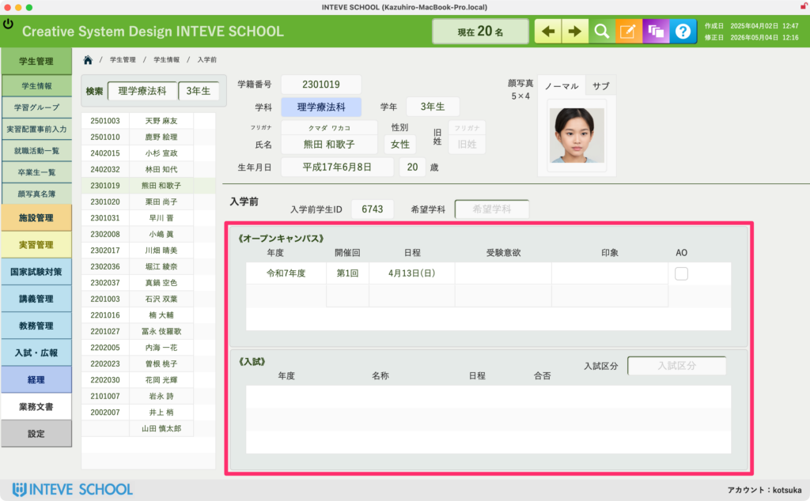

[← 学生管理ポータルに戻る](学生管理ポータル.md) | [メインページ](top.md)

# 学生情報 入学前

### 学生情報 入学前画面の使い方

この画面では、学生が正式に入学する前の「オープンキャンパスへの参加履歴」や「入試の選考結果」をまとめて確認・参照することができます。

#### 📊 データの参照エリア（オープンキャンパス・入試）

画面下部のピンクの枠内には、以下の情報が自動的に表示されます。

- **《オープンキャンパス》**：参加した年度、開催回数、具体的な日程、本人の受験意欲や教職員からの印象、AOエントリーの有無など。
- **《入試》**：受験年度、入試の名称、試験日程、合否結果、および詳細な入試区分。

#### 🚨 注意点（この画面では入力できません）

この画面に表示されているデータは、入試広報課のマスターデータ（または事前の登録システム）から自動的に連動して引っ張ってきている「閲覧専用」の情報です。

そのため、**この「入学前」タブの画面内から直接文字を入力したり、内容を書き換えたりすることはできません。** 過去の正確なデータを安全に「参照・確認する場所」としてご活用ください。

---
[← 学生管理ポータルに戻る](学生管理ポータル.md) | [メインページ](top.md)
