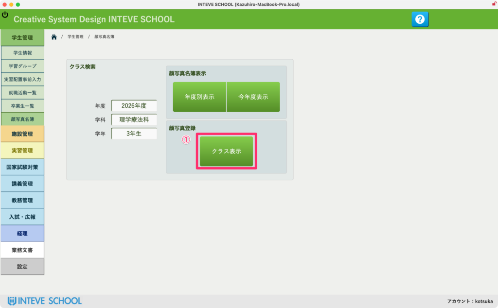
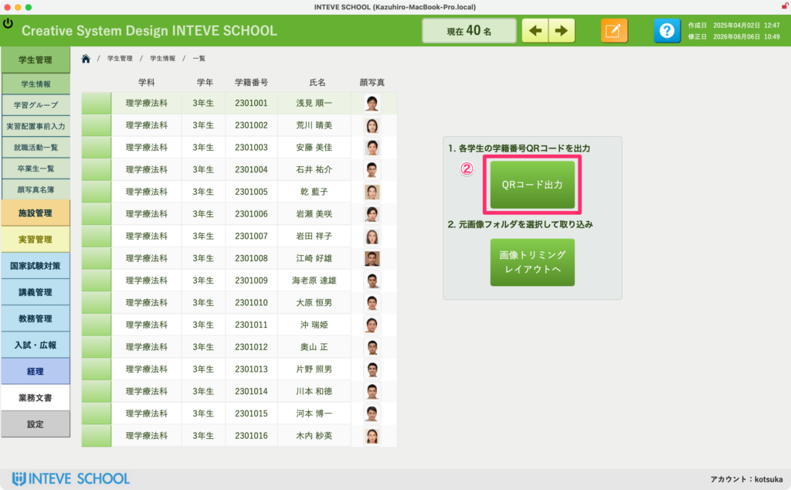
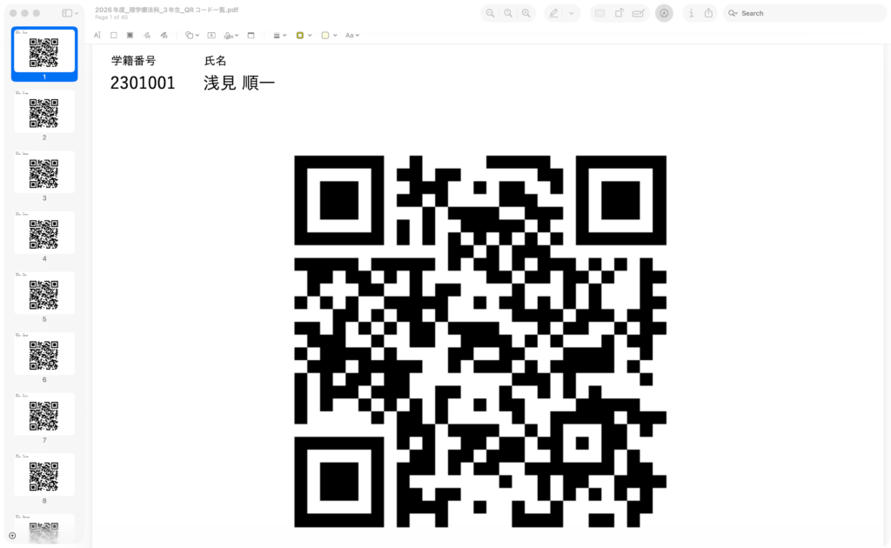
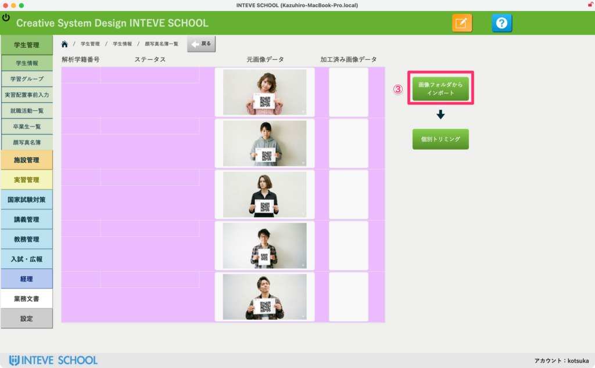
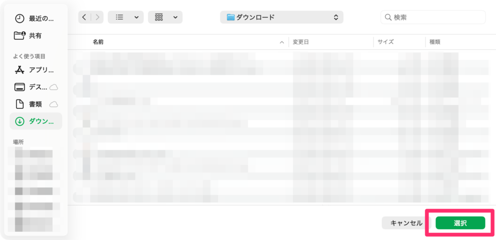
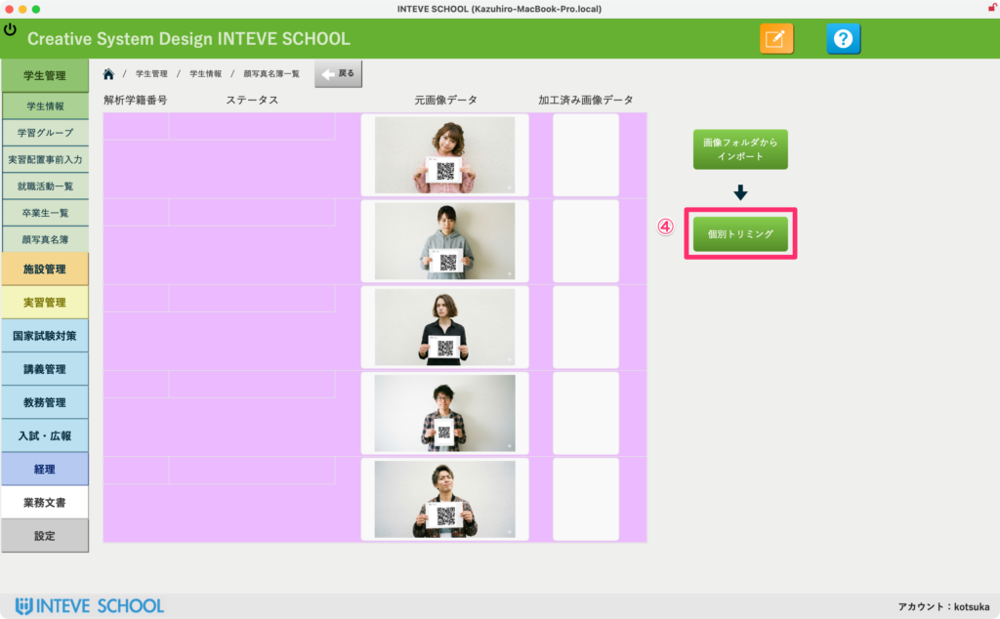
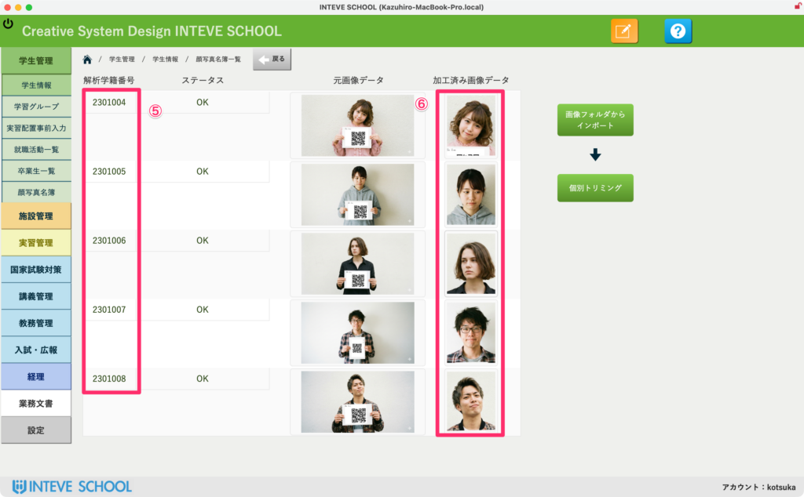

[← 学生管理ポータルに戻る](学生管理ポータル.md) | [メインページ](top.md)

# 学生情報 写真取込

## 📸 学生情報 写真取込（一括登録）の使いかた

これまで膨大な手間がかかっていた「学生の顔写真の登録」を、QRコードの自動識別技術を使って一括で処理する非常に便利な機能です。 最初だけ少し手順がありますが、一度使い始めると手作業には戻れないほど教務の負担が激減します。

### 🔲 ① クラス表示からレイアウトを移動

ポータル画面から対象のクラスを指定し、「クラス表示」ボタンを押して、写真取り込み用の専用画面へ移動します。

### 🖨️ ② QRコードの出力と写真撮影

対象学生のQRコード一覧を出力・印刷し、学生に持たせた状態で上半身の写真を撮影します。

- **撮影のポイント：** カメラがQRコードを自動解析して「誰の写真か」を判定します。衣服や手でQRの四隅が隠れないよう、またピンボケしないようハッキリ撮影するのが成功のコツです。

### 📂 ③ 画像フォルダから一括インポート

撮影した全員分の写真データをパソコンの1つのフォルダにまとめます。 画面内の **「画像フォルダからインポート」** ボタンを押し、用意したフォルダを選択すると、すべての写真がシステムへ一気に読み込まれます。

フォルダを選択して「選択」を押してください。

### ✂️ ④ 個別トリミング（全自動処理）

読み込みが完了したら、 **「個別トリミング」** ボタンを押します。

- あとはシステムが全自動で動きます。写真内のQRコードから学籍番号を自動取得し、顔写真に最適なサイズへ自動でトリミング（切り抜き）を行います。

### 🎉 ⑤ ⑥ 学籍番号と顔写真の自動紐付け

処理が完了すると、自動的に **「学籍番号」** と **「トリミングされた顔写真」** が各学生のデータに正しくマッピングされます。

- 💡 **最高水準のセキュリティ設計：** 学籍番号の読み取りはシステム内部で安全に行われます。また、解析に使用した画像データは、**取り込みとトリミングが完了した瞬間にクラウドサーバーから『即時自動消去』される**設計になっています。サーバー内に学生の顔写真データが残ることは一切ありませんので、プライバシーや情報漏洩のリスクに対して極めて安全です。

---
[← 学生管理ポータルに戻る](学生管理ポータル.md) | [メインページ](top.md)
