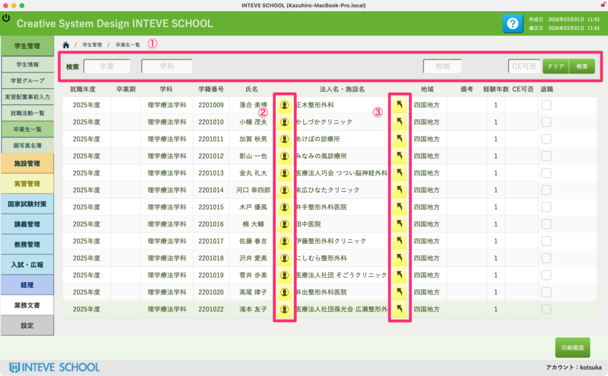

[← 学生管理ポータルに戻る](学生管理ポータル.md) | [メインページ](top.md)

# 学生情報 卒業生 一覧

## 🎓 学生情報 卒業生 一覧の使いかた

過去の卒業生データを検索・閲覧する画面です。ここから各学生の詳細な情報や、在学中に関わりのあった施設情報を確認できます。

### 🔍 ① 卒業生の検索

画面上部の検索エリアを使って、必要なデータを絞り込みます。

- **「年度」「学科」「地域」「CE可否」** などの条件を入力・選択し、右側の **「検索」** ボタンを押してください。
- 条件をリセットしたい場合は **「クリア」** ボタンを押します。

### 👤 ② 学生詳細ページへのジャンプ

各学生の氏名の左横にある **「人型アイコン」** をクリックします。

- その学生の進路や在学中の詳細な記録が保管されている **「学生詳細」** 画面へ直接ジャンプします。

### 🏢 ③ 実習施設詳細ページへのジャンプ

施設名の左横にある **「斜め矢印アイコン」** をクリックします。

- 該当する施設の連絡先や過去の受け入れ実績が登録されている **「施設詳細」** 画面へ直接ジャンプします。

---
[← 学生管理ポータルに戻る](学生管理ポータル.md) | [メインページ](top.md)
