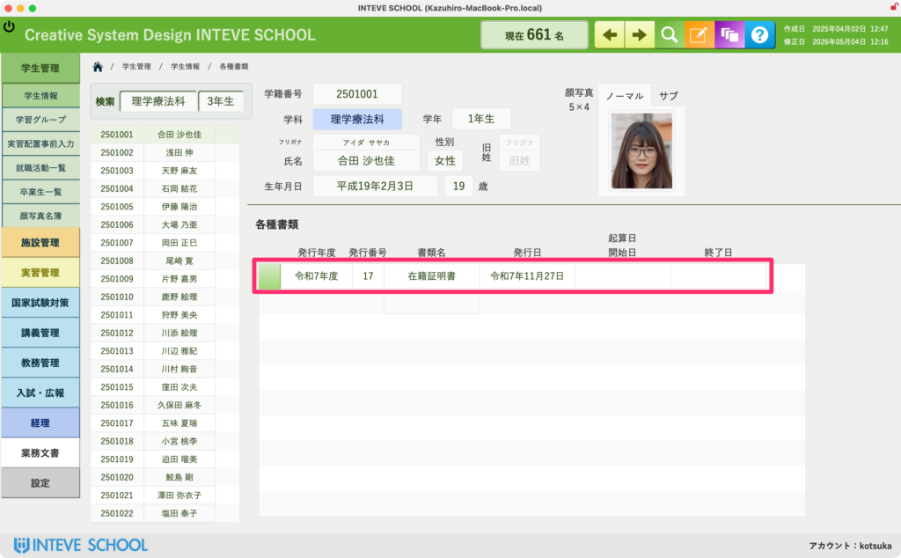
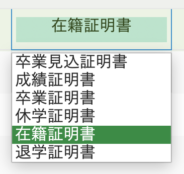

[← 学生管理ポータルに戻る](学生管理ポータル.md) | [メインページ](top.md)

# 学生情報 各種書類

### 学生情報 各種書類画面の使い方

この画面では、学生に発行する「在籍証明書」や「成績証明書」などの各種書類を、教員がその場で素早く作成・出力することができます。  
事務方に発行を依頼する手間を省き、必要な書類を必要な時に最短で発行するための便利な機能です（学校の運用に合わせてご活用ください）。

#### 📄 証明書の発行・出力手順

画面中央のリストエリアで、発行したい書類の情報を入力します。

1. **「編集モード」をONにします。**
2. **「発行日」を入力し、「書類名」の欄をクリックして発行したい書類を選択します。**  
    ※「起算日 開始日・終了日」は、必要に応じて入力してください。
3. **入力が終わったら、行の左端にある「緑色のボタン」をクリックします。**  
    自動的に印刷用レイアウトに画面が切り替わり、そのまま印刷やPDFとして出力することができます。

#### 💡 発行できる書類の選択肢一覧

「書類名」のフィールドをクリックすると、以下のドロップダウンリストが表示されます。用途に合わせた証明書を選択してください。

- **卒業見込証明書 / 卒業証明書**：就職活動や進路提出用
- **成績証明書**：就職・進学・実習先への提出用
- **休学証明書 / 在籍証明書 / 退学証明書**：各種公的機関や手続き用

---
[← 学生管理ポータルに戻る](学生管理ポータル.md) | [メインページ](top.md)
