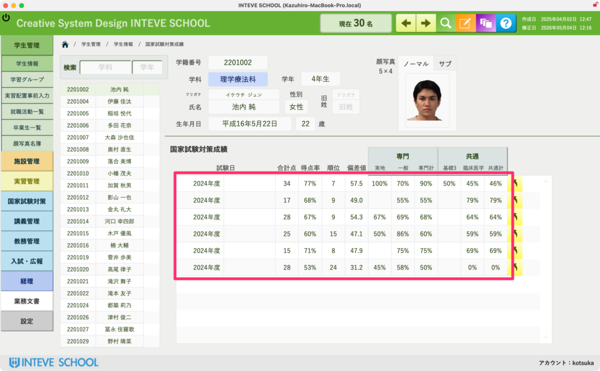

[← 学生管理ポータルに戻る](学生管理ポータル.md) | [メインページ](top.md)

# 学生情報 国家試験対策成績

### 学生情報 国家試験対策成績画面の使い方

この画面では、学生が学内で受験した国家試験の模擬試験（模試）の成績推移を一覧で確認することができます。  
※本機能は「国家試験対策機能」をご契約いただいている学校様のみデータが反映されます。未契約の場合は画面は表示されますが、データは連動しません。

#### 📊 模試成績の参照エリア

画面下部のピンクの枠内には、これまでに受験した模試の結果が時系列で自動蓄積されます。  
合計得点や得点率、学内順位、偏差値だけでなく、**「専門分野（実戦・一般・専門計）」や「共通分野（基礎医学・臨床医学・共通計）」の科目ごとの得点率**まで一目で把握できるため、学生が今どこで躓いているかの学習指導に直結します。（この分野は理学療法士・作業療法士国家試験用の分類です。他学科の場合はご要望に応じます。）

#### 🔗 模試の全体データ（試験情報）へのジャンプ

各成績行の右端にある**「斜め上の矢印ボタン」**は、その模試全体の詳細ページへのダイレクトリンクです。

**操作方法：** 矢印ボタンをクリックすると、その模擬試験自体の「平均点」「最高・最低点」「問題ごとの正答率分析」などを管理する、大元の『試験情報』ページへ一瞬でジャンプすることができます。

---
[← 学生管理ポータルに戻る](学生管理ポータル.md) | [メインページ](top.md)
