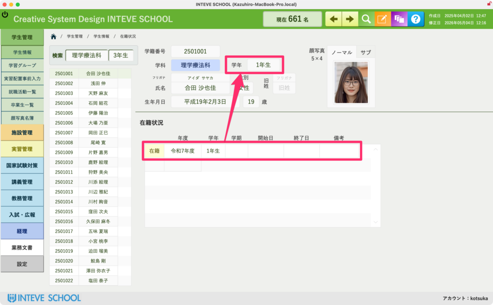
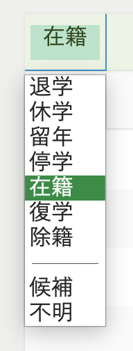

[← 学生管理ポータルに戻る](学生管理ポータル.md) | [メインページ](top.md)

# 学生情報 在籍状況

### 学生情報 在籍状況画面の使い方

この画面では、学生の現在の「在籍状態（在籍・休学・退学など）」や「学年」を管理します。  
ここで設定されている学年データは、システム内のあらゆる画面や検索・集計機能にリアルタイムで反映されるため、**INTEVE SCHOOLにおいて非常に重要性が高い「入力必須」の項目**となります。

#### 📊 現在の在籍状態と学年の設定

画面上部のピンクの枠内（基本情報の下）で、学生の最新のステータスを管理します。

- **学年の手動変更：** 通常の学年更新（進級処理）は、年度末に全学生を対象に一括で行う便利な機能が用意されています。  
    ※年度末の一括進級処理の手順については、\[[年度末の一括学年更新マニュアルへ](設定-年度学年設定.md)\] をご覧ください。

#### 📜 学籍異動履歴の記録（留年・休学・退学など）

画面下部のリストエリアでは、その学生の過去の学籍異動の歴史を記録・蓄積できます。

- **活用方法：** 「どの年度に留年したのか」「休学・退学・復学した具体的な日付や理由」などを詳しく入力しておきます。
- **メリット：** ここに日頃から正確な履歴を残しておくことで、数年後に「過去の在籍推移」を振り返ったり、休学者数の統計データを出力したりする際に非常に便利になります。

#### 💡 在籍状況の選択肢一覧

「在籍状況」のフィールドをクリックすると、以下のドロップダウンリストが表示されます。学生の現在の状況に合わせて、正確なステータスを選択してください。

- **退学 / 休学 / 留年 / 停学**：学籍異動が発生した際に選択します。
- **在籍**：通常期、および復学が認められた通常の学生のステータスです。
- **復学 / 除籍**：該当する手続きが完了した際に切り替えます。
- **候補 / 不明**：新入生の確定前や、状況の確認が必要な一時的なステータスとして利用します。

※ステータスを切り替える際は、必ずオレンジ色の「編集モード」をONにしてから操作を行ってください。

---
[← 学生管理ポータルに戻る](学生管理ポータル.md) | [メインページ](top.md)
