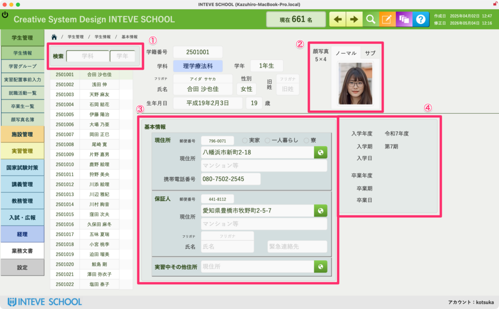

[← 学生管理ポータルに戻る](学生管理ポータル.md) | [メインページ](top.md)

# 学生情報 基本情報

### 学生情報 基本情報画面の使い方

この「基本情報」は、学生に関するすべてのデータの出発点となる最重要画面です。ここで入力された正確なデータが、実習管理や就職活動など、あらゆる学内業務の自動化へと連動します。

#### ① 学科・学年によるクイック絞り込み（検索）

画面左上にある検索ボックスでは、**「学科」や「学年」を入力するだけで、対象となる学生を一瞬で絞り込むことができます。** クラス単位での進捗確認や、特定の学年を対象とした一括処理を行いたいときに大変便利です。

#### ② 顔写真の登録（各種書類への自動連動）

ここに登録された学生の顔写真は、単なる本人確認用ではありません。  
システム内で**「顔写真付き名簿（クラス一覧）」をワンクリックで自動作成**したり、病院や施設に提出する**「実習生プロフィール（履歴書）」へも反映**されます。

#### ③ 住所・保証人情報の管理（実習配置の検討）

学生の現住所（実家・一人暮らし・寮の区分）や、保証人の連絡先を管理します。  
この正確な住所データがあることで、後の**「実習配置シミュレーション」の際、自宅から実習先までの通勤ルートや距離に無理がないかを検討する重要な指標**としてフル活用されます。

#### ④ 入学・卒業年度データ（実習・就職データへの自動連動）

入学年度、学期、卒業予定日などのタイムラインを管理します。  
この「期」や「年度」のデータがガチッと決まっていることで、**各学生が「どの年度の実習に参加しているか」「何期生として就職活動を行っているか」がシステム全体で自動集計**され、過去の膨大なデータとも正確に紐づくようになります。

---
[← 学生管理ポータルに戻る](学生管理ポータル.md) | [メインページ](top.md)
