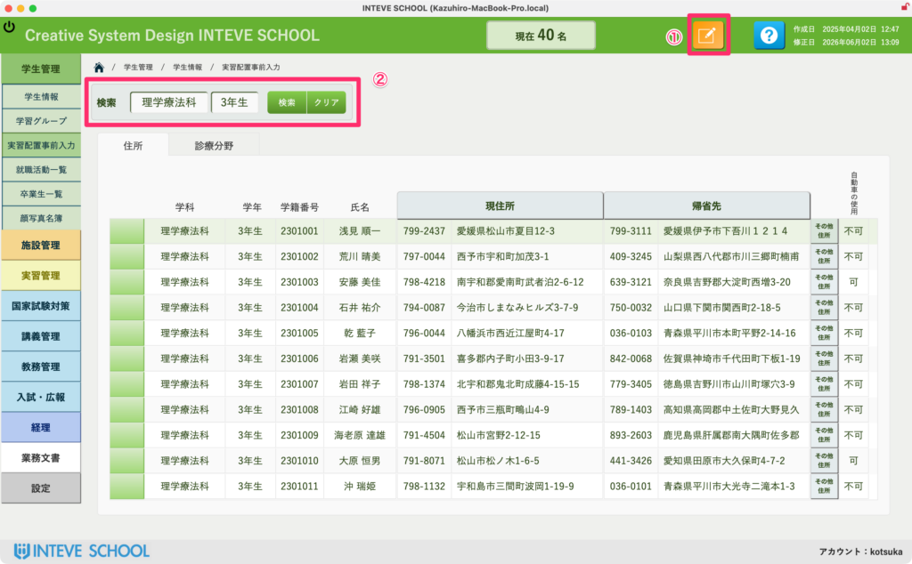
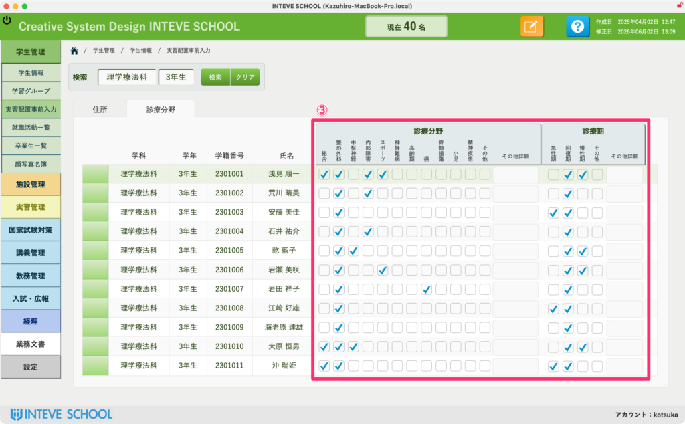

[← 学生管理ポータルに戻る](学生管理ポータル.md) | [メインページ](top.md)

# 学生情報 学生仮配置事前入力

## 学生情報 仮配置事前入力画面の使い方

この画面では、AIによる実習仮配置（自動マッチング）を行うために必要な、学生側の「事前情報（通学出発元の住所や、希望する診療分野・診療期など）」を登録・管理します。 ここで入力された条件を元に、AIが最適な実習先をシミュレーションします。

### 👥 事前情報を入力する手順

**① `[<a href="編集モードへ.md">編集モードへ]</a>`ボタンをクリックする** 画面左上のボタンをクリックして、データの入力・編集が可能な状態にします。

**② 学科・学年を入力して学生を表示する** 対象の「学科」や「学年」を正しく入力し、事前情報を入力したい学生リストを画面に表示させます。

**③ 「住所」タブと「診療分野」タブの中身を入力する** 表示された学生それぞれの行に対して、以下のタブを切り替えながら条件を入力していきます。

- **\[住所\] タブ：** 実習地へのルート計算の基準となる、出発元の住所（自宅や帰省先、その他など）や、自動車使用の可否を入力します。

- **\[診療分野\] タブ：** 学生が希望する診療分野や、実習を行う診療期（急性期や回復期など）の要件を細かく指定します。

### 💡 業務効率化のヒント：Googleフォームとの連携について

本画面の事前情報は、先生方が手動で一つずつ入力することも可能ですが、学生数が多い場合は入力の手間がかかります。

もし、学生への事前アンケート（希望分野や現在の住所、車の有無など）を **Googleフォーム** で実施される場合は、**集計データを本システム（INTEVE SCHOOL）へ自動で一括連携・取り込みするカスタマイズが可能です。**

手入力の手間や転記ミスを完全にゼロにすることができますので、フォーム連携をご希望の際はお気軽に開発担当までご相談ください。

---
[← 学生管理ポータルに戻る](学生管理ポータル.md) | [メインページ](top.md)
