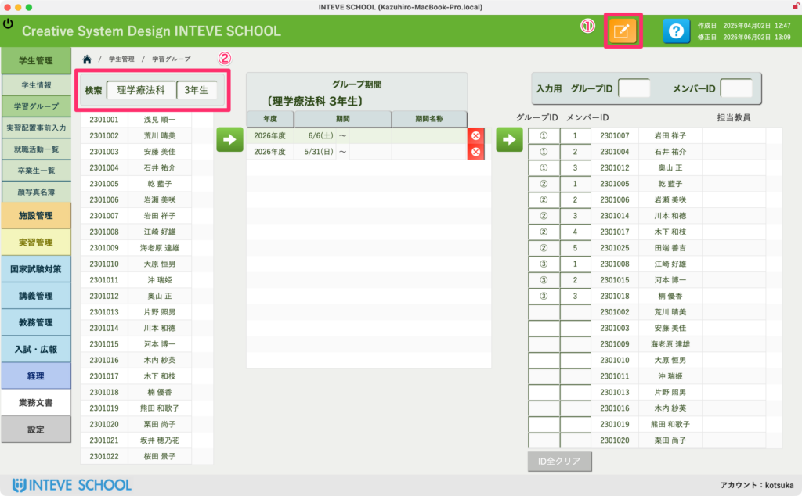
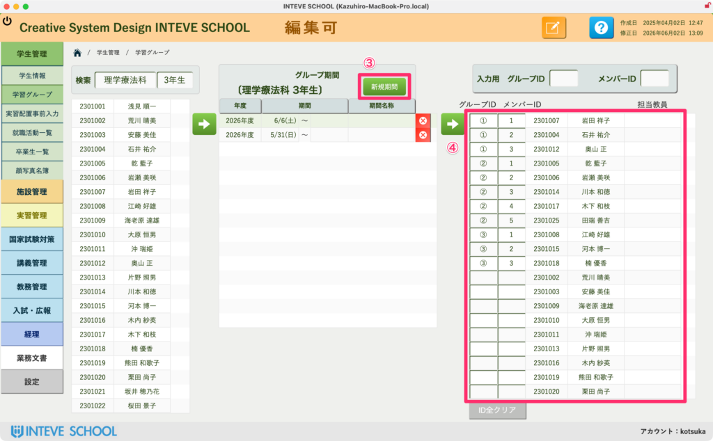
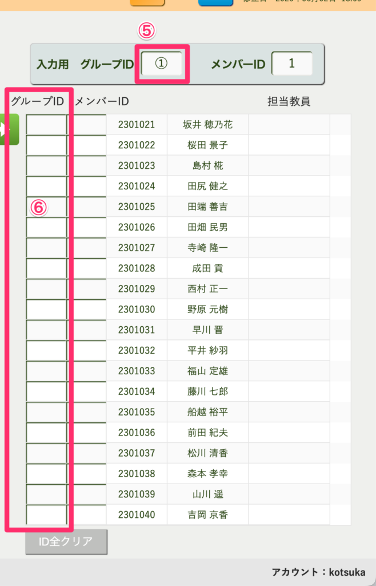

[← 学生管理ポータルに戻る](学生管理ポータル.md) | [メインページ](top.md)

# 学生情報 学習グループ

## 学生情報 学習グループ画面の使い方

この画面では、学生を実習や校内演習などの単位に合わせて、任意の「グループ」へ振り分ける管理を行います。 グループごとの期間（日付）やタイトルを設定し、学生をポチポチとクリックしていくだけで、自動でグループ内の連番が割り振られる便利な機能です。

https://www.youtube.com/watch?v=49uz0TKpkao

### 📊 グループ期間とタイトルの設定（画面中央）

画面中央のエリア（グループ期間）で、いつから始まる実習・演習のグループなのかを設定します。

- **新規期間の登録：** `[新規期間]` ボタンをクリックして、日付やタイトル（例：国家試験対策 vol.1）を入力しておきます。
- **履歴の確認：** 過去に作成したグループの一覧もここで年度ごとに切り替えて確認・管理できます。

### 👥 学生をグループへ割り当てる手順（左右の連動）

左側の「学生リスト」から、右側の「グループメンバー表」へ、直感的な操作で一気に振り分けを行うことができます。

- **① `[<a href="編集モードへ.md">編集モードへ</a>]`（リンク）ボタンをクリックする** まずは画面左上のボタンをクリックして、編集可能な状態にします。
- **② 学科・学年を入力して学生を表示する** 対象の「学科」や「学年」を正しく入力し、割り当て対象となる学生リストを画面に表示させます。

**③ `[新規期間]` をクリックし、期間情報を登録する** 画面中央のエリアで `[新規期間]` ボタンをクリックし、実習の日付やタイトル（例：国家試験対策 vol.1）を入力してグループの枠組みを作っておきます。

**④ 指定した学科・学年の学生リストを確認する** 条件に合致した学生たちが左側のリストに正しく表示されているかを確認します。

**⑤⑥ 学生をポチポチとクリックしてグループ分けを行う** 画面右上にある「入力用 グループID」を確認します。最初は **【 ① 】** になっています。 左側の学生リストから、第1グループに入れたい学生の横にある **`[矢印ボタン（緑）]`** を順番にクリックしていきます。

- **自動カウントアップ（グループID）：** クリックするだけで、右側の表に指定した「グループID：①」と、自動でカウントアップされた「メンバーID（1、2、3...）」が瞬時に追加されていきます。
- **グループの切り替え：** 第1グループの選択が終わったら、右上の「入力用 グループID」を手動で **【 ② 】** に切り替えます。同様の手順で、第2グループに入れたい学生をリストから選んでいきます。

※もし途中で間違えて登録してしまった場合は、右下の `[ID全クリア]` ボタン、または各行の削除ボタンからやり直すことができます。

https://www.youtube.com/watch?v=49uz0TKpkao

---
[← 学生管理ポータルに戻る](学生管理ポータル.md) | [メインページ](top.md)
