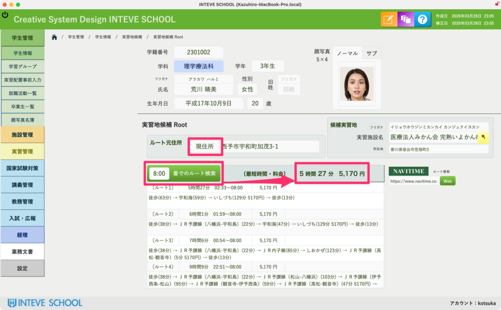

[← 学生管理ポータルに戻る](学生管理ポータル.md) | [メインページ](top.md)

# 学生情報 実習地候補 詳細

### 実習地候補 詳細画面の使い方（自動ルート検索機能）

一覧画面から「詳細」ボタンを押すと、この画面が開きます。  
ここでは、大塚システム最大の目玉機能である**「NAVITIME APIと連動した自動ルート検索機能」**を利用できます。ボタン1つで、学生の自宅から実習先までの公共交通機関のルート、所要時間、運賃を一瞬で自動取得する神機能です。

#### 🛠️ 自動ルート検索の操作手順

1. **【前提条件】学生のルート元住所を確認します。**  
    ※この機能は、\[[学生の基本情報](学生情報-基本情報.md)\] に「現住所」や「帰省先住所」が正しく入力されている必要があります。事前に住所が入っていることを確認してください。
2. **「編集モード」をONにします。**
3. **「ルート元」を選択し、「到着時間」を指定します。**

- **ルート元**：「自宅」「帰省先（保証人宅）」「親戚宅」など、どこから出発するかを選びます。
- **到着時間**：実習先に「何時何分までに到着しなければならないか（例：08:00）」を入力します。

1. **フィールド自体の「ルート検索」ボタンをクリックします。**  
    システムがAPI経由でNAVITIMEの最新データベースへ自動アクセスします。
2. **検索結果が自動で反映されます。**

- 画面下部の広いテキストエリアに、**NAVITIMEが推奨する「優先5択」の公共交通機関ルート情報**がテキストでパチッと自動入力されます。
- さらに、その5択の中から**「最短の時間」と「最安の料金」が、上部の専用フィールドに自動で抽出されて表示**されます。

---

💡 ここで自動取得された「最短時間」と「料金」のデータが、先ほど一覧画面で確認した「通勤ルート一覧」にそのまま反映され、全体の[実習仮配置](実習管理-実習仮配置.md)へと繋がっていきます。

---
[← 学生管理ポータルに戻る](学生管理ポータル.md) | [メインページ](top.md)
