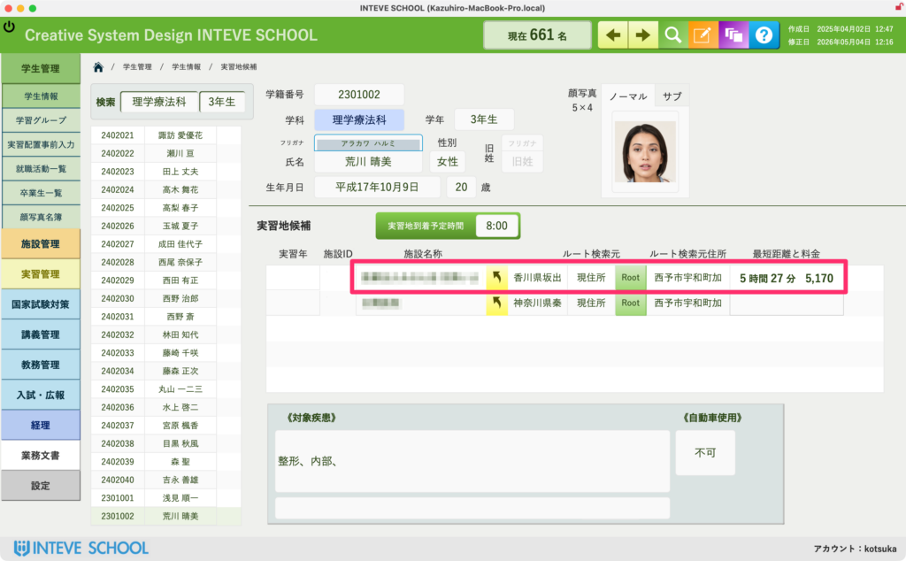
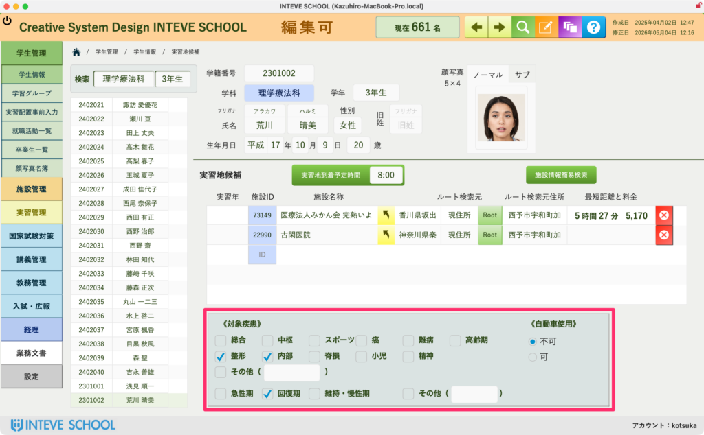
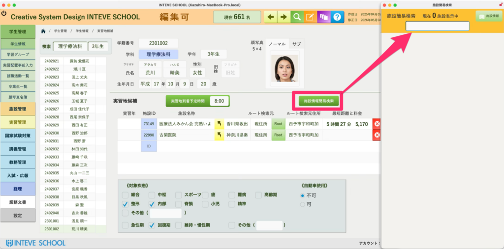
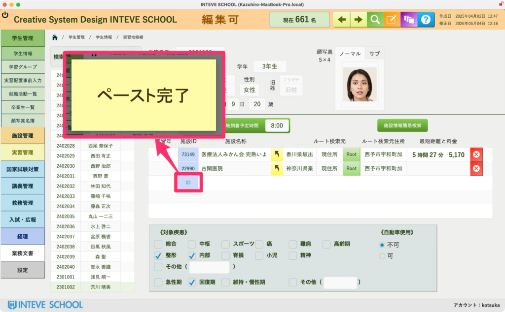

[← 学生管理ポータルに戻る](学生管理ポータル.md) | [メインページ](top.md)

# 学生情報 実習地候補

### 学生情報 実習地候補画面の使い方

この画面では、学生ごとに「どこの実習地（病院・施設）が候補になっているか」を管理します。  
本システム独自の「ワンクリック自動コピー＆ペースト機能」により、複雑なコードの入力や手書きでのメモをすることなく、簡単な数ステップで実習地を登録・確認することができます。

#### 📊 1. 通勤ルート・所要時間の確認（1枚目）

一覧には、現在候補になっている施設がズラリと表示されます。  
ここでは、指定した**「ルート元（自宅 / 帰省先 / 親戚宅など）」から対象施設までの「移動時間」や「公共交通機関の料金」**がリアルタイムに表示されます。学生に無理のない実習先を選定する重要な指標となります。  
※サンプルの数値はダミーデータです。

**仮配置シミュレーションへの活用：**  
ここに学生の希望条件や施設データを正しく紐づけておくことで、後に全体の**「実習仮配置機能」**を実行した際、システムが裏側で自動的に最適な実習先をマッチングしてくれます。  
（※仮配置全体の詳しい操作手順は \[[実習仮配置機能マニュアルへ](実習管理-実習仮配置.md)\] をご覧ください）

#### 🛠️ 2. 実習地（施設）の追加・登録手順（2〜6枚目）

新しく実習地候補を追加する場合は、以下の「ワンクリック連携機能」を使って登録を行います。

1. **「編集モード」をONにします。**  
    ※編集モードの共通ルールは \[編集モードへの切り替え方法（リンク）\] をご覧ください。
2. **「施設情報簡易検索」ボタンをクリックします（2枚目）。**  
    クリックすると、別ウィンドウで「施設一覧（検索）」画面が立ち上がります。

3\. **施設を検索し、「施設ID」をクリックしてコピーします。**  
上部の検索フィールドにキーワードを入れて目的の施設を探します。該当する施設の左端にある**「施設ID（赤枠部分）」をカチッとクリック**するだけで、画面に「コピー完了」と表示され、システムがIDを自動記憶します。

4\. **元の画面のフィールドを叩いてペーストします。**  
元の「実習地候補」画面に戻り、追加したい行の**「施設ID（同じ色のフィールド）」をカチッとクリック**します。すると画面に「ペースト完了」と表示され、先ほど選んだ施設の情報が名前や住所も含めてパチッと一瞬で自動入力されます。

💡 各機能の詳細な仕様や、さらに詳しい操作方法については \[[実習地候補：詳細マニュアルへ](学生情報-実習地候補-詳細-2.md)\] をご覧ください。

---
[← 学生管理ポータルに戻る](学生管理ポータル.md) | [メインページ](top.md)
