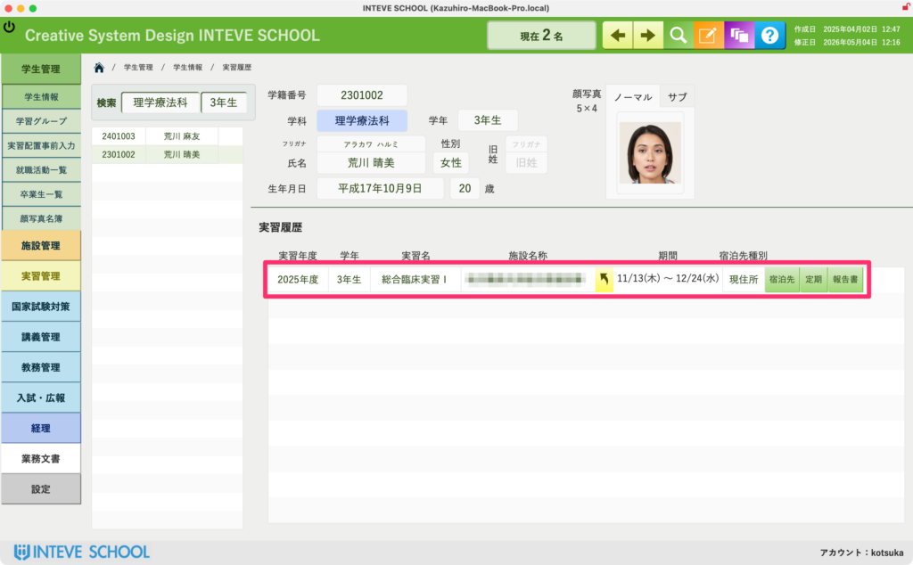

[← 学生管理ポータルに戻る](学生管理ポータル.md) | [メインページ](top.md)

# 学生情報 実習履歴

### 学生情報 実習履歴画面の使い方

この画面では、その学生が過去（または現在）に参加したすべての実習履歴を一覧で確認することができます。  
実習の時期や場所だけでなく、実習中の交通手段や教員の訪問記録など、実習管理に必要なあらゆる詳細データへここからダイレクトにアクセスできます。

#### 📊 実習履歴の参照エリア

画面中央のピンクの枠内には、実習担当システムから連動した正確な履歴が表示されます。

#### 🔗 各種詳細データへのダイレクトリンク

履歴の右側にある各ボタン（黄色のアイコンなど）をクリックすると、詳細を確認することができます。

- **宿泊先種別 / 定期**：実習当時の学生の宿泊場所（現住所・宿泊先など）や、通学のための定期券の利用状況をすぐに確認できます。
- **報告書（訪問報告書）**：指導教員が実習先を訪問した際に作成した「訪問報告書」のデータをその場で開いて閲覧できます。  
    ※訪問報告書の詳しい内容については、\[実習管理：訪問報告書マニュアルへ（リンク予定）\] をご覧ください。

#### 🚨 注意点（この画面からは入力はできません）

この画面は、大元の「実習管理」システムで決定・入力されたデータが自動的に反映される「閲覧・確認専用」の場所です。

そのため、**この画面内から直接実習先を書き換えたり、日付を変更したりすることはできません。** 過去や現在の実績を安全に「確かめる窓口」としてご活用ください。

---
[← 学生管理ポータルに戻る](学生管理ポータル.md) | [メインページ](top.md)
