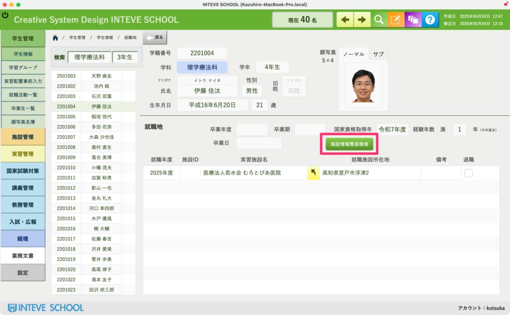
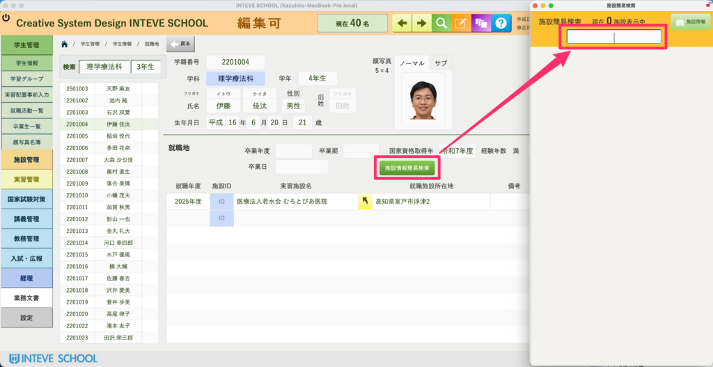
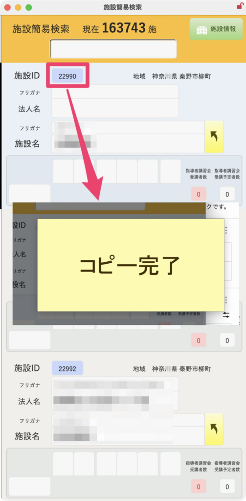
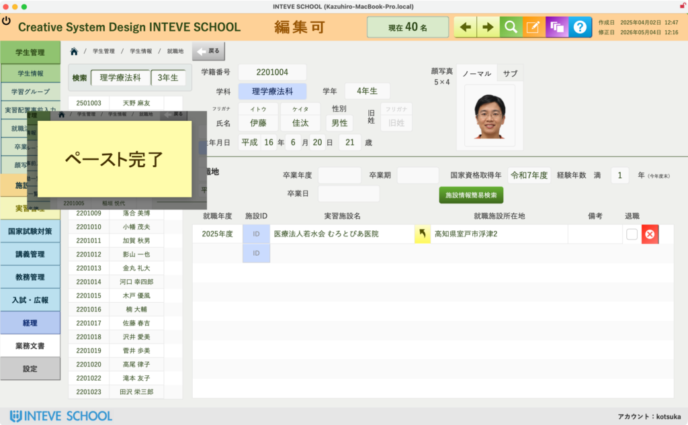

[← 学生管理ポータルに戻る](学生管理ポータル.md) | [メインページ](top.md)

# 学生情報 就職地

## 🏢 学生情報 就職地の使いかた（個別登録・変更）

学生の卒業時の就職先、および卒業後の転職情報を管理する画面です。

💡 **あらかじめ知っておいてほしいこと：** 在学中の「[就職活動](学生情報-就職活動-一覧.md)」の記録が正しく入力されていれば、卒業時にシステムが一括して就職地へデータを引き継ぎます。そのため、**この画面から手動で登録する機会はそれほど多くありません。**

主に「卒業後に転職した連絡が入った」など、個別にデータを追加・修正したい場合に使用します。

### 🔍 登録したい施設（法人）を検索する

画面中央にある **「施設情報簡易検索」** ボタンを押します。

- 別ウィンドウで施設検索の画面が立ち上がります。

### 📋 施設IDのコピー

目的の施設が見つかったら、その施設名の横にある **「ID（青色のボタン）」** をクリックします。

- クリックすると、その施設の固有IDがパソコンのクリップボードに自動でコピーされます（画面に「コピー完了」と表示されます）。

### 💾 就職地レイアウトへのペースト（登録）

元の学生画面に戻り、就職先を入力したい行の **「施設ID」** の入力欄（またはペースト用のエリア）をクリックします。

- 「ペースト完了」の文字とともに施設情報が自動で呼び出され、登録が完了します。
- ⚠️ **注意（データの書き換えについて）：** 転職情報の登録などで新しい施設を登録する際は、過去の新卒時の就職実績データを上書き消去してしまわないよう、システムのレコード追加手順に従って正しく入力を行ってください。

---
[← 学生管理ポータルに戻る](学生管理ポータル.md) | [メインページ](top.md)
