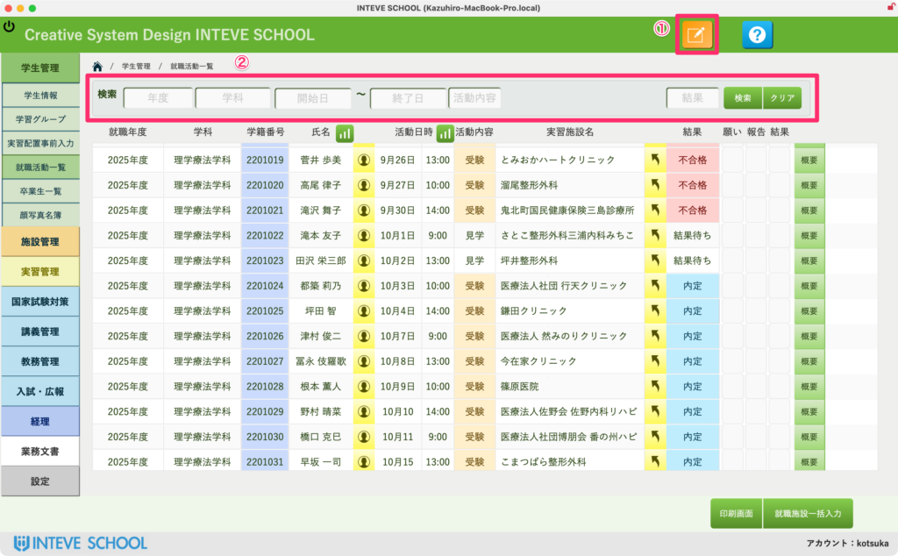
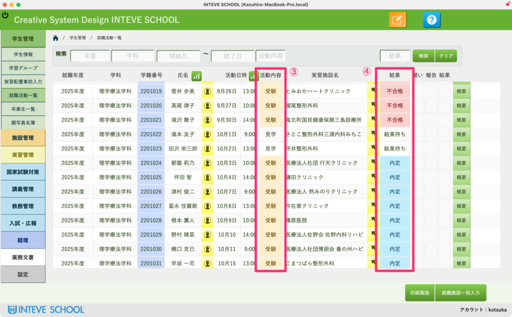
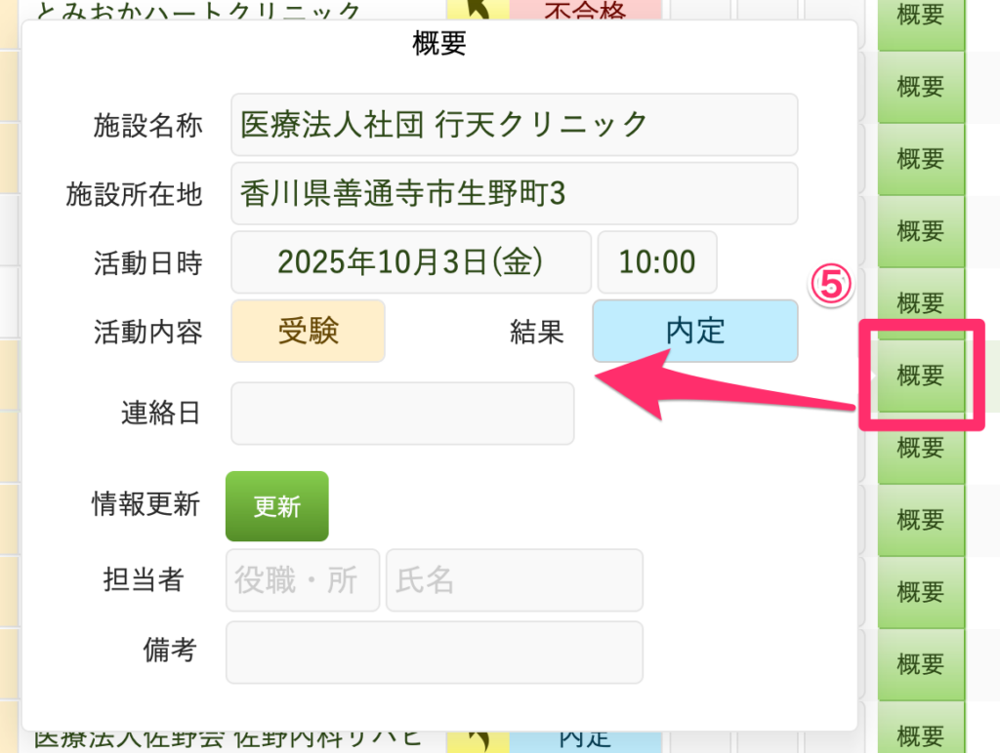
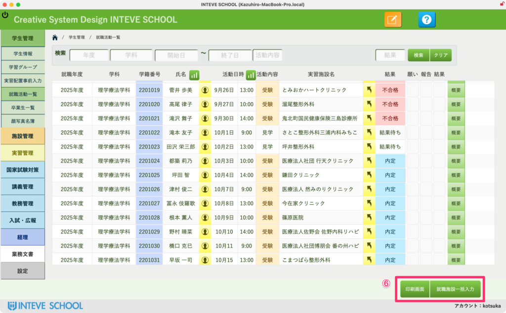

[← 学生管理ポータルに戻る](学生管理ポータル.md) | [メインページ](top.md)

# 学生情報 就職活動 一覧

## 就職状況画面の使い方

この画面では、学生たちの就職活動の進捗状況（内定先、活動ステータス、試験日など）を一覧で確認・管理します。学年全体の就職実績や進行状況をリアルタイムに把握するのに最適な画面です。

> ⚠️ **入力に関する重要なお知らせ：** 本画面は一覧での確認や一括操作をメインとした画面です。**新規の学生情報や施設情報をこの画面から新しく追加・登録することはできません。** 新規データの追加や、各学生のより詳細な就職活動記録の入力は、別途 **`[<a href="学生情報-就職活動.md">学生情報 就職活動</a>]`** レイアウトにて行います。
> 
> 
> 
> ### 💼 就職状況の確認と編集手順
> 
> **① `[<a href="編集モードへ.md">編集モードへ</a>]`ボタンをクリックする** 画面左上の `[編集モードへ]` ボタンをクリックして、データの入力や編集、各種ボタン操作が可能な状態にします。
> 
> **② さまざまな条件で学生を検索・絞り込む** 画面上部の検索エリアを使い、「学科」「学年」だけでなく「就職ステータス（内定/活動中など）」など、様々な条件を組み合わせて対象の学生リストを自由に絞り込むことができます。

**③・④ 一覧画面上で直接データを編集する** 絞り込まれた学生リストの行内で、それぞれの「活動内容」や「試験日」「結果」などのステータスを、一覧画面から直接ポチポチと手軽に編集・更新することができます。

**⑤ 詳細な情報を編集する** より細かい進捗内容や詳細情報を編集したい場合は、該当する学生の行にある ⑤ のエリアからスムーズに入力・修正を行うことができます。

**⑥ 印刷・就職先テーブルへの一括入力を行う** 画面右上のボタンエリアから、以下の便利な一括操作が実行できます。

- **一覧印刷：** 現在画面に表示されている就職状況リストを、そのまま綺麗な帳票として印刷・PDF出力します。
- **就職先一括入力：** 内定が確定した学生たちの情報を、確定データとして「就職先テーブル」へワンクリックで一括反映・移行させることができます。

---
[← 学生管理ポータルに戻る](学生管理ポータル.md) | [メインページ](top.md)
