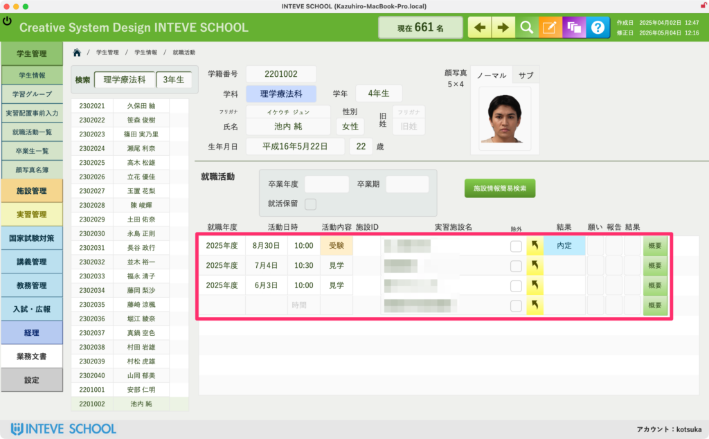
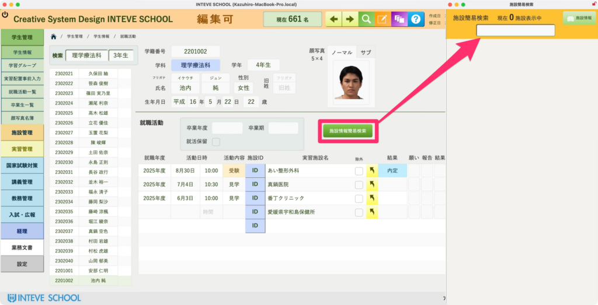
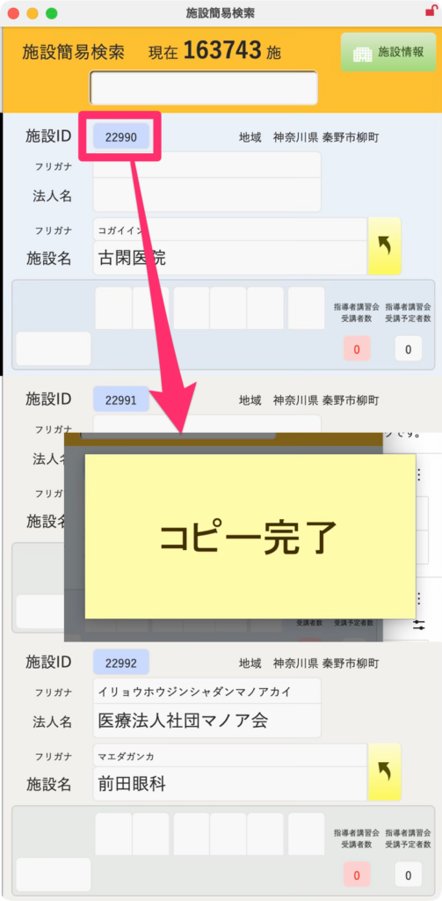
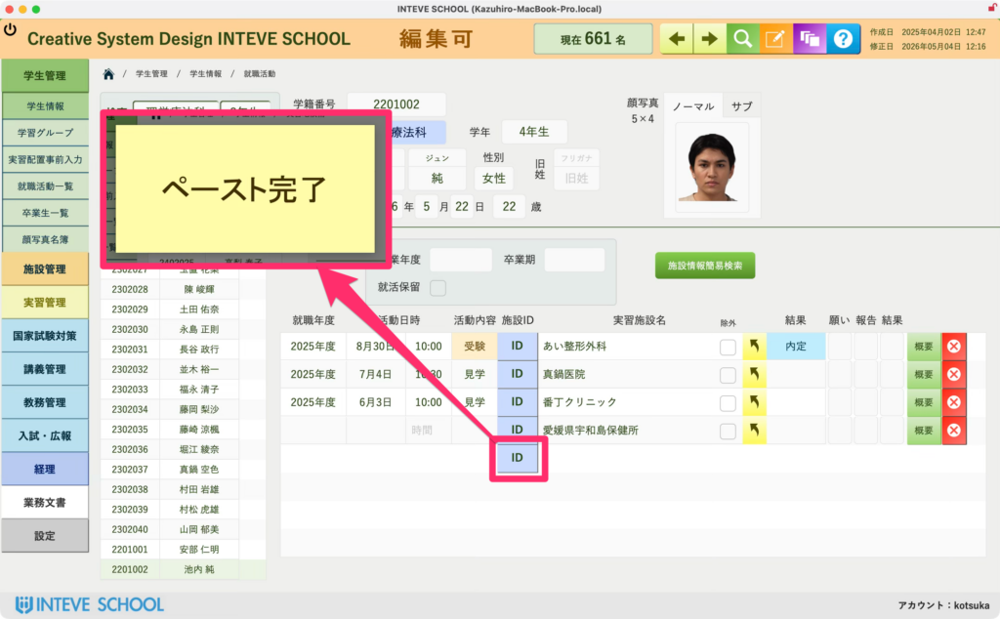
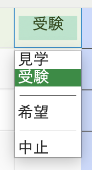
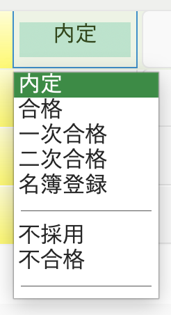

[← 学生管理ポータルに戻る](学生管理ポータル.md) | [メインページ](top.md)

# 学生情報 就職活動

### 学生情報 就職活動画面の使い方

この画面では、学生ごとの「就職活動の履歴（どこの施設に、どのような動きをしているか、その結果はどうだったか）」を時系列で管理します。  
ここで蓄積されたデータが、学校全体の就職内定率の集計や、次年度以降の学生への就職指導の貴重なデータベースとなります。

#### 🛠️ 1. 就職活動（施設）の追加・登録手順

新しく就職活動の履歴を追加する場合は、以下の手順で施設の登録を行います。

1. **「編集モード」をONにします。**  
    ※共通ルールは \[[編集モードへの切り替え方法](編集モードへ.md)\] をご覧ください。
2. **「就職先簡易検索」ボタンをクリックします。**  
    別ウィンドウで「施設一覧（検索）」画面が立ち上がります。

3. **施設を検索し、「施設ID」をクリックしてコピーします。**  
    目的の施設を見つけたら、左端にある**「施設ID」をカチッとクリック**すると「コピー完了」となります。

4. **元の画面の「施設ID」フィールドを叩いてペーストします。**  
    元の画面に戻り、追加したい行の**「施設ID（同じ色のフィールド）」をカチッとクリック**すると「ペースト完了」となり、施設名や住所が一瞬で自動入力されます。

#### 📊 2. 活動内容と結果内容の記録

施設が登録されたら、以下の重要項目を正しく入力・更新していきます。

**活動内容（進捗のステータス）**  
「見学」「説明会」「受験中（1次面接・2次面接など）」といった、現在の具体的なアクションを選択・記録します。今その学生がどこまで進んでいるかを担任や就職担当がリアルタイムに把握するために重要です。

**結果内容（合否・最終ステータス）**  
「内定」「不採用」「辞退」などの最終的な結果を選択します。  
学生が「内定」に決まった際は、ここに正しい結果を入れることで、システム全体の「内定者一覧」や「進路決定通知」などの各種集計へ全自動でデータが連動します。

---
[← 学生管理ポータルに戻る](学生管理ポータル.md) | [メインページ](top.md)
