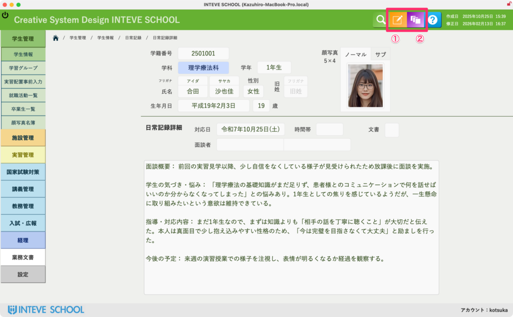

[← 学生管理ポータルに戻る](学生管理ポータル.md) | [メインページ](top.md)

# 学生情報 日常記録 詳細

### 日常記録 詳細画面の使い方

一覧画面で「詳細」ボタンをクリックすると、この詳細入力画面が開きます。  
一行の簡易入力とは異なり、指導した具体的な経緯や、学生・保護者との詳細なやり取りなどを、広いスペースで落ち着いて長文で記録・編集することができます。

#### ① 指導内容の入力・編集（編集モード）

画面中央の広いテキストエリアが、具体的な指導記録の入力スペースです。

- **操作方法：** 画面右上にあるオレンジ色の**「編集モード」ボタン**を押すと編集可能状態になり、文字を入力できるようになります。入力を終えたら、もう一度ボタンを押して解除（保存）してください。  
    ※編集モードの詳しい共通ルールは、\[[編集モードへの切り替え方法](編集モードへ.md)\] をご覧ください。

#### ② 過去の変更履歴の確認（編集ログ）

長文の記録を何度も書き換えた場合でも、裏側で自動的に履歴が蓄積されています。

- **操作方法：** 画面右上にある紫色の**「編集ログ」ボタン**をクリックすると、この詳細記録が「いつ、誰によって、どのように修正されたか」の履歴を確認できます。  
    ※編集ログの詳しい見方は、\[[編集ログ（変更履歴）の確認方法](編集ログの確認.md)\] をご覧ください。

---
[← 学生管理ポータルに戻る](学生管理ポータル.md) | [メインページ](top.md)
