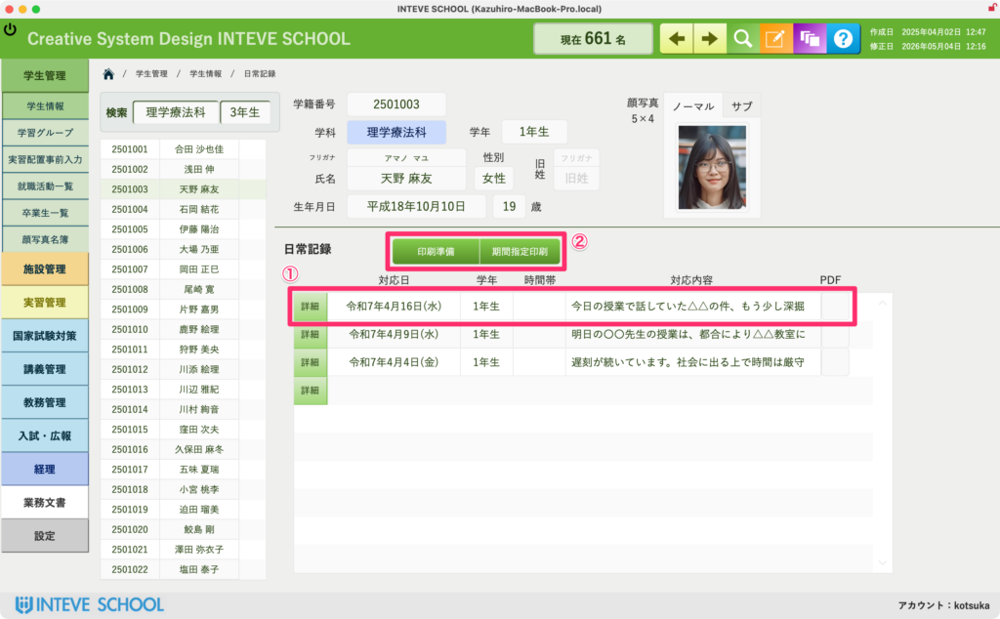
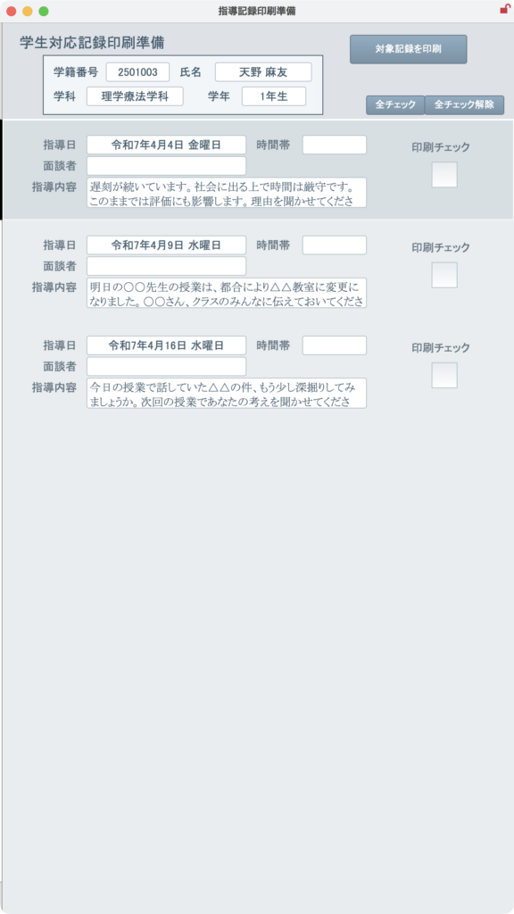
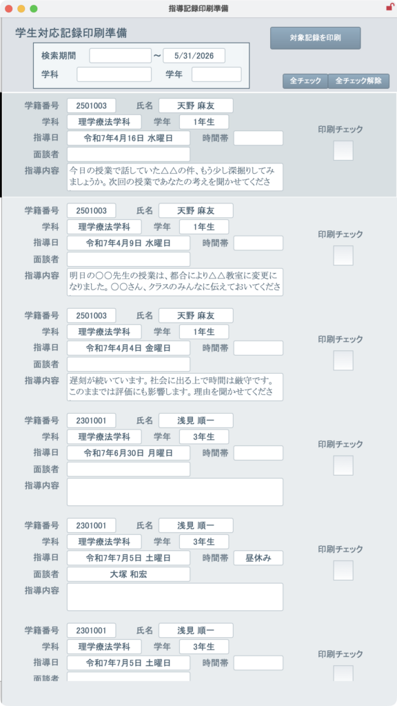

[← 学生管理ポータルに戻る](学生管理ポータル.md) | [メインページ](top.md)

# 学生情報 日常記録

### 学生情報 日常記録画面の使い方

この画面では、学生の日々の指導内容や気になる言動などを「日記」のように時系列で蓄積していくことができます。  
頻繁に使う画面ではないかもしれませんが、万が一のトラブル対応や、保護者面談などの際に「いつ、どのような事象や指導があったか」を正確に説明するための強力なエビデンス（証拠資料）となります。そのため、日頃から些細なことでもこまめに入力しておくことを強くお勧めします。

#### ① 日常記録の新規追加・詳細入力

画面真ん中のリストには、これまでの記録が新しい順に一覧表示されています。

- **新規追加の方法：** 画面右上にあるオレンジ色の「編集モード」ボタンを押すと、新しい行が追加できるようになり、日付やタイトル（要約）の簡易入力が可能になります。
- **詳しい内容の入力（詳細画面へ）：**  
    各記録の左端にある**「詳細」ボタン**をクリックすると、その記録のより詳しい本文を入力・閲覧するための「詳細画面」へジャンプします。  
    ※詳しい入力方法については、[\[日常記録（詳細）のマニュアルへ\] ](学生情報-日常記録-詳細.md)をご覧ください。

### 日常記録の印刷方法（印刷準備画面の使い方）

**操作方法：**  
このボタンをクリックすると、これまで蓄積された日常記録を、保護者面談や学内会議でそのまま配布できる美しいレイアウトで**まとめて一括PDF出力**することができます。

画面上部にある「印刷準備」や「期間指定印刷」ボタンを押すと、印刷する記録を細かくコントロールできる専用のポップアップ画面が立ち上がります。  
用途に合わせて「特定の学生の履歴」や「特定の期間の記録一覧」を自由に出力することができます。

#### 2つの印刷パターン

・**特定の学生の時系列印刷（個人カルテ用）：**  
対象の学生が選ばれた状態で画面を開くと、その学生の過去の指導記録だけが時系列順にズラリと表示されます。保護者面談用の資料に最適です。

・**期間や学科を指定した一覧印刷（週報・月報用）：**  
最上部の検索エリアで「検索期間」や「学科」「学年」を指定することで、例えば「今週1週間で面談を行った学生の一覧」といったクロス検索によるリスト出力が可能です。

---
[← 学生管理ポータルに戻る](学生管理ポータル.md) | [メインページ](top.md)
