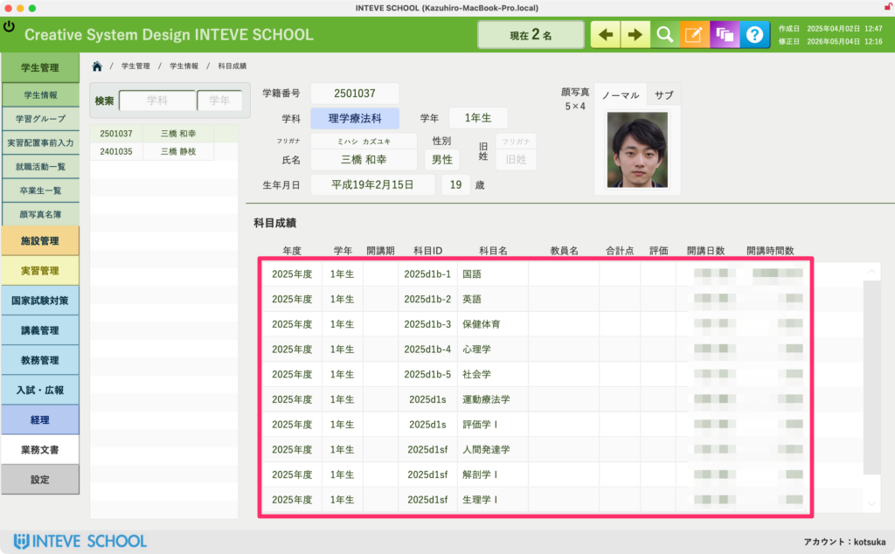

[← 学生管理ポータルに戻る](学生管理ポータル.md) | [メインページ](top.md)

# 学生情報 科目成績

### 学生情報 科目成績画面の使い方

この画面では、学生の日々の通常カリキュラムにおける「定期試験の成績」や「授業の出席・欠席データ」を一覧で確認することができます。  
※本機能は「講義管理・教務管理」をご契約いただいている学校様のみデータが反映されます。未契約の場合は画面は表示されますが、データは連動しません。

#### 📊 科目成績・出席データの参照エリア

画面下部のピンクの枠内には、各年度・各学期で履修している科目のデータが自動的に表示されます。

- **成績の確認**：科目ごとの「合計点」や「評価（優・良・可／単位修得の有無）」がリアルタイムに連動します。
- **出席状況の確認**：各科目の「開講日数」に対して、その学生の「出席・欠席・公欠・遅刻」などの時間数が自動集計されて表示されます。

💡 留年の危機にある学生の早期発見や、保護者面談の際に出席率の推移を元にした正確な生活指導を行うための、最も身近で強力なデータベースとしてご活用いただけます。

---
[← 学生管理ポータルに戻る](学生管理ポータル.md) | [メインページ](top.md)
