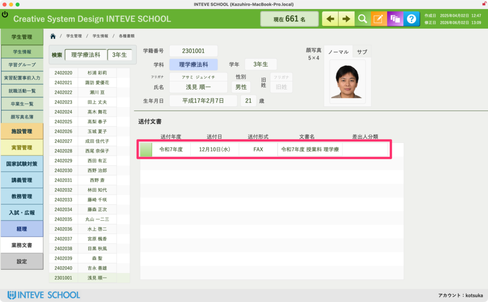

[← 学生管理ポータルに戻る](学生管理ポータル.md) | [メインページ](top.md)

# 学生情報 送付文書

### 学生情報 送付文書画面の使い方

この画面では、その学生（または保護者）に対して、過去にどのような書類や案内が発送されたかという「送付履歴」を一覧で確認することができます。  
「あの書類、いつ発送したっけ？」と確認したい時や、保護者からの問い合わせにスムーズに対応するための振り返り画面として活用してください。

#### 📊 送付履歴の参照エリア

画面中央のピンクの枠内には、これまでの発送実績が自動的に表示されます。

- **送付年度 / 送付日**：書類が実際に発送された（またはシステムから出力された）日付です。
- **送付形式**：宛名ラベルや窓付き封筒用など、どのような形式で出力されたかが分かります。
- **文書名**：発送された具体的な書類の名称（例：令和7年度 授業料 振込のご案内 など）が表示されます。

#### 🚨 注意点（この画面からは発送や入力はできません）

この画面は、一括発送システムや事務方のマスターデータから自動的に流れてきている情報を表示する「閲覧・確認専用」の場所です。

そのため、**この画面内から直接新しい文書を追加したり、日付や文書名を書き換えたりすることはできません。** 過去に送ったものを安全に「確かめる場所」としてご活用ください。

---
[← 学生管理ポータルに戻る](学生管理ポータル.md) | [メインページ](top.md)
