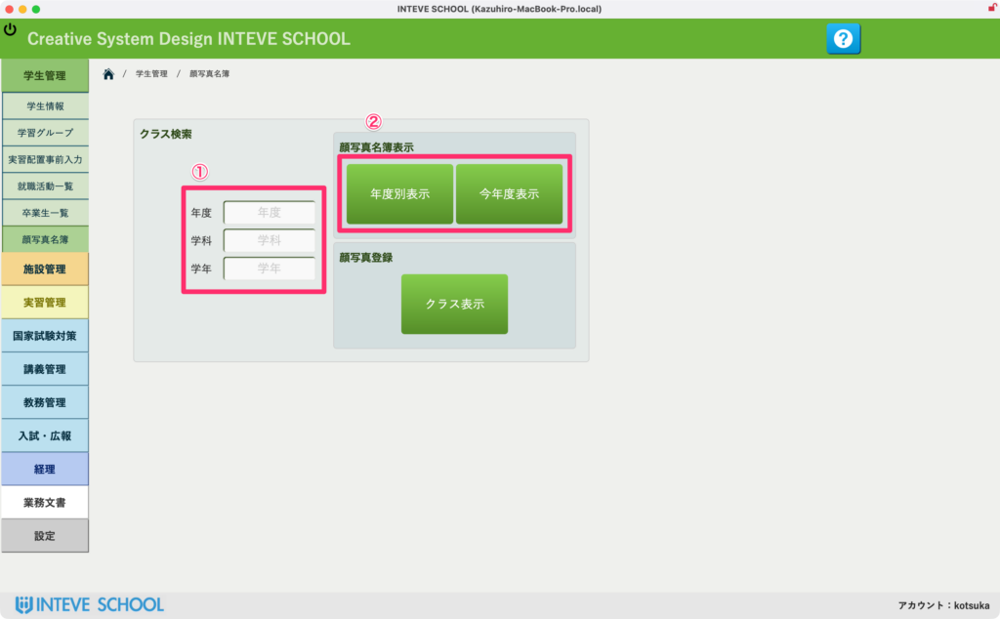
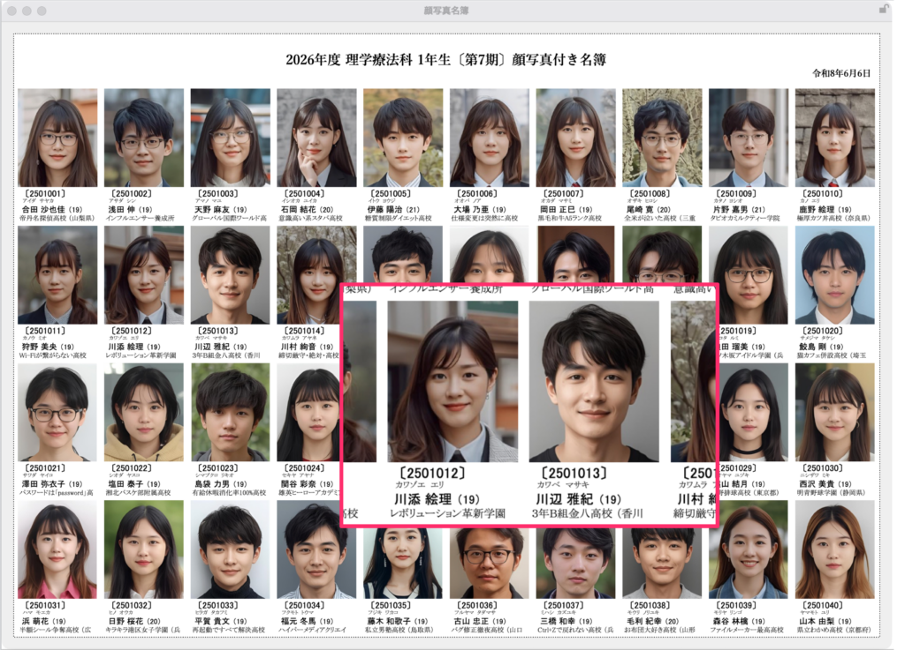
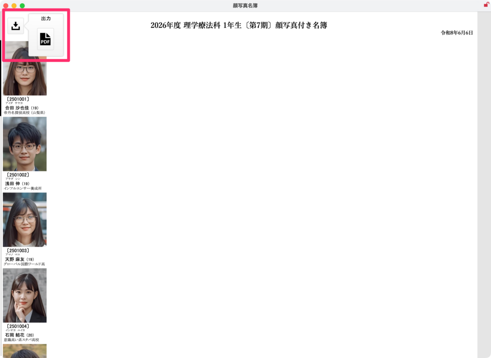

[← 学生管理ポータルに戻る](学生管理ポータル.md) | [メインページ](top.md)

# 学生情報 顔写真名簿 ポータル

## 📝 「学生情報 顔写真名簿 ポータル」マニュアル原稿案

WordPressの編集画面にそのまま貼り付けられる構成テキストです。

> ## 📸 学生情報 顔写真名簿の使いかた
> 
> クラスごとの学生の顔写真付き名簿を表示・出力する画面です。新学期のクラス把握や、教職員間での情報共有に活用できます。
> 
> ### 📝 ① クラス（対象）の指定
> 
> 画面左側の入力エリアを使って、表示したいクラスを指定します。
> 
> - **「年度」「学科」「学年」** をそれぞれ入力・選択してください。
> 
> ### 🟢 ② 名簿の表示（年度別 / 今年度）
> 
> 条件を指定したあと、右側の緑色のボタンで表示形式を選びます。
> 
> - **「今年度名簿」ボタン：** 通常はこちらを使用します。現在の最新データに基づいた名簿が一発で表示されます。
> - **「年度別名簿」ボタン：** 過去の卒業生や、特定の過去年度の名簿を振り返って確認したい場合は、こちらを押してください。
> 
> *(※顔写真の登録方法については、こちらの【[リンク：学生情報 写真取込](学生情報-写真取込.md)】をご覧ください)*

### 🔍 実際の表示画面（名簿内容）

条件を指定して進むと、顔写真付きの一覧画面が開きます。

- 各学生の **「学籍番号」「氏名」「年齢」「出身校」** が顔写真とともに一覧で確認できます。拡大して細かくチェックすることも可能です。

### 📄 ③ PDFでの出力

画面左上の **「出力/PDFアイコン」** をクリックします。

- 現在表示されている顔写真名簿を、そのままPDFファイルとして保存・印刷することができます。
- ⚠️ **注意：** お使いのパソコンの環境によっては、PDF出力時に画像が正しくレンダリングされない（白く抜ける）場合があります。その際は、ブラウザやOSのアップデート状況をご確認いただくか、管理者までご連絡ください。

---
[← 学生管理ポータルに戻る](学生管理ポータル.md) | [メインページ](top.md)
