[← 実習管理ポータルに戻る](実習管理ポータル.md) | [メインページ](top.md)

# 実習管理 実習仮配置 詳細

📌 本ページの見出し（目次）  
画面をスクロールするか、各リンクをクリックして目的の項目へ進んでください。

- [\[1. 魔法のボタンで「配置の叩き台」を自動生成する\]](#step1)
- [\[2. 「施設基準レイアウト」の見方と便利マーク\]](#step2)
- [\[3. ドラッグ＆ドロップ感覚！直感的なパズル調整（移動機能）\]](#step3)
- [\[4. API連携：通勤ルート検索 ＆ 周辺宿泊施設の自動抽出\]](#step4)
- [\[5. 「学生基準レイアウト」によるクラス全体の不公平感・バランスの視認\]](#step5)
- [\[6. パズル完成！実習データへの正式反映\]](#step6)

🚀 1. 魔法のボタンで「配置の叩き台」を自動生成する

実習仮配置ポータル画面から **\[実習仮配置表示\]** ボタンをクリックすると、最初はまだ空っぽのベース画面（1枚目の画像）が開きます。

1. 数秒待つと、「施設基準レイアウト」（2枚目）と「学生基準レイアウト」（3枚目）の2つのウィンドウに、超高精度な配置の叩き台がズラリと自動生成されます。
2. 画面上部にある **\[実習仮配置 作成・更新\]** ボタンをクリックします。
3. システムが裏側で、通学距離、宿泊要件、双方のマッチング要件、AIアルゴリズムを総動員して計算を開始します。

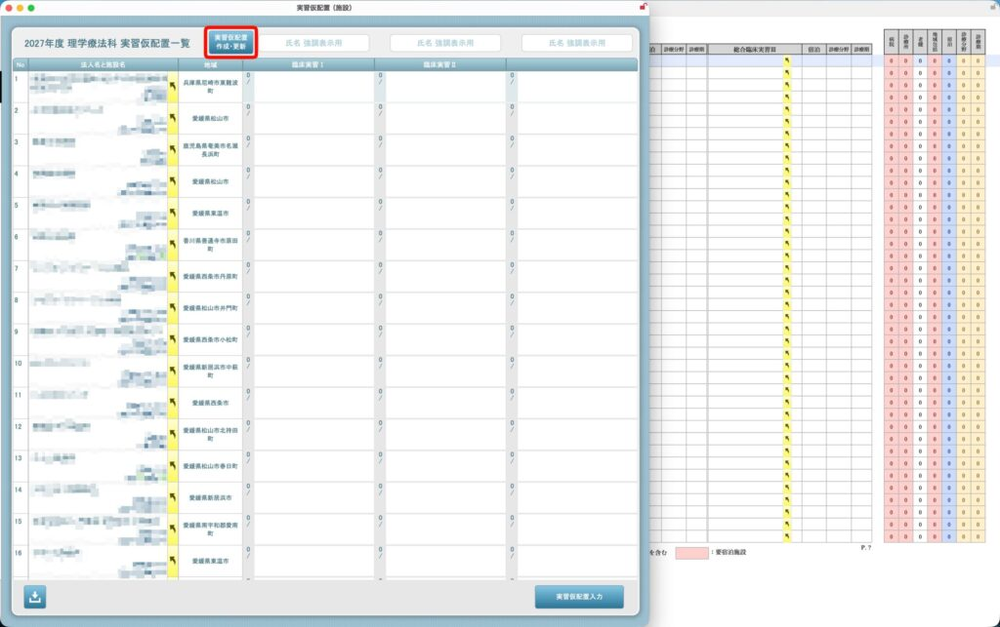

自動生成後の状態①：施設ベースのレイアウト

ボタンをクリックすると、まずは各実習施設に対して「どの学生が・どの期間に配置されたか」が自動的に割り当てられます。受入枠の残り数や、学生の通勤距離（キロ数）もこの段階で自動算出されています。

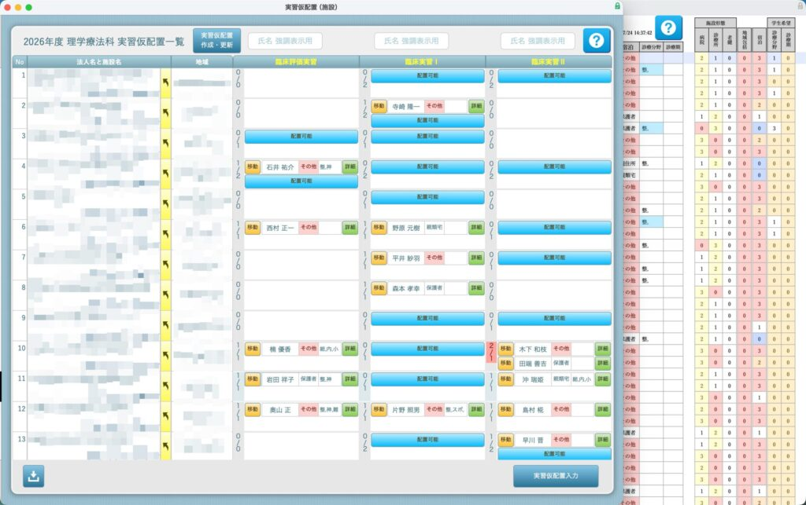

✨ 自動生成後の状態②：学生ベースのレイアウト

それと同時に、裏側では学生一人ひとりをベースにした横断レイアウトも自動生成されています。各学生が3つの実習期を通じて「希望する診療分野に当たっているか」「ホテル宿泊の負担が偏っていないか」が、すべてリアルタイムに連動して可視化されます。

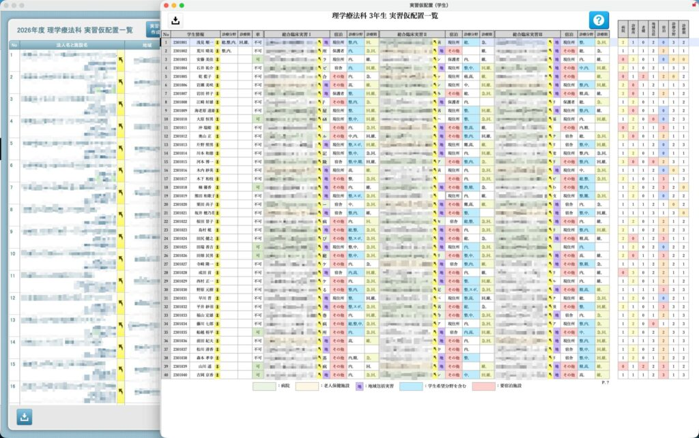

🏠 2. 「施設基準レイアウト」の見方と便利マーク

4枚目の画面は、各実習施設をベースに誰が配置されたかを確認する画面です。実習は主に3つの期間（期）に分かれており、左から順に並んでいます。

**① 配置学生の可視化：** 例として、赤枠内では「2つ目の実習期」に2人の学生が自動配置されていることが一目でわかります。

**② 受入数と超過アラート（分数表示）：** `[配置された学生数 ／ 施設が承認してくれた受入枠数]` をリアルタイムに表示します。もし受入枠を超過して配置された場合は、一目で認識できるようになっています。

**③ 通勤元ステータスと距離の自動算出：** 学生がどこから通うか（現住所・帰省先・その他）を表示。その他（レオパレスや宿舎など）の場合は、宿泊先手配が必要なことが事前に分かります。また、API連携により、**その住所から実習地までの正確な「距離（キロ数）」が自動算出**されて表示されます。

**④ ルート・宿泊詳細ボタン：** 後述する、NAVITIMEやBooking.comのAPIと連携した詳細情報を開くボタンです（6枚目の画像）。

**⑤ 配置可能ボタン：** 後述する、学生の配置施設を移動させられる“枠”に表示されます（実習の受入数よりも、現在の配置数が少ない場合に表示される）。

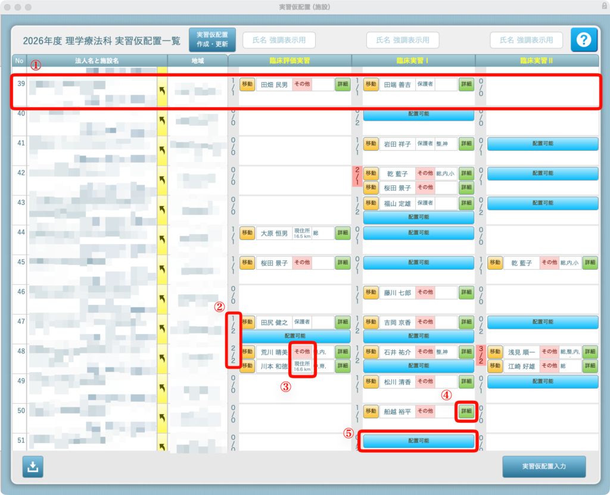

🧩 3. ドラッグ＆ドロップ感覚！直感的なパズル調整（移動機能）

AIが作った叩き台をベースに、教員が手動で学生を入れ替える（パズルをする）のも一瞬です。

1. 動かしたい学生の横にある **\[移動\]** ボタンをクリックします。選択された学生の情報がグレーアウトし、移動モードになります。
2. リストをスクロールすると、受入数にまだ余裕がある（空き枠のある）施設に **\[配置可能\]** ボタンが自動出現します。
3. 目的の施設の **\[配置可能\]** ボタンをクリックするだけで、一瞬で学生の配置換えが完了します。

💡 **連動性：** ここで移動を行うと、裏側で開いている「学生基準レイアウト（3枚目）」の配属施設名もリアルタイムに自動更新されます。

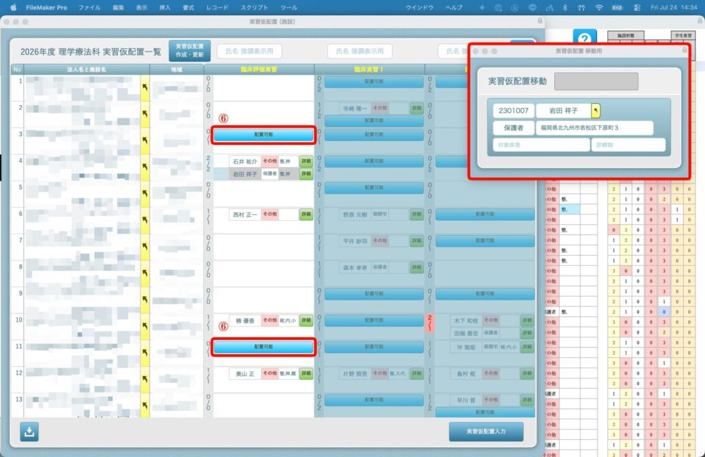

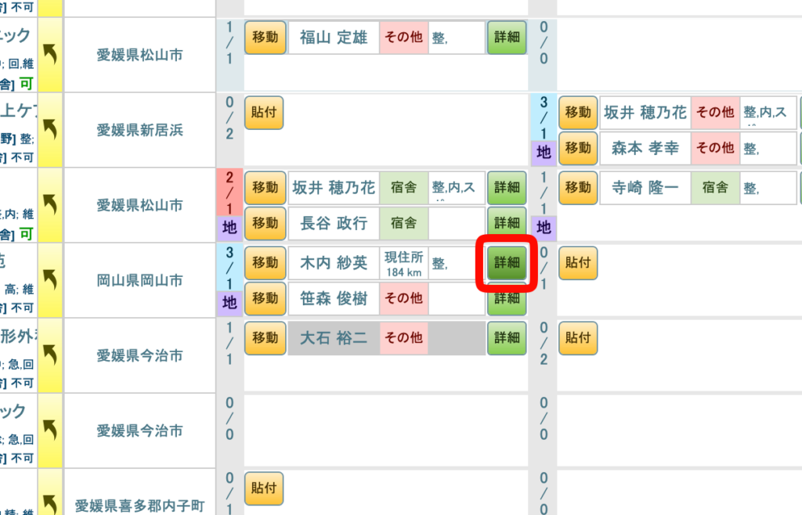

🗺️ 4. API連携：通勤ルート検索 ＆ 周辺宿泊施設の自動抽出

学生の移動を検討する際、一番気になる「本当に通えるか？」「宿はあるか？」を画面を切り替えずに1秒で確認できます（左赤枠の「移動」ボタンよりポップアップ表示）。

**🚌 左の画像：【ルート検索】タブ（公共交通機関）** NAVITIMEのAPIとリアルタイム連携。現住所や帰省先、親戚の家から実習地までの「優先ルート5件」の概要・最短時間・最安料金を自動でまとめて提示します。

**🏨 右の画像：【宿泊】タブ（ホテル・宿舎検索）** 遠方のため宿泊が必要な学生の場合、Booking.comやGoogleのAPIを使い、**実習地周辺の宿泊施設、1泊の料金、実習地からの距離**を一覧表示。ワンタップで宿泊施設の公式URLへアクセスして詳細を確認することも可能です。

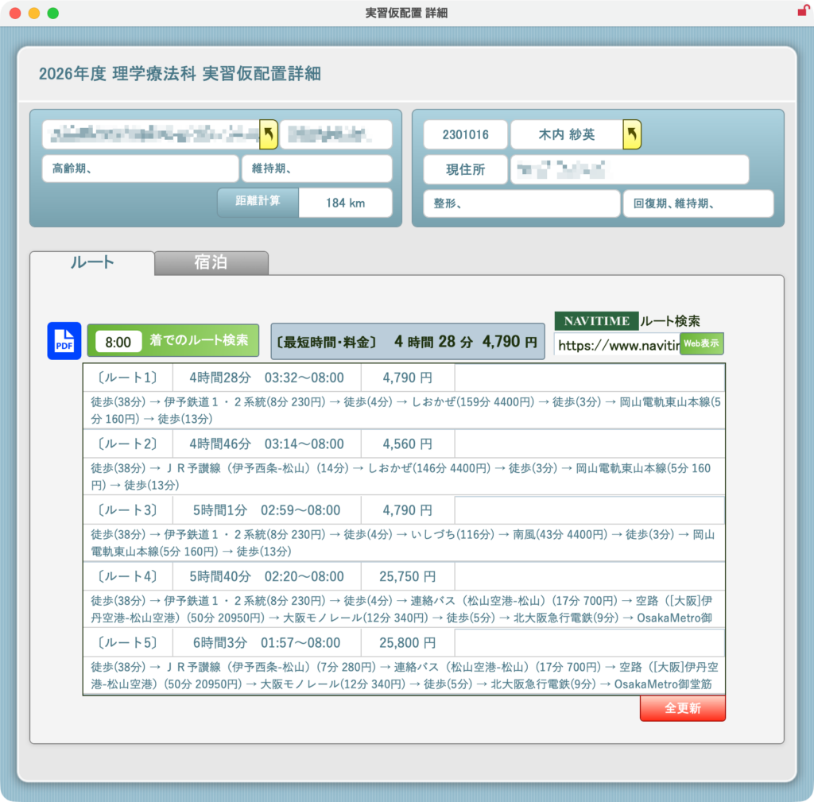

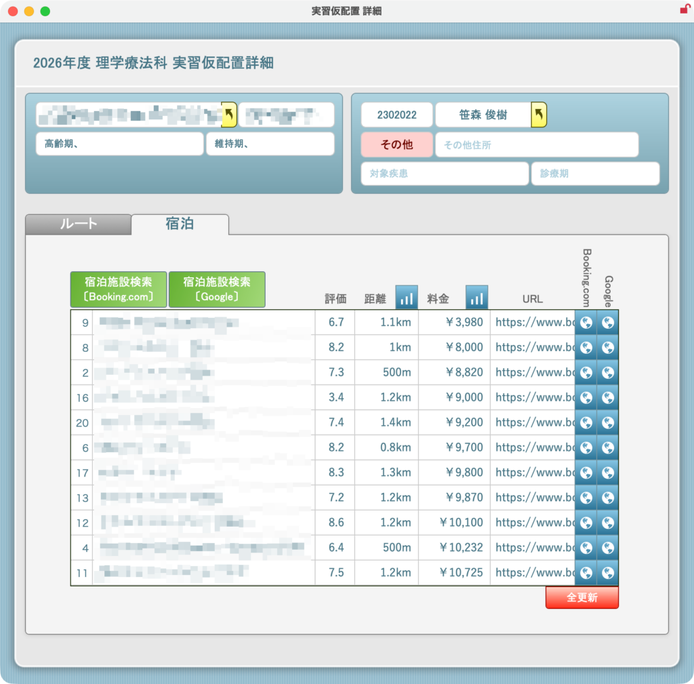

📊 5. 「学生基準レイアウト」によるクラス全体の不公平感・バランスの視認

下の画面は、学生一人ひとりをベースに「3つの実習がどう割り当てられたか」を横断的に監視する画面です。

クラス全体のバランスや不公平感をなくすため、以下の要素を完全に自動計算して「色分け（カラーマネジメント）」しています。

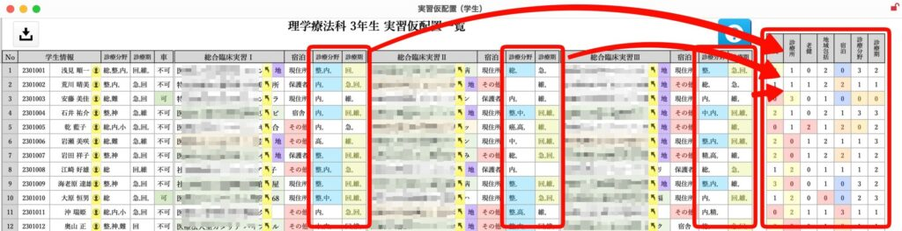

**実習地形態のバランス：** 病院、診療所、老健などの割り当て回数

**環境のバランス：** ホテル生活（宿泊）をする回数、自宅から通える回数

**希望との合致：** 学生が希望する「診療分野」「診療期」と、施設側の属性が合致している回数

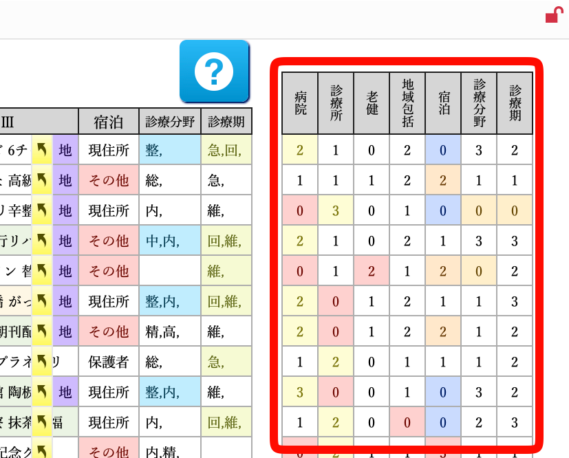

🎯 **調整のゴール：** 例えば「A君は3回とも希望通りなのに、B君は1回も希望が叶っていない」「C君だけ3回ともホテル生活で負担が大きい」といった不公平さが、カラーセルによって一目瞭然になります。

**理想は「赤のセル（不公平・要調整）」がなくなること。** 施設側のウィンドウでパズルを動かしながら、この学生画面の色が綺麗に整っていくように調整を進めていきます。

### 💾 6. パズル完成！実習データへの正式反映

すべての配置調整が終わり、完璧な実習配置計画が完成したら、最終ステップです。

画面右下にある **\[実習仮配置入力\]** ボタン（11枚目の赤枠部分）をクリックします。

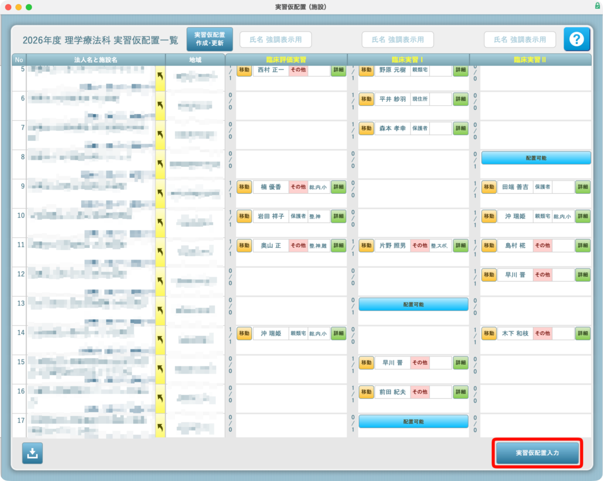

このボタンを押すことで、魂を込めて作った仮配置データが「本番の実習一覧データ」へ一括して正式に流し込まれ、全学年・全施設への反映が完了します！

また、それぞれのレイアウト（施設基準・学生基準）を配布用に出力することができます。それぞれのボタンを押してください。

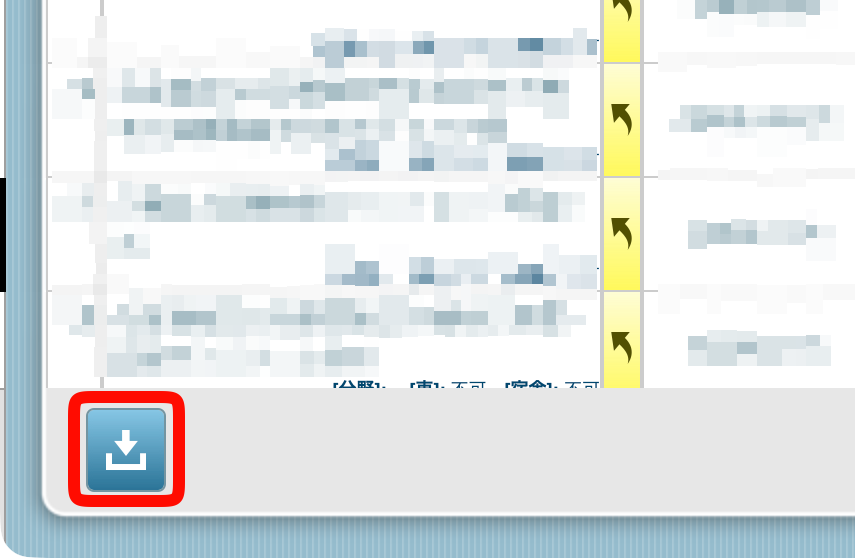

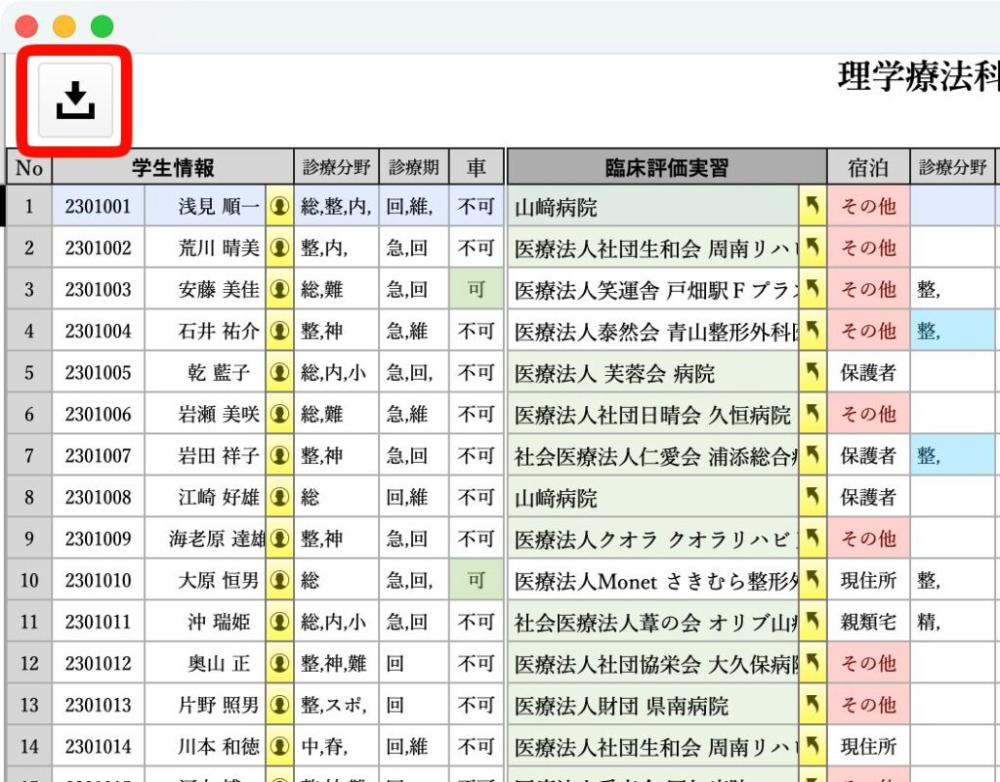

> 🔗 **次のステップへ：** \[[実習情報 ポータル](実習情報-ポータル.md)\]

---
[← 実習管理ポータルに戻る](実習管理ポータル.md) | [メインページ](top.md)
