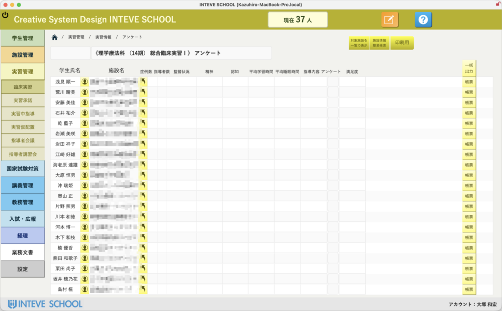

[← 実習管理ポータルに戻る](実習管理ポータル.md) | [メインページ](top.md)

# 実習情報 アンケート

# 📊 実習情報：アンケート収集とAIによる高度分析機能

臨床実習が1期終わるごとに実施される「指導者アンケート」。実習地からのフィードバックは、学生の成長を把握し、次期の実習環境を改善するために極めて重要なプロセスです。INTEVE SCHOOLでは、このアンケート業務を単なる「回収」で終わらせず、学校の財産となる「質の高いデータ」へと昇華させます。

### 📥 1. 回収と集計の完全自動化

多くの学校で手作業や外部ツール（Googleフォーム等）で行われているアンケート回収をシステム内で統合管理します。

- **数値・選択式データの自動集計:** 症例数、指導時間、睡眠時間、満足度といった数値データやプルダウン形式の回答は、回収と同時にリアルタイムで集計。教員が電卓を叩いたり、Excelに転記したりする時間はもう必要ありません。

### 🤖 2. 自由回答をAIが「整理・分析」

アンケートで最も重要なのは、指導者が書く「自由回答」の中身です。しかし、膨大なコメントをすべて読み解き、課題を整理するのは多大な労力を要します。

- **学生個人の課題抽出:** 指導者のコメントから、その学生が直面している具体的な課題や、強みをAIが自動で整理。
- **学校全体の課題特定:** 複数の施設からの指摘を横断的に分析し、「カリキュラムのどこを補強すべきか」「実習前指導で何を伝えるべきか」といった学校全体の改善ポイントをAIが示唆します。

### 🛠️ 3. 柔軟なカスタマイズとデータの資産化

実習アンケートの形式に「正解」はありません。だからこそ、INTEVE SCHOOLは高い自由度を持たせています。

- **独自の設問設計:** 数値・選択肢・テキスト入力など、学校のニーズに合わせて設問を自由にカスタマイズ。
- **「経験」を「資産」へ:** 過去のアンケート結果はすべて蓄積され、年度をまたいだ比較分析も可能です。単なる「実施」で終わらせていたアンケートが、教育の質を裏付ける強力なエビデンス（財産）へと変わります。

💡 **教員としての視点:** 「アンケートを配って、督促して、集計する」という事務作業に追われる時代は終わりです。これからは、**「整理された結果を見て、次の教育をどう良くするか」という本来のクリエイティブな仕事**に専念できます。AIと連携し、指導者の貴重な声を使い倒すための、攻めの機能をぜひご活用ください。

---
[← 実習管理ポータルに戻る](実習管理ポータル.md) | [メインページ](top.md)
