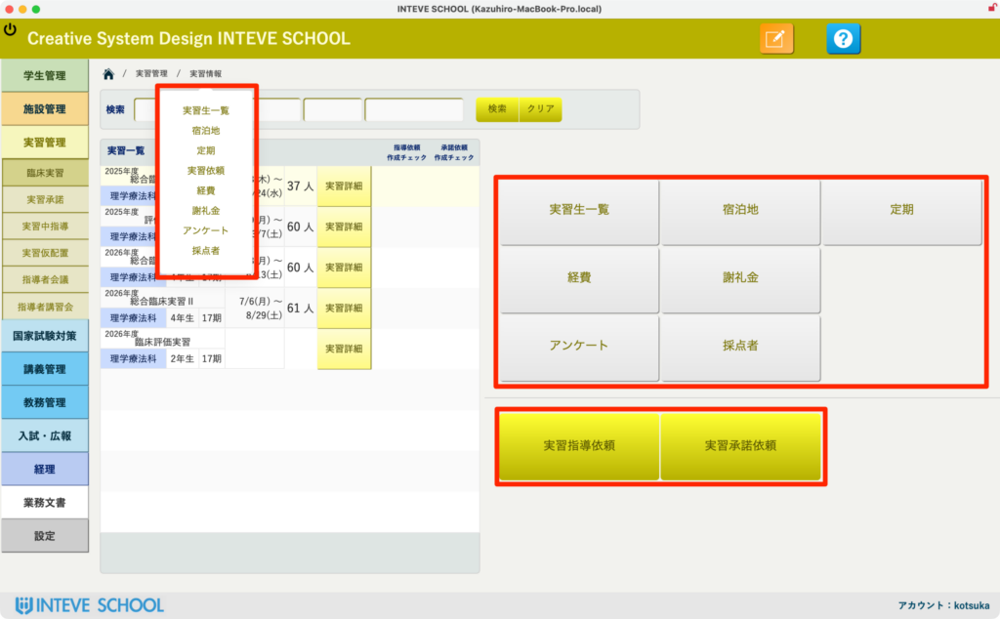
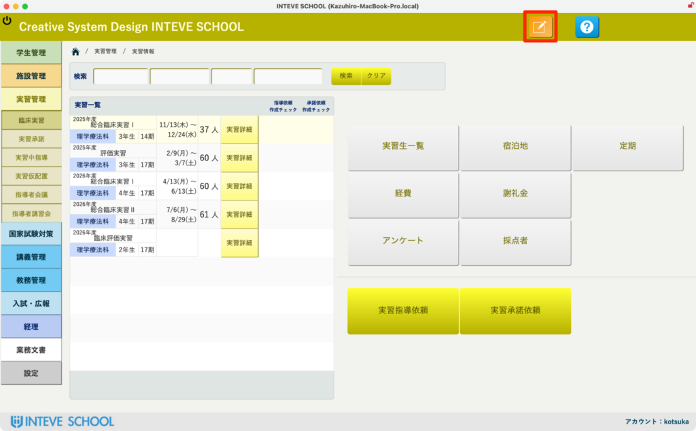
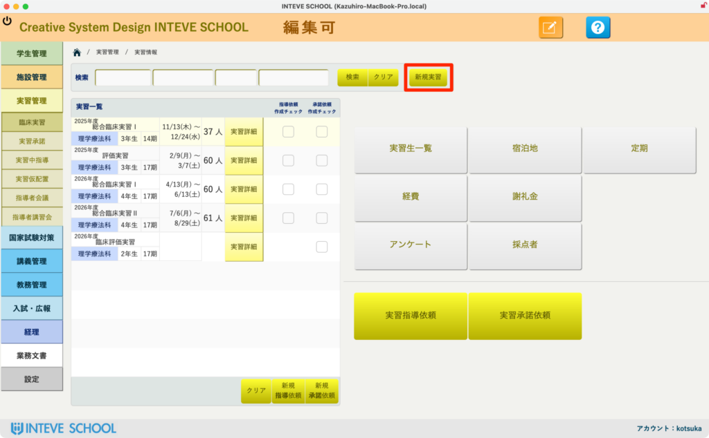
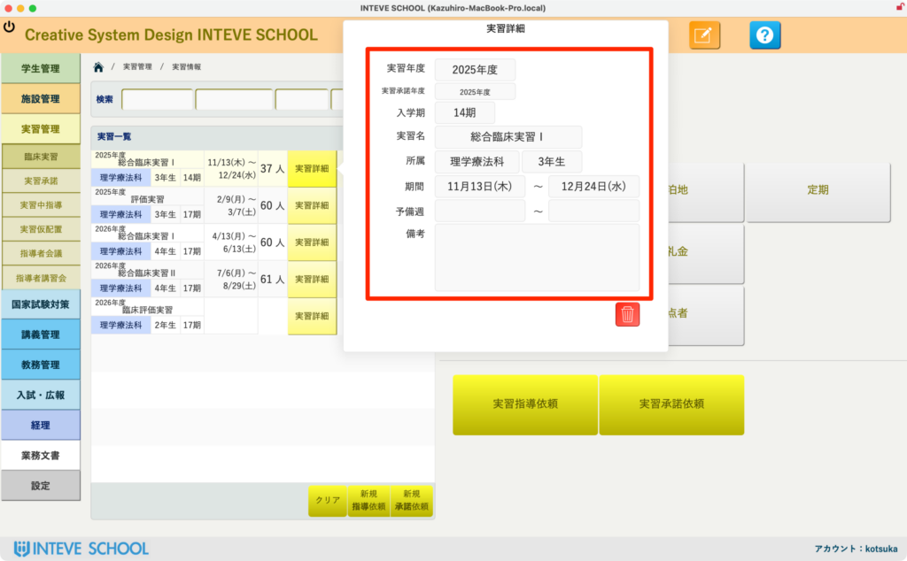

[← 実習管理ポータルに戻る](実習管理ポータル.md) | [メインページ](top.md)

# 実習情報 ポータル

### 🏥 実習情報 実習生一覧の使いかた

🚀 **はじめに（業務効率化のポイント）** 本画面は、実習に関わる教員業務と事務業務を一元管理し、大幅な時間短縮を実現するコア機能です。特に教員自らが多くの実習手続きを兼任されている学校様においては、劇的な業務改善を実感していただけます。

各ボタンから実習に必要な手続きへ瞬時にアクセスできるほか、実習運営に必須となる「2大依頼文書」の作成から送付準備までをシステム内で完結できます。

### 👤 教員業務・事務業務を支える各種機能ボタン

画面右側のメニューから、実習運営に必要なデータや次のアクションへワンクリックでジャンプできます。

- **○ 各種一覧・評価・アンケート:** 実習生一覧、配置表、履修、選考、割当表、アンケート、得点表など、状況把握に必要なデータが一元化されています。
- **○ 【必須】2大依頼文書の送付準備:** 画面下部の「実習依頼書」「実習承諾依頼」の2つのボタンは、実習を行う上で避けて通れない必須書類の出力機能です。必要な情報を入力するだけで瞬時に書類が生成され、そのまま発送・送付準備までスムーズに進めることができます。

### 🔒 閲覧モードと編集モードの切り替え（権限による制御）

誤操作による重要なデータの書き換えを防ぐため、本画面は初期状態では「閲覧モード」になっています。

- **👀 閲覧モード（開くだけの場合）:** データの確認やボタンのクリックだけであれば、そのまま操作が可能です。
- **✏️ 編集モード（データの変更・追加）:** 画面右上にある「オレンジ色の鉛筆マーク」をクリックすることで、編集モードへ切り替わります。
    - 💡 **注意：** 編集モードへの切り替えは、操作権限を持つアカウント（教員・管理者など）のみが可能です。
    - *※編集モードの基本的な操作手順は【[編集モードの基本操作](編集モードへ.md)】をご覧ください*

### ➕ 新規実習の登録手順

画面を「編集モード」に切り替えることで、画面中央上部に「新規実習」ボタンが表示されます。

- 新しい実習データを登録する際は、必ず最初に「編集モード」へ切り替えてから、この「新規実習」ボタンをクリックして作成を開始してください。

### 📋 ④ 実習登録時の最低限の必須入力フィールド

「新規実習」を作成すると、データ入力用のポップアップ画面（ダイアログ）が表示されます。実習データを正しく管理・運用するために、以下の最低限のフィールド（赤枠エリア）は必ず初期段階で入力を行ってください。

1. **実習年度:** この実習を行う現在の年度を入力します。
2. **実習承諾年度:** 施設側から承諾を得る（または書類を発行する）対象の年度を入力します。
3. **入学期:** 対象となる学生の生え抜き期（例：○期生）を指定します。
4. **実習名:** 「評価実習」「総合臨床実習」など、該当する実習の名称を選択・入力します。
5. **所属:** 実習を担当する学科やコース（例：理学療法学科など）を指定します。
6. **期間:** 実習の開始日〜終了日を設定します。
7. **予備週:** 感染症や災害等による補習・延長を想定した予備期間を入力します。
8. **備考:** 特記事項や施設ごとの個別ルールなど、教員間で共有すべき申し送り事項を入力します。

- ⚠️ **ポイント：** ここで入力された「実習名」「期間」などのデータが、先述の「実習依頼書」「実習承諾依頼」といった必須公文書にそのまま自動反映されます。書類作成の手間を無くすためにも、正確な入力を心がけてください。

---
[← 実習管理ポータルに戻る](実習管理ポータル.md) | [メインページ](top.md)
