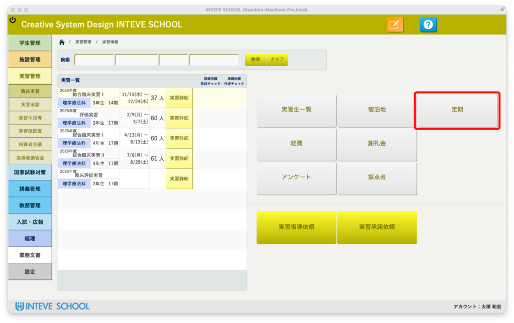
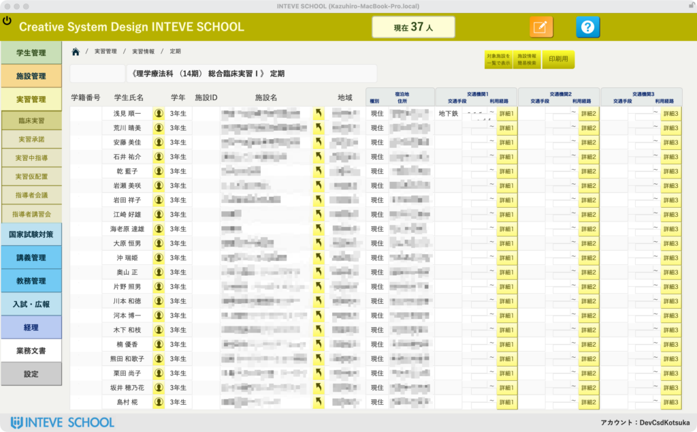
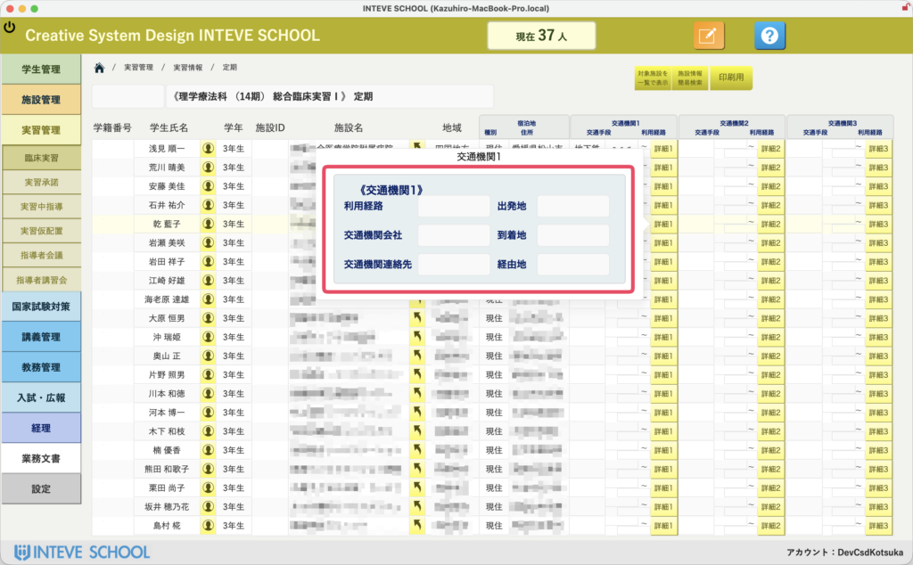

[← 実習管理ポータルに戻る](実習管理ポータル.md) | [メインページ](top.md)

# 実習情報 定期

実習ポータルから「定期」メニューを開くと、学生が実習期間中に使用する通学定期券の申請情報や、各交通機関への公文書発行の発行元データを管理する画面が開きます。

> **💡 開発者・大塚からのワンポイントアドバイス** 実習先への通学定期券の手続きは、鉄道会社やバス会社ごとに指定の公文書を作成して提出する必要があり、教職員の皆様にとって「隠れた激重業務」になりがちです。本システムでは、学校独自の運用に合わせて柔軟にカスタマイズできるよう、ベースとなる管理機能を実装しています。

### 📋 定期情報管理の基本操作

実習生が利用する定期券のルートや、申請状況を一覧でスマートに俯瞰できます。

- **📄 交通機関ごとのグルーピングとステータス管理** 利用する交通機関ごとに申請が必要な学生を自動でピックアップ。処理がどこまで進んでいるかを一目で管理できます。
- **🔍 交通機関別の詳細ポップオーバー** 一覧の「詳細」ボタンを押すと、その学生が利用する交通機関の「出発地」「到着地」「経由地」などの詳細データがポップアップ。個別のルート修正もここから手軽に行えます。

### 🚀 将来のカスタマイズで「ここまでラクになる！」提案

本画面は、学校ごとの申請フローに合わせて以下のような「超効率化システム」へアップグレードすることが可能です。「うちの学校のルールに合わせたい」という場合は、いつでもお気軽にご相談ください！

#### 1. 🖨️ 交通機関ごとの「公文書・購入申込書」を一撃で一括印刷

一通り入力が完了したら、ボタンをワンクリックするだけで、**各鉄道会社やバス会社が指定するフォーマットの「通学定期乗車券購入申込書」や、学校長名義の「公文書（添え状）」を、対象の学生分丸ごと一括でPDF出力・印刷**できるようになります。何枚も手書きしたり、Wordで差し込み印刷をする手間から完全に解放されます。

#### 2. 🗺️ NAVITIME APIからの「定期ルート自動引っ張り」

先ほどご紹介した「宿泊地」画面のNAVITIMEルート検索機能と連動させることで、**検索した最短ルートから「定期券の発着駅・経由駅」のテキスト情報を、この定期画面へ自動でコピーして流し込む**カスタマイズも可能です。手入力による打ち間違いがゼロになります。

#### 3. 📧 学生への「一斉確認メール」送信

承認された定期ルートや支給額を、対象の学生に向けて「このルートで定期を申請します」とシステムからボタン一つで一斉メール通知。学生との確認作業もペーパーレスで行えます。

---
[← 実習管理ポータルに戻る](実習管理ポータル.md) | [メインページ](top.md)
