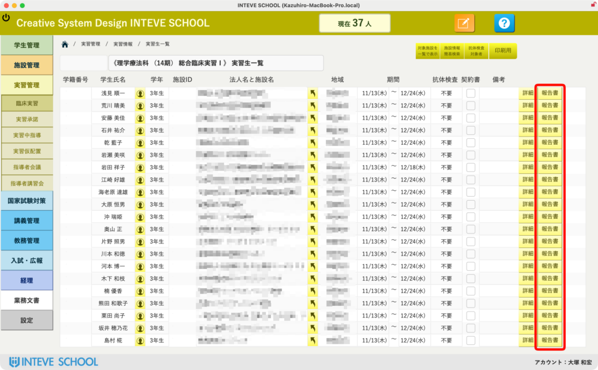
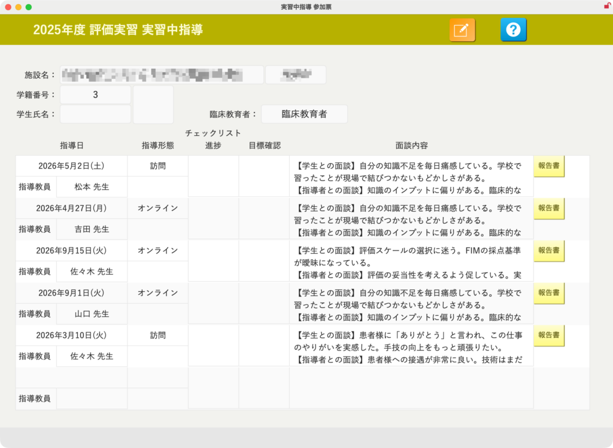
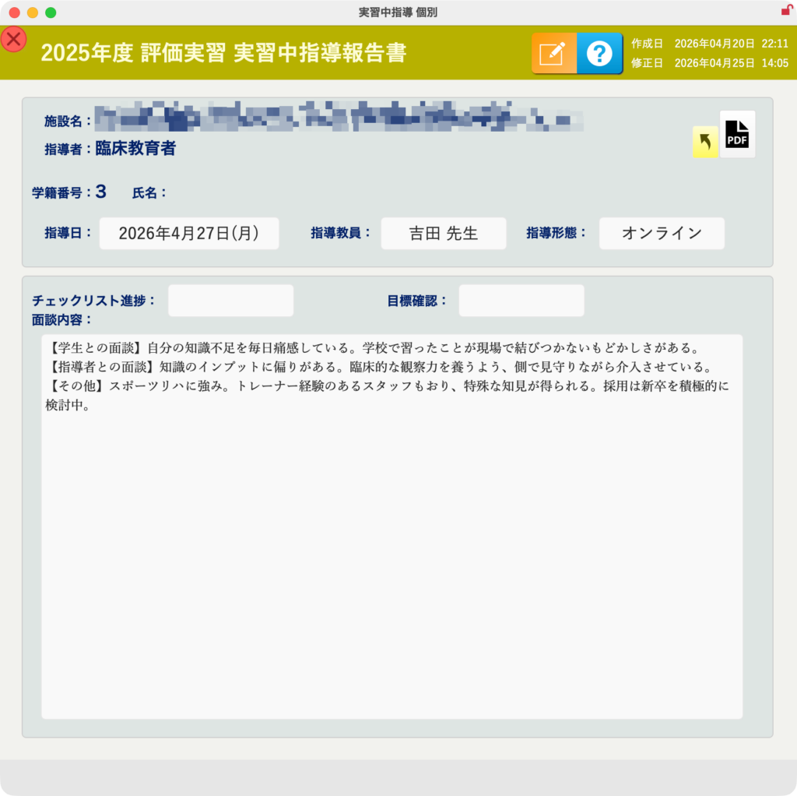
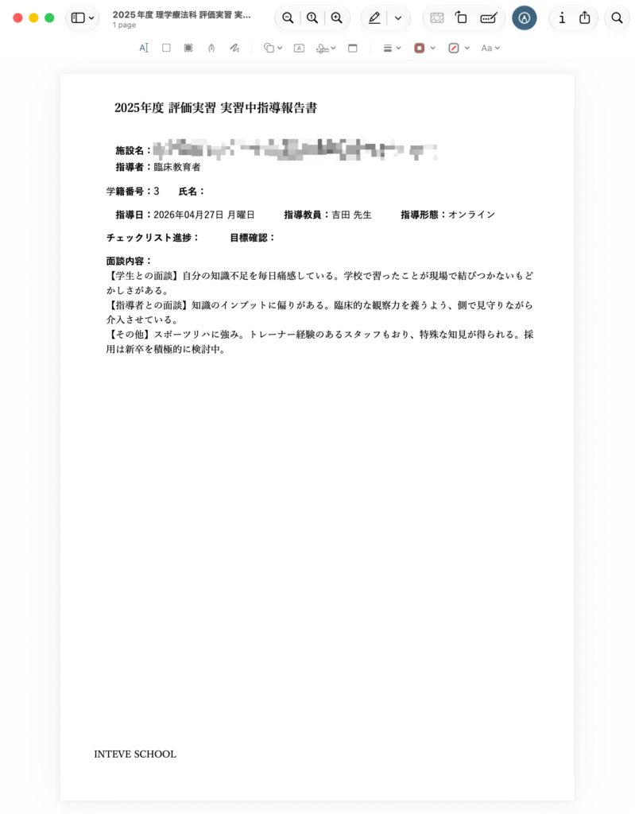

[← 実習管理ポータルに戻る](実習管理ポータル.md) | [メインページ](top.md)

# 実習情報 実習中指導

## 📋 実習情報：実習中指導の記録・管理機能

臨床実習中の指導は定期的に行われます。実際に実習先へ訪問するだけでなく、電話やオンライン面談など、学生の様子や実習地の状況に合わせて適宜調整・実施されます。 学生の成長を応援するためには、「いつ、どういう状況で、どのような指導が行われたか」を正確に記録することが極めて重要です。ここで蓄積された指導記録は、実習終了後に学内での指導をスムーズに継続するための必須のデータとなります。

### 🔍 【事前準備】対象学生の選定

まずは「実習生一覧」などのメイン画面から、指導記録を入力・確認したい対象の学生を表示させておきます。

### 📂 1. 実習中指導履歴へのアクセス

画面内の実習生一覧ポータル、各行の右端にある **\[報告書\]** ボタンをクリックします。

### 📊 2. 過去の指導履歴一覧の確認

該当する学生の「1つの実習期間」に対して、これまでに行われた過去の指導履歴がタイムライン形式で一覧表示されます。 過去にどのようなステップで指導が行われてきたかを、ここで一目で振り返ることができます。新規の記録を追加する場合や、詳細を確認したい日付の行を選択します。

### 📝 3. 実習中指導報告書の入力・編集

選択した日付の「実習中指導報告書」の個別詳細ページが開きます。 画面上部にある **\[[編集（鉛筆アイコン）](編集モードへ.md)\]** ボタンをクリックすることで、内容の入力や編集が可能になります。

- **カスタマイズ柔軟に対応します：** 現在、画面内には「チェックリスト・概況」や「目標確認」といった項目をポップアップ形式で選択・入力できるように設定していますが、これらの項目名や選択肢の内容は、学校様の運用に合わせて**自由にカスタマイズ（変更・追加）の要望を承ります。** お気軽にご相談ください。

### 🖨️ 4. 報告書のPDF帳票出力

画面右上にある **\[PDFアイコン\]** ボタンをクリックすると、入力された指導内容が綺麗なフォーマットの帳票として画面に出力され、そのまま印刷やデータ保存が可能です。

- **帳票レイアウトの変更も可能です：** 印刷されるPDFのレイアウトや、出力したい特定の項目について「学校指定の既存の書式に合わせたい」といった**レイアウトカスタマイズの要望も柔軟に承ります。**

---
[← 実習管理ポータルに戻る](実習管理ポータル.md) | [メインページ](top.md)
