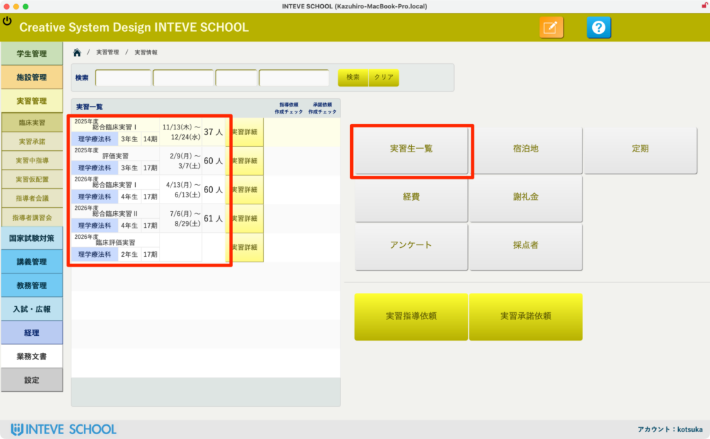
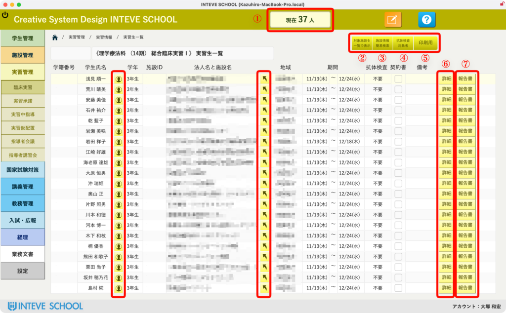
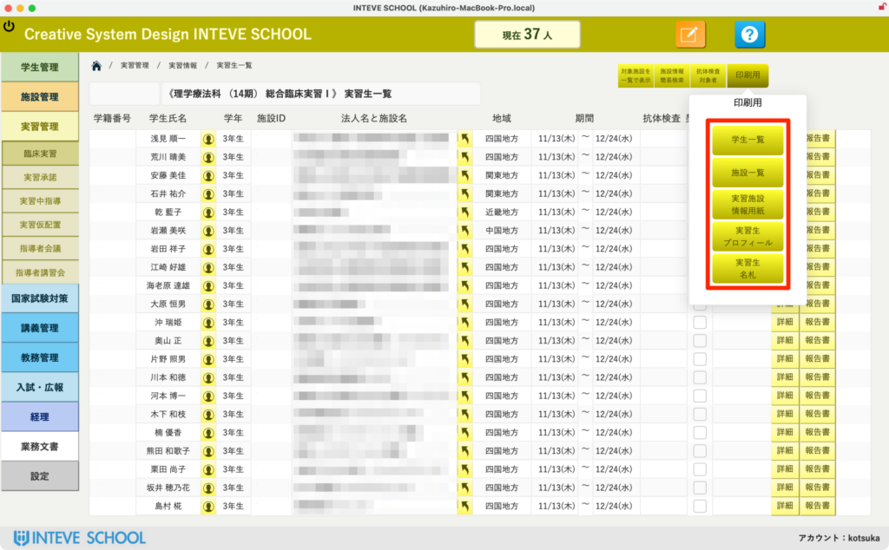
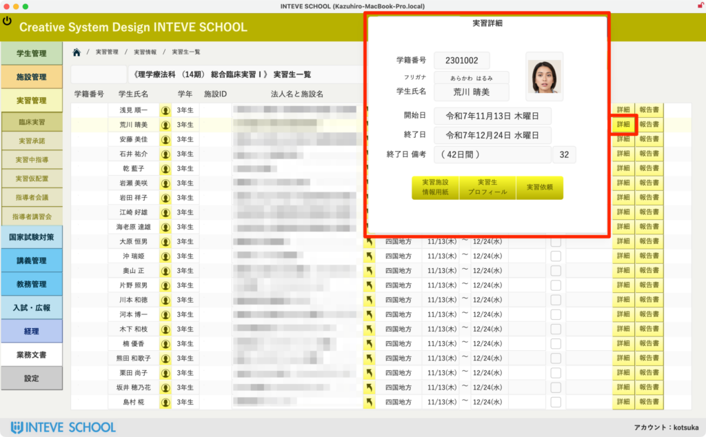

[← 実習管理ポータルに戻る](実習管理ポータル.md) | [メインページ](top.md)

# 実習情報 実習生一覧

### 👥 実習生一覧画面の使いかた

🚀 **はじめに（画面の開きかた）** 本画面は、選択した実習に割り当てられている学生の一覧と、それぞれの実習先（病院・施設）の詳細情報を紐づけて管理する画面です。

画面を開くには、トップ画面（ポータル）から以下のいずれかの方法でアクセスします。

- **方法A:** 左側の実習一覧ポータルから、該当する実習レコードを直接クリックする。
- **方法B:** 選択している実習の右側メニューにある「実習生一覧」ボタンをクリックする。

### 🚀 実習生一覧の基本機能・便利マーク

画面上の各マークや項目は、実習運営をスムーズに行うための様々な自動化・ショートカット機能を備えています。

- **① 総実習生数の自動カウント** 画面中央上部に、現在この実習・クールに登録されている「総学生数（合計 〇〇名）」がリアルタイムで自動表示されます。
- **🏠 ② 施設詳細画面へのダイレクトジャンプ** 学生の横に表示されている「黄色い書類マーク（施設ボタン）」をクリックすると、その学生が配属されている「施設情報画面」へ一瞬で遷移できます。
- **📝 ③ 施設アンケートデータの確認** 実習の受け入れに際し、施設側から事前に回収したアンケートデータ（受け入れ条件や注意点など）が登録されている場合、一覧上でその回答内容をスムーズに確認・参照できます。

### 🧪 ④ 抗体検査が必要な施設のワンクリック抽出

実習先（病院・施設など）によっては、受け入れ条件として学生の「抗体検査」を必須としている場合があります。

- 画面中央上部にある【抗体必須】ボタンをクリックすることで、抗体検査の提出・確認が必要な施設に配属されている学生のみを瞬時にリストアップできます。
- **💡 重要（事前のマスタ登録）：** この抽出機能を使用するには、あらかじめ各施設の詳細画面で条件を有効にしておく必要があります。設定手順の詳細は、こちらの【施設情報マニュアル】をご確認ください。

### 🖨️ ⑤ 各種帳票の出力・印刷メニュー

画面右上にある **\[印刷（プリンタアイコン）\]** ボタンをクリックすると、実習運営に欠かせない各種帳票の出力メニュー（ポップアップ）が表示されます（※本ページ３枚目の画像を参照）。

- 印刷メニュー内からは、学内共有用の配置表、施設向けの送付状、学生配布用のスケジュールなど、用途に合わせた様々なレイアウトの帳票をワンクリックで即座に出力・印刷できます。

### 👤 ⑥ 学生個別情報の確認とクイック修正

一覧の右端にある **\[詳細\]** ボタンをクリックすると、選択した学生の個別詳細ダイアログが画面を切り替えることなくその場で開きます（※本ページ4枚目の画像を参照）。

- このダイアログ内から、学生の基本情報や顔写真の確認、実習期間の個別微調整、特記事項（個別メモ）の追記などをスピーディに行うことができます。一覧画面に戻ることなくその場で修正・更新が完了するため、データ入力の手間を大幅に削減できます。

### 📂 ⑦ 実習中指導（訪問・電話等）の記録・管理 【重要機能】

実習期間中に行われる、定期的な学生への指導・連絡内容（実際に足を運んだ訪問指導、電話サポート、オンライン面談、メール連絡など）を履歴として記録しておけます。

- 📝 **機能の詳細・詳しい使い方はこちら：** \[[実習中指導の記録・管理マニュアル](実習管理-実習中指導.md)\] をご確認ください。

---
[← 実習管理ポータルに戻る](実習管理ポータル.md) | [メインページ](top.md)
