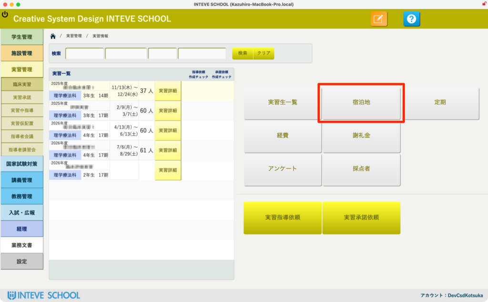
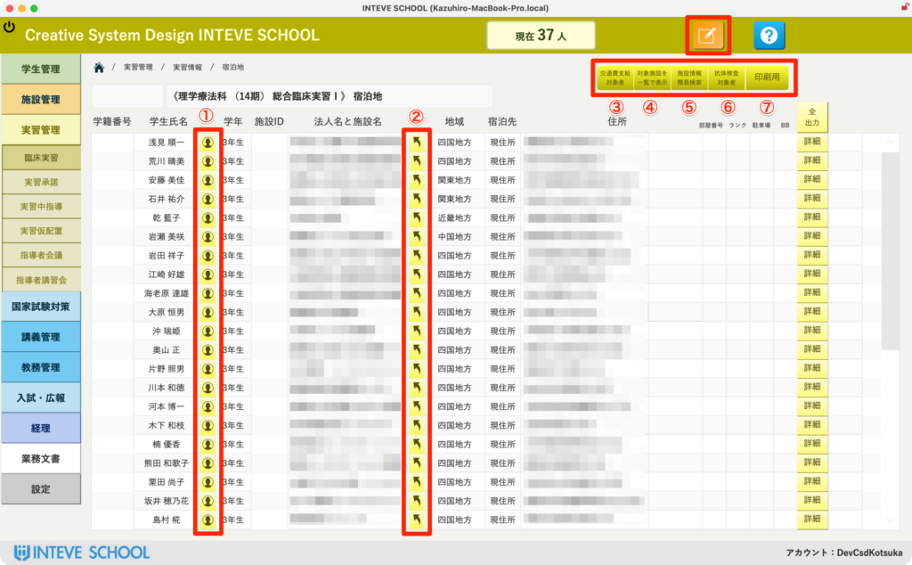
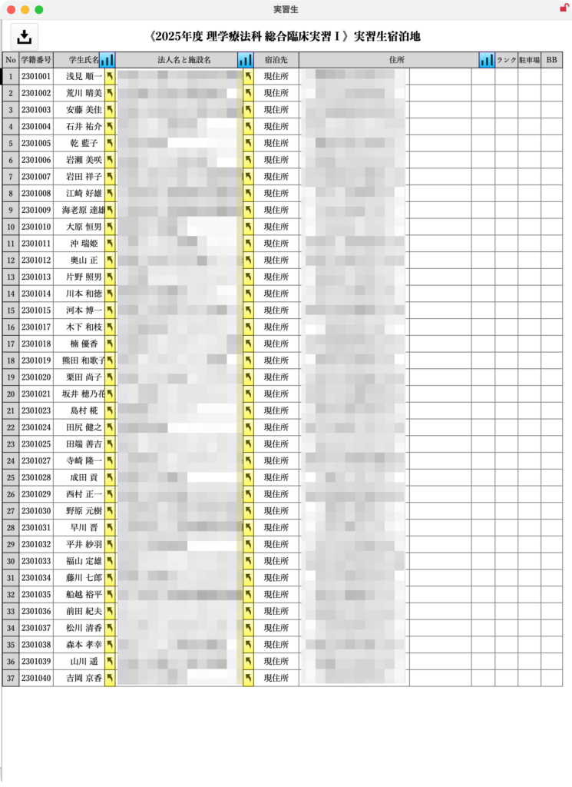
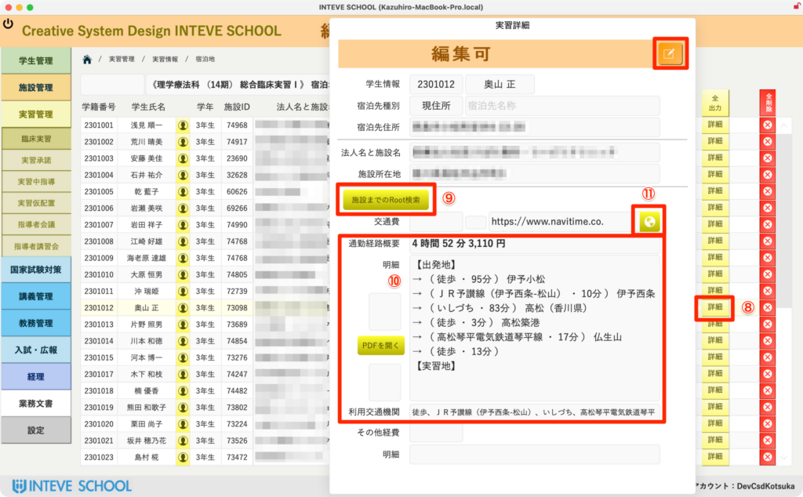
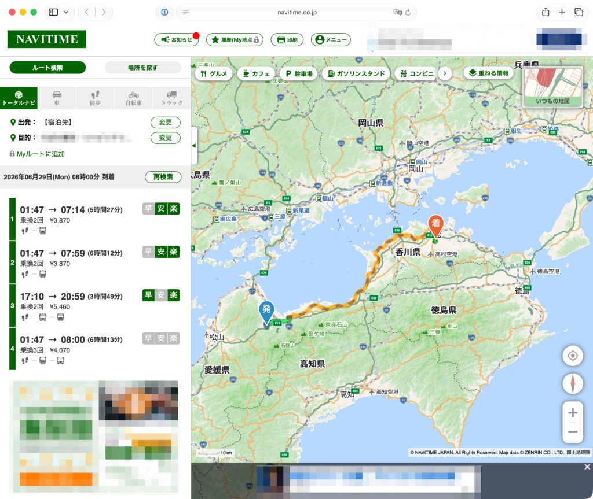

[← 実習管理ポータルに戻る](実習管理ポータル.md) | [メインページ](top.md)

# 実習情報 宿泊地

実習ポータルのメニューから「宿泊地」ボタンを押すと、学生の宿泊地（帰省先・下宿先など）と実習施設との位置関係や通勤経路を一元管理する画面が開きます。

### 📋 宿泊地一覧の基本操作

実習先への配置が決まった学生の宿泊情報や、そこからの通勤ルートを一覧で確認・出力できる便利な画面です。

- **① 👤 学生詳細へのアクセス** クリックすると、対象学生のより詳細な個別情報ページへ一瞬でジャンプします。
- **② 🏢 施設詳細へのアクセス** 配置先となっている実習施設の詳細情報ページへ遷移し、施設の基本情報を確認できます。
- **③ 🚊 交通費・通勤ルートの一覧表示** 後述する「NAVITIME API連携」によって取得された、学生ごとの最短通勤ルートや交通費サマリーがここにスッキリと一覧表示されます。
- **④ 🔍 対象施設の情報を表示** 現在選択している対象施設が、施設情報ページの中でどこにあるかをピンポイントで表示させることができます。
- **⑤ 🔄 施設情報の簡易検索** 個別に実習先を変更・調整する際に重宝する検索機能です。※詳しい調整方法や使い方は \[[こちらのリンク](学生情報-実習地候補.md)\] をご覧ください。
- **⑥ 🧪 抗体検査必要施設の一覧（最重要！）** 実習に赴くにあたり、抗体検査やワクチン接種記録が必須となる施設とその条件を一覧で確認できる、運用上絶対に欠かせないマスターページです。※情報の入力方法や管理手順は \[[こちらのリンク](施設情報-内部情報.md)\] をご覧ください。
- **⑦ 🖨️ 宿泊地・配置施設の一覧帳票出力** 学生の宿泊地と配属施設をセットで美しく出力できる印刷用帳票を表示します。（実際の帳票イメージは下の3枚目の画像を参照）

### ⚡️ 経路・交通費の自動取得（NAVITIME API連携）

詳細ポップオーバーを開き、学生が本当にその施設から通勤できるかをシステムが裏側で自動判定します！

- **⑧ 🔎 詳細ボタンからポップオーバーを起動** 一覧の「詳細」ボタンをカチッと押すと、個別調整用のポップオーバー画面がスマートに開きます。
- **⑨ 🛠️ 編集モードで「ルート検索」を実行！** 右上の[「編集」ボタンをクリック](編集モードへ.md)すると、ルート検索用のボタンが出現します。 ボタンを押すと、システムがGoogleから瞬時に「宿泊地」と「実習施設」の正確な緯度経度を取得。その座標データをベースに**NAVITIMEのAPIへダイレクトに突合し、最短ルートをミリ秒単位で超高速計算**します。
- **⑩ 🤖 通勤可否・交通費・利用交通機関をすべて自動記載！** （※画像内の数値は開発中のダミーデータです） 検索が完了すると、以下の情報がフィールドへ一撃で美しく自動格納されます。 
    - **実習地に本当に遅刻せず通勤できるか（所要時間）**
    - **片道の交通費が支給上限や実習規定の範囲内に収まっているか（総額料金）**
    - **実際の乗り換えルートの全容（綺麗な1行明細）**
    - **学生が利用する公共交通機関の種類を「、」でスマートに繋いだテキスト）**

    これらがすべて自動で入るため、これまでのように手作業で乗り換え案内サイトを叩いてコピペする不毛な作業は一切不要になります！
- **⑪ 🗺️ NAVITIMEの公式ルート地図をブラウザで一発起動** 「MAP表示」ボタンを押すと、たった今計算したルートと全く同じ条件の「NAVITIMEルート結果画面」がブラウザでピンポイントで起動します。学生への経路指導や、より詳細な地図上での位置確認がワンクリックで行えます。

※ ダミーデータでの処理なので、実際の臨床実習ではあり得ないルートになっています。

---
[← 実習管理ポータルに戻る](実習管理ポータル.md) | [メインページ](top.md)
