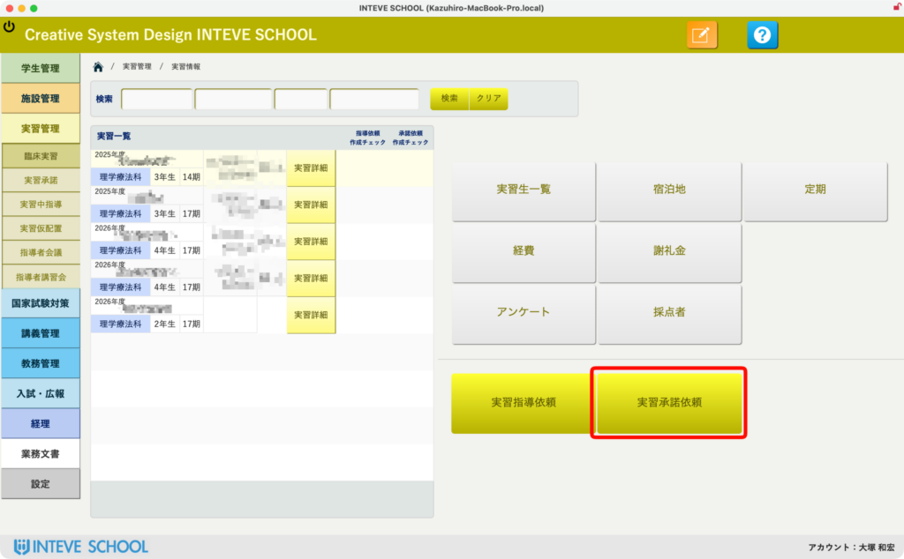
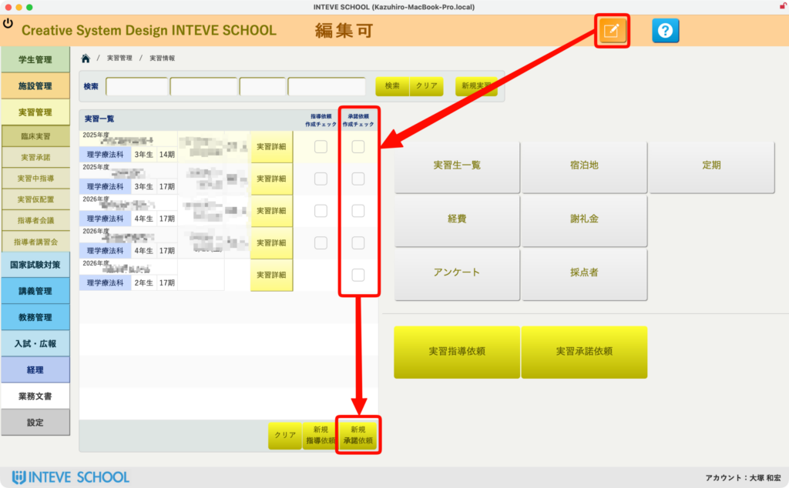
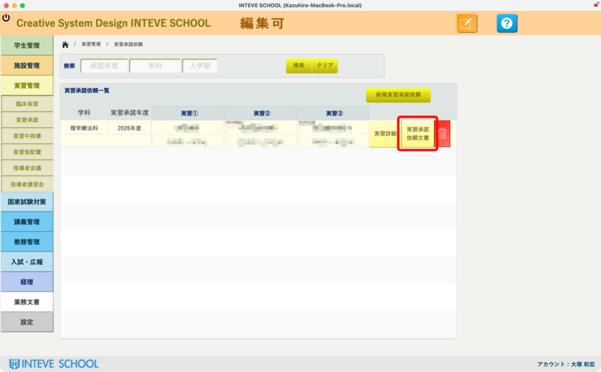
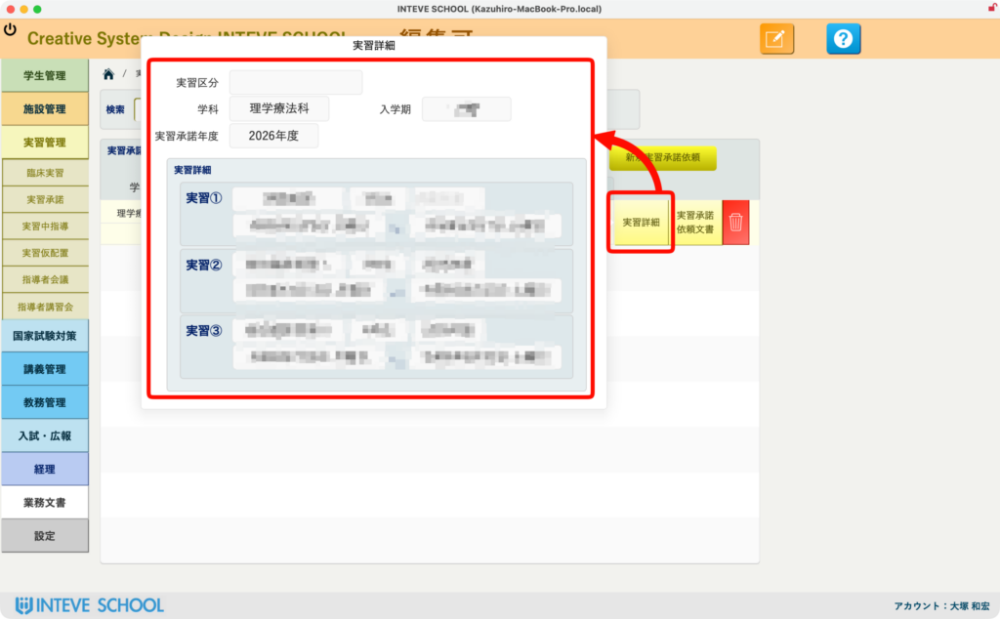

[← 実習管理ポータルに戻る](実習管理ポータル.md) | [メインページ](top.md)

# 実習情報 承諾依頼

# ✉️ 実習情報：実習承諾依頼文書の作成・管理機能

次年度の実習受け入れを各施設へ打診する「実習承諾依頼」。あらかじめ確定している実習日程などの条件をもとに、対象となる複数の実習期を1通の公文書へスマートにまとめ上げ、ミスのない依頼文書を一括生成します。毎年、スケジュール調整や書類作成で苦労していた業務を大幅に効率化します。

### 🔑 【事前準備】依頼年度（ポータルレコード）の作成

承諾依頼文書を新規作成する前に、あらかじめ「[承諾履歴](施設情報-実習承諾.md#jisshu-batch)」のページにて、対象となる「依頼年度」のポータルレコードが作成されていることが必要です（リンク）。 この事前準備によって、システム側が「次年度のどの実習枠に対して打診を行うか」を正しく認識できるようになります。レコードが作成されていることを確認してから、以下の手順に進んでください。

### 📂 1. 承諾依頼画面へのアクセス

実習管理ポータルから「実習承諾依頼」（※または該当ボタン）をクリックします。過去に作成した打診状況の確認や、文書の再印刷を行いたい場合は、ここからいつでもアクセス可能です。

### 📑 2. 新規承諾依頼の作成と実習期の選択

次年度の複数の実習日程（実習期）をまとめて1通の依頼書にするための手順です。

1. 画面上部の「編集」ボタン（ノートと鉛筆のアイコン）をクリックして編集許可状態にします。
2. 画面中央のリストに、あらかじめ登録されている次年度の実習スケジュールが表示されます。今回の依頼文書に含めたい実習期の「選択チェックボックス」にレ点を入れます。
3. 下部の「新規承諾依頼」ボタンをクリックすると、選択した実習スケジュールが自動集約された新しい承諾依頼データが生成されます。

### 🔍 3. 承諾依頼文書の一覧と詳細編集

生成が完了すると、承諾依頼の管理一覧画面に切り替わります。

- 編集や確認を行いたい施設行の右端にある「承諾依頼詳細」（または該当ボタン）をクリックすると、さらに詳細なドキュメント編集画面や、設定用のポップアップ画面が起動します。

### ⚙️ 4. 依頼内容（実習条件）の最終確認

ポップアップ画面では、今回の文書に盛り込まれている実習の詳細（対象学年、実習の種別、具体的な日程スケジュールなど）が一覧でマッピングされます。 印刷・送付する前に、「次年度のどの実習日程を提示しているか」を視覚的に再確認できるため、日程の案内ミスや送り間違いを未然に防ぎます。

💡 **ポイント:** 「来年の実習スケジュールを施設ごとに手書きやコピペで案内文にまとめる」という、毎年のあの不毛な作業から完全に解放されます。システムにあらかじめ入っている日程を選ぶだけで、すべての対象施設に向けた正確な承諾依頼公文書が瞬時に組み立てられます。

続きは[こちらのページ](実習情報-承諾依頼文書.md)へ。

---
[← 実習管理ポータルに戻る](実習管理ポータル.md) | [メインページ](top.md)
