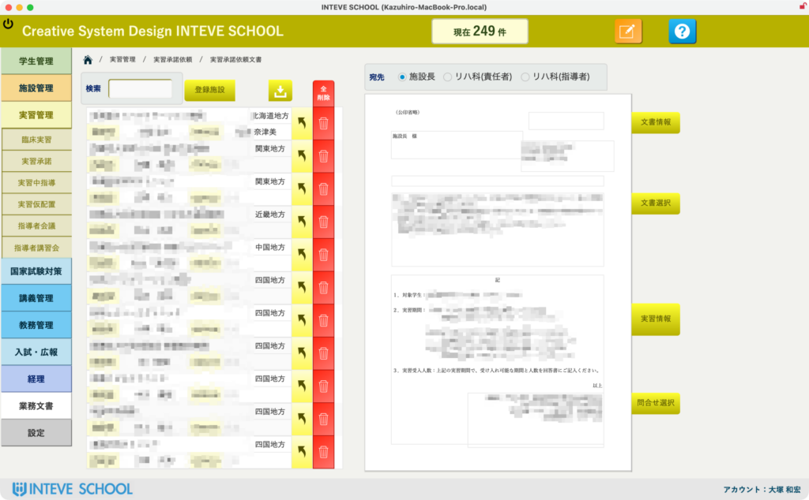
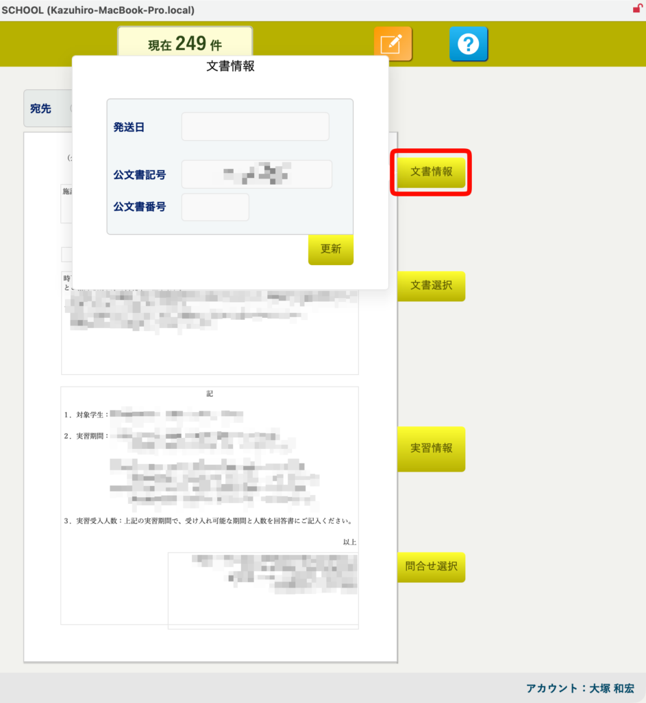
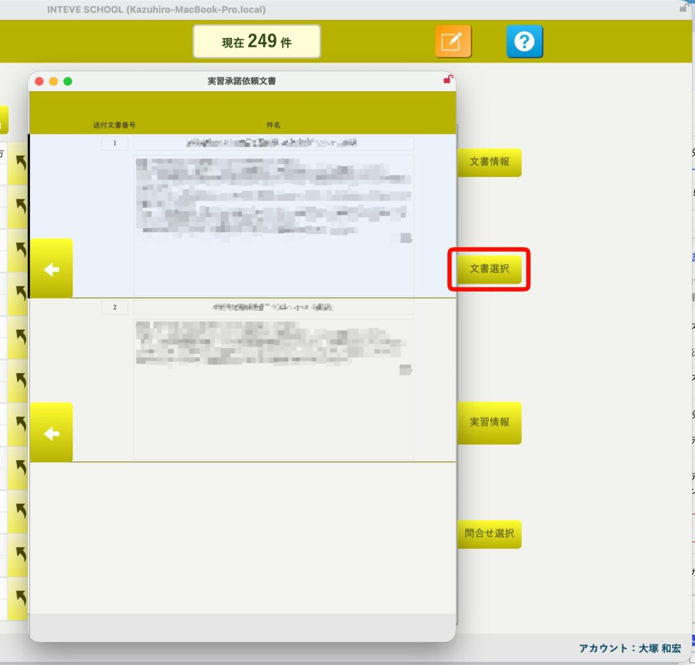
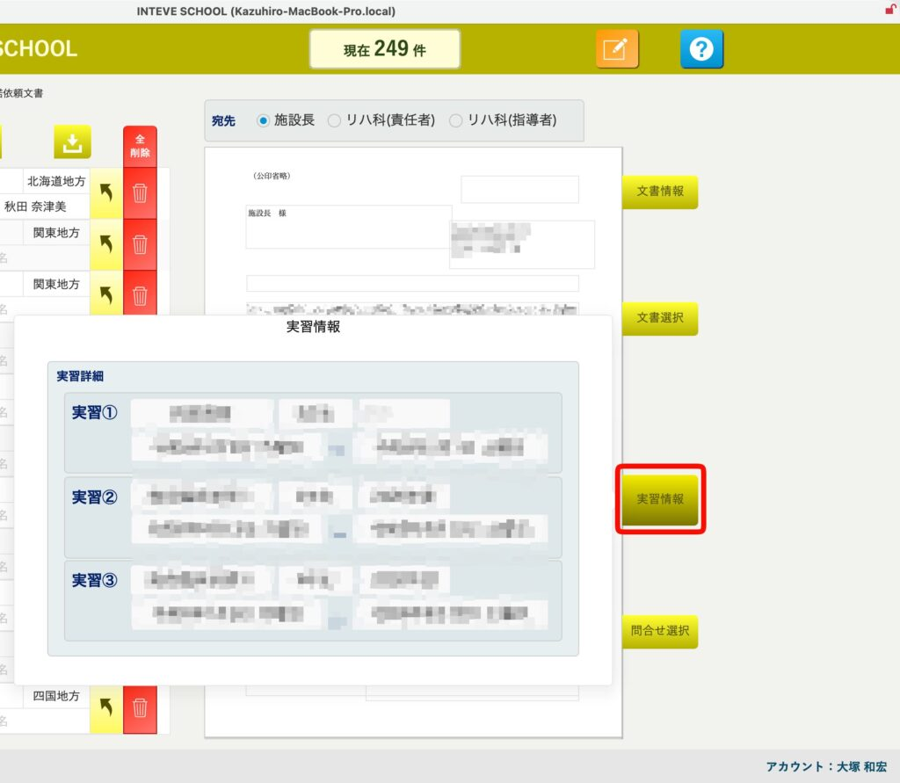
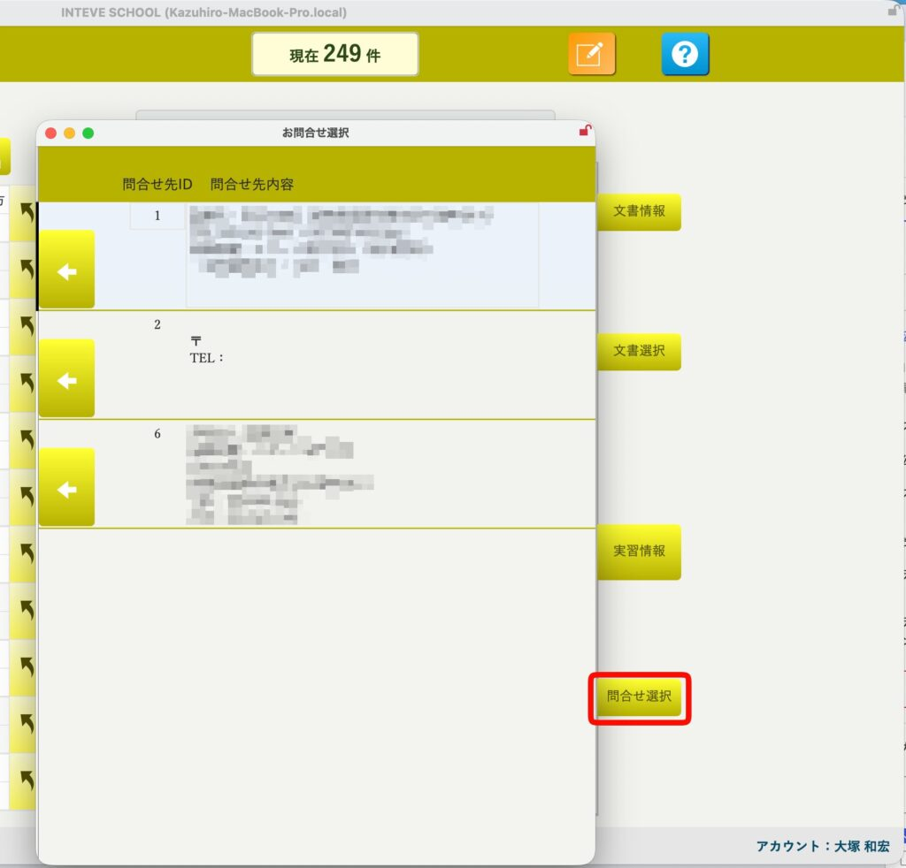

[← 実習管理ポータルに戻る](実習管理ポータル.md) | [メインページ](top.md)

# 実習情報 承諾依頼文書

# 📄 実習情報：実習承諾依頼文書の編集・マスタ設定機能

「実習承諾依頼」のデータ生成が完了したら、各施設へお送りする公文書の細部を仕上げていきます。INTEVE SCHOOLでは、施設ごとに異なる宛名や案内文のプレビュー確認、共通テンプレートの流し込み、公文書番号の割り振りを、すべて画面を切り替えることなくシームレスに行うことができます。

### 🔍 1. 宛先切り替えとプレビューの完全連動

承諾依頼の編集・確認を行うメインのレイアウトです。

- **クリックで一発切り替え:** 左側に表示されている施設一覧から特定の施設名をクリックするだけで、右側の文書プレビューの宛名、来年度の受け入れ予定学生数、提示している日程スケジュールなどの情報がリアルタイムに切り替わります。施設ごとに別ファイルを開き直す必要は一切ありません。

### ⚙️ 2. テンプレートを活用した各部設定（右側メニュー）

右側に並ぶ4つのボタンから、文書の構成要素を簡単な操作で柔軟にカスタマイズできます。

**📅 文書情報設定:** 公文書の送付日や、管理用の公文書番号を設定します。学校共通のベースとなる公文書記号は初期値として自動反映されますので、事務担当者はその年の枝番を入力するだけでスピーディーに番号管理が行えます。

**💬 本文テンプレート:** 「次年度受け入れのお願い」にふさわしい、あらかじめ登録しておいた時候の挨拶や本文テンプレートの一覧が表示されます。使用したい文章の左側にある【矢印（◀）】をクリックするだけで、右側の本文エリアへ一発で流し込まれます。

**📊 実習情報確認:** 今回の承諾依頼に紐づいている実習のスケジュール詳細（学年、開始・終了日など）を手元で再確認できます。施設に提示する実習日程に間違いがないかを、書類を印刷する前に確実にダブルチェックすることが可能です。

**📞 問合せ先設定:** 学校側の担当窓口や、書類の返送先となる住所・連絡先マスタを呼び出します。こちらも【矢印（◀）】ワンクリックで、文書の最下部（または指定位置）に正確に挿入されます。

---
[← 実習管理ポータルに戻る](実習管理ポータル.md) | [メインページ](top.md)
