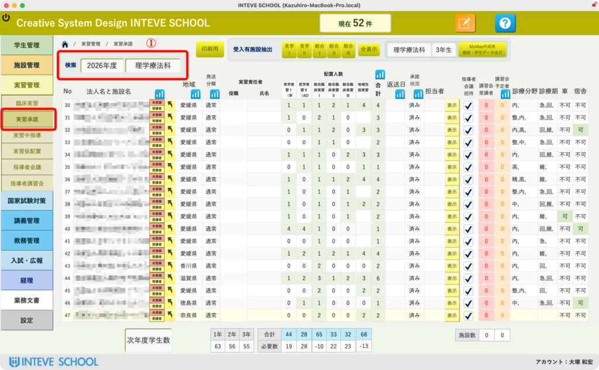
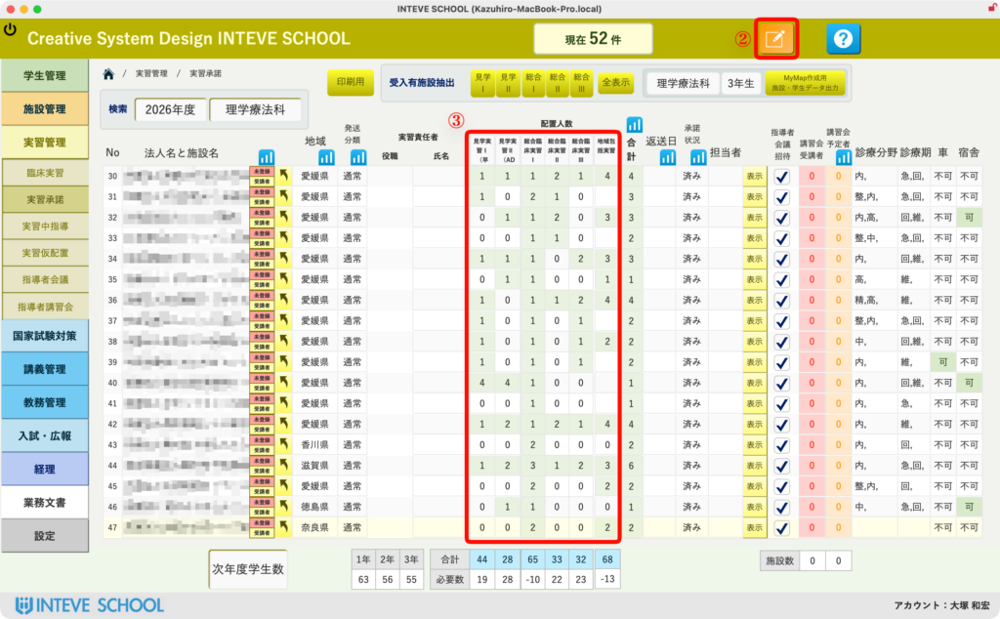
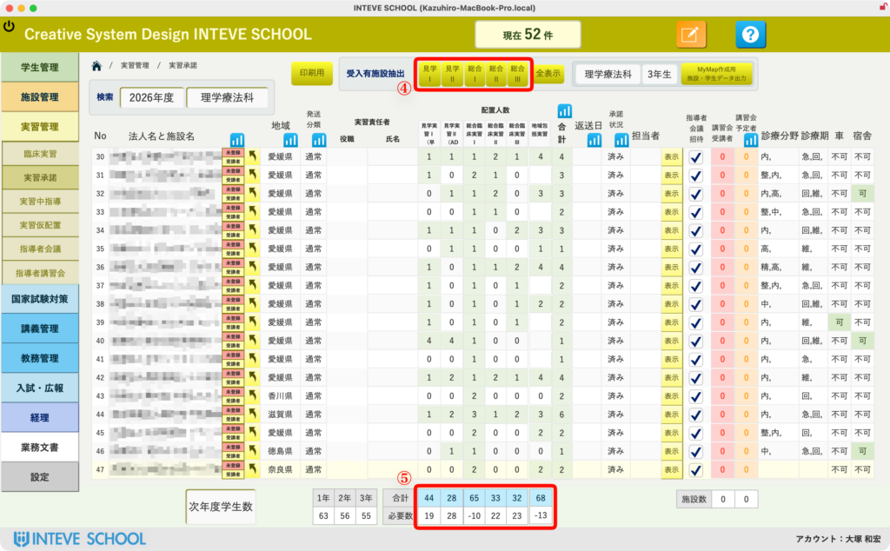
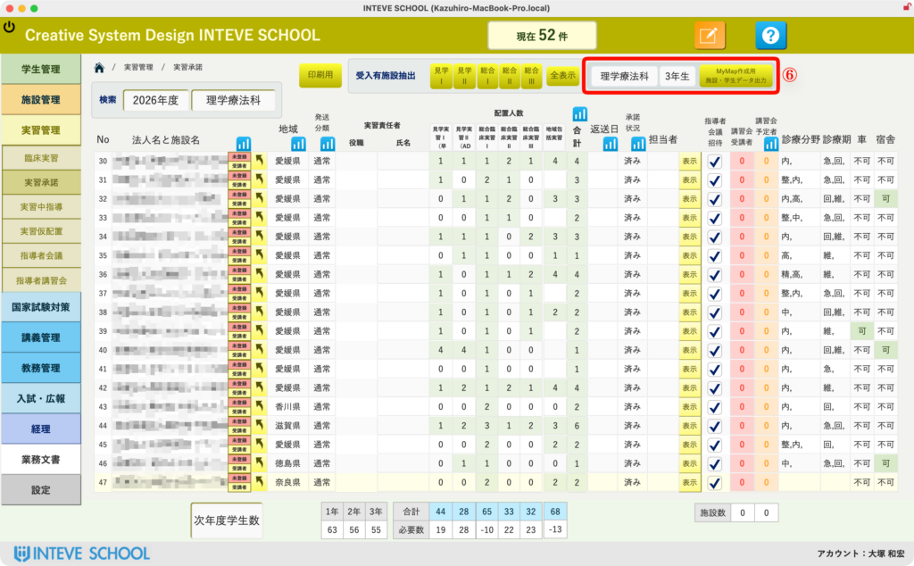
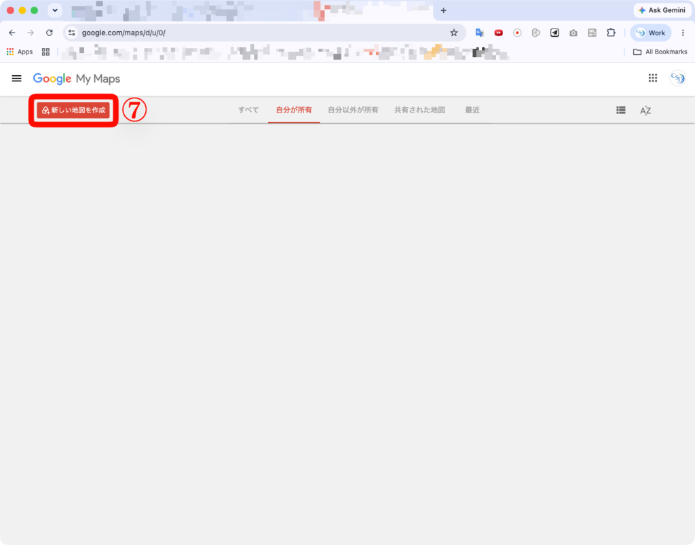
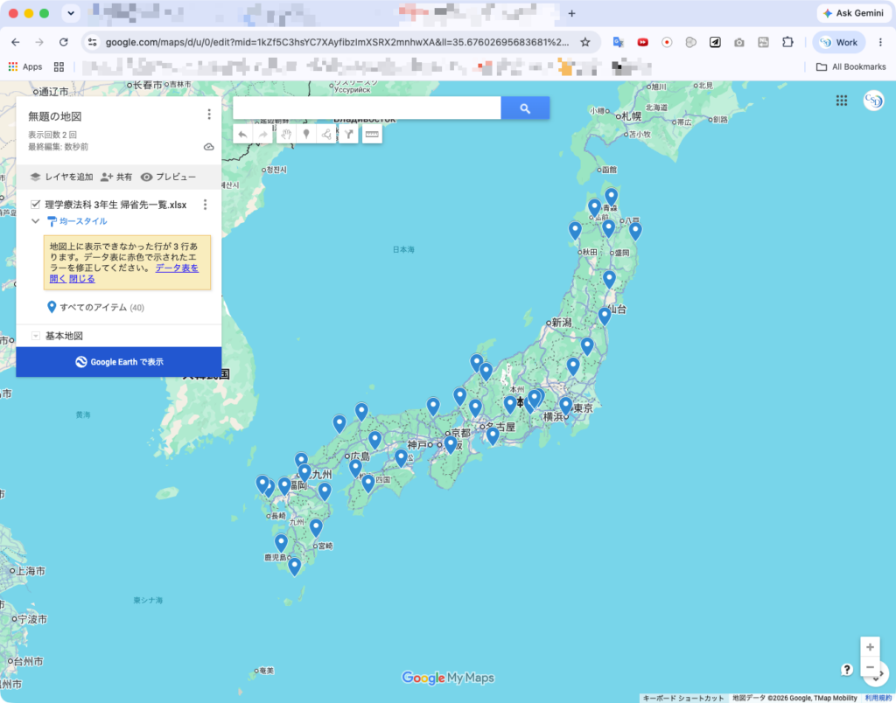

[← 実習管理ポータルに戻る](実習管理ポータル.md) | [メインページ](top.md)

# 実習情報 承諾履歴

# 🏢 施設情報：実習承諾履歴（MyMap連携・一括処理）

「実習承諾履歴」画面では、各施設が過去から現在にわたり、「何年度に、どの学科の学生を、何人受け入れてくれたか」という貴重な履歴データを一元管理しています。

この画面から、現在の学生の配置状況や不足数のリアルタイム確認、さらには「Google MyMap（マイマップ）」と連動した視覚的な実習先選定データの一括書き出しまでを行うことができます。

> 🔒 **\[編集\] 業務を行う際の必須操作：** 右上にある「[編集ボタン（鉛筆マーク）](編集モードへ.md)」をクリックして、編集可能状態に切り替えてから操作を行ってください。

### 📑 実習承諾履歴の基本操作・確認フロー

スクショの番号に沿って、画面の見方と操作手順を解説します。

#### **① 学年・学科でのクイック絞り込み**

- **操作：** 画面左上の「検索年（年度）」と「学科」のドロップダウンから条件を選択します。
- **効果：** 指定した条件に該当する「受け入れ実績・予定のある施設」だけが画面にずらりと自動抽出され、リストアップされます。

#### **② 編集モードへの切り替え**

- **操作：** 画面右上にある **【鉛筆マーク（編集ボタン）】** をクリックします。
- **効果：** 画面全体が「編集可」の状態に切り替わり、承諾人数の入力や修正が可能になります。
- 🔗 **関連マニュアル：** [編集モードの詳しい権限・操作切り替えについてはこちら（リンク）](編集モードへ.md)

#### **③ 承諾人数の入力・変更**

- **操作：** 各施設の「見学実習」「総合臨床実習」などの各列にある数値ボックスを直接書き換えます。
- **効率化テクニック：** 施設から返送されてきた「承諾書PDF」を確認しながら、キーボードの「Tabキー」や「矢印キー」を駆使することで、画面を切り替えることなくサクサクと効率よく連続入力していくことが可能です。
- 🔗 **関連マニュアル：** [受領したPDFから効率よく連続入力するコツはこちら（リンク）](施設情報-実習承諾.md)

#### **④ 特定実習のターゲット絞り込みボタン**

- **操作：** リスト上部にある各実習名（「見学実習」「総合Ⅰ」など）の小さなボタンをクリックします。
- **効果：** 現在表示されている施設の中から、**「該当する実習の受け入れ人数が『1名以上』の施設のみ」にさらにピンポイントで絞り込み**が行われます。特定の実習先だけを急ぎで探したいときに非常に強力なボタンです。

#### **⑤ 必要枠数と過不足のリアルタイム集計確認**

- **確認ポイント：** 画面中央上部には、選択された実習年度の「現在の在籍学生数（必要枠数）」と、それに対して現在確保できている「合計承諾数」を比較した【過不足数】がリアルタイムに自動計算されて表示されます。
- 💡 数字が赤字で不足している場合は、追加の開拓や打診が必要な目安となります。

### 🗺️ Google MyMapへの配置連動フロー（個人情報完全保護）

実習先の位置関係と学生の自宅からのルートを視覚的にシミュレーションするため、Googleマイマップ用のデータを一括出力します。

#### **⑥ マップ用データの一括出力**

- **操作：** 対象の学科・学年が選択されていることを確認し、画面中央の **【mymap作成用 施設・学生データ出力】** ボタンをクリックします。
- **効果：** 裏側で「学生の現住所」「学生の帰省先」「施設の所在地」の3つのリストファイルが個人情報を完全に排除した状態（学籍番号下3桁＋イニシャル記号化）で自動生成され、次のステップ⑦のフォルダが自動で開きます。

#### **※ 出力先フォルダの自動オープン**

- **挙動：** ボタンを押すと同時に、パソコンのOSに合わせて保存先フォルダが目の前にポンと立ち上がります。
    - **Macの場合：** Finder（ファインダー）が自動起動
    - **Windowsの場合：** エクスプローラーが自動起動
- 💡 ここに今書き出されたばかりのインポート用ファイルが格納されています。

#### **⑦ Googleマイマップへのインポートと確認**

- **操作：** Googleマイマップのインポート画面を開き、ステップ⑦で開いたフォルダからファイルをドラッグ＆ドロップ（またはGoogleドライブ経由で選択）して読み込ませます。
- **効果：** 全国のマップ上に、施設と学生の位置関係が綺麗なピンで可視化されます！
- ⚠️ **テスト時の注意点：** スクショ内のマップに表示されているピンは、システム開発テスト用の「ダミーデータ」を流し込んだものですので、実際の場所や位置関係は気にせず、機能の動作確認としてご覧ください。
- 💡 **ブラウザの注意：** 直接のドラッグ＆ドロップでサーバーエラーが出る場合は、ブラウザを **Google Chrome** に切り替えて操作するか、一度ファイルをGoogleドライブに保存してから読み込ませると100%確実にインポートに成功します。

### 🚀 システム開発者・大塚からのアドバイス

> この画面の最大の強みは、「実習配置の検討にかかる時間を10分の1にする」ことです。
> 
> 従来のように、学生の住所録と施設の住所をエクセルで突き合わせる必要はありません。FileMakerで過不足のない施設をパッと絞り込み、ボタン一つでMyMapへ書き出すだけで、通学ルートに無理がないか、帰省先から近い施設はどこかが一目瞭然になります。
> 
> また、Google側に送信されるデータは自動で **「123\_O.K」** のように完全匿名化されるため、クラウド利用における個人情報漏洩のリスクも完全にシャットアウトした堅牢な設計になっています。

---
[← 実習管理ポータルに戻る](実習管理ポータル.md) | [メインページ](top.md)
