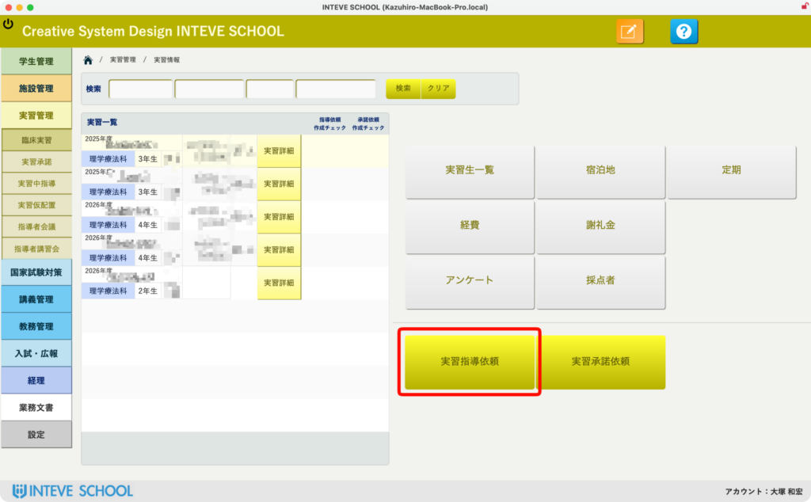
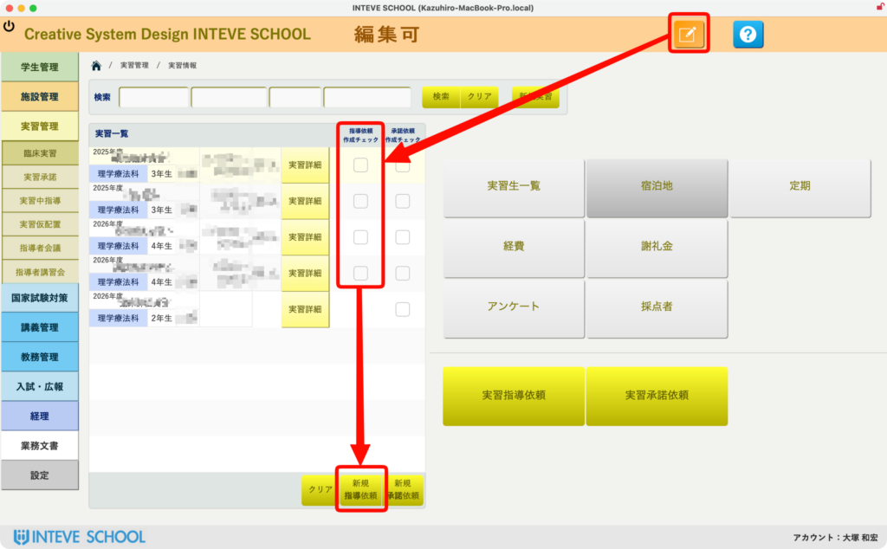
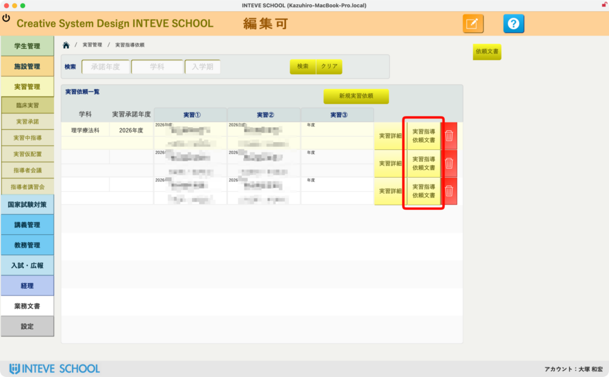
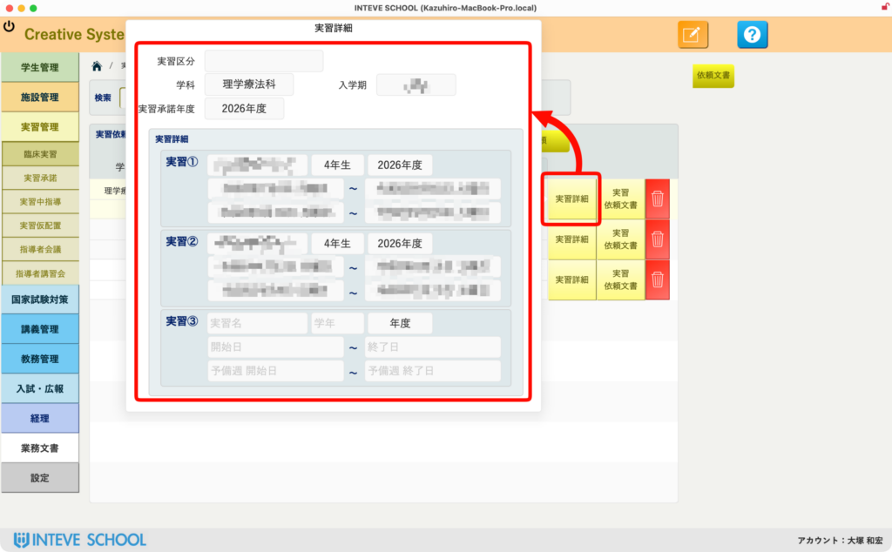

[← 実習管理ポータルに戻る](実習管理ポータル.md) | [メインページ](top.md)

# 実習情報 指導依頼

# ✉️ 実習情報：実習指導依頼文書の作成・管理機能

実習を受け入れていただく施設へお送りする「実習指導依頼文書」。宛先ごとに学生数や実習期を正しく記載し、公文書番号などを管理する作業は、間違いが許されないデリケートな業務です。INTEVE SCHOOLでは、複数の実習情報を1通の公文書へスマートにまとめ上げ、テンプレートを活用して一瞬で美しい依頼文書を生成します。

### 📂 1. 指導依頼画面へのアクセス

- **作成済みの場合:** 実習管理ポータルから「実習指導依頼」をクリックするだけで、いつでも過去に作成した文書の確認や再印刷が可能です。

### 📑 2. 複数実習をまとめた新規文書の作成

複数の実習（最大3つまで）を1通の依頼文書にまとめて作成できます。

1. 画面を「[編集モード](編集モードへ.md)」にします。
2. 依頼文書に含めたい実習期をドロップダウンから選択します。
3. 下部の「新規指導依頼」をクリックすると、選択した実習データが自動集約された新しい文書が作成されます。

### 🔍 3. 指導依頼文書の選択と編集画面の起動

一覧の中から、内容を編集・確認したい行の「実習指導依頼文書」（※ボタン名変更後を反映）をクリックします。 クリックすると、その施設向けの個別レイアウトと詳細な編集画面が起動します。すでに自動集約されたデータをもとに構築されているため、ここからの手入力は最小限に抑えられます。

### 📋 4. 選択された実習詳細情報の自動確認

編集画面内では、事前のステップで選択・集約された実習情報（学年、実習期間、対象となる実習期の組み合わせなど）が一覧でマッピングされています。 文書作成を進める前に、「どの実習期の情報が盛り込まれているか」をこの画面上でひと目で再確認できるため、実習期の取りこぼしやミスマッチを防ぎ、確実な書類作成をサポートします。

続きは[こちらのページ](実習情報-指導依頼文書.md)へ。

---
[← 実習管理ポータルに戻る](実習管理ポータル.md) | [メインページ](top.md)
