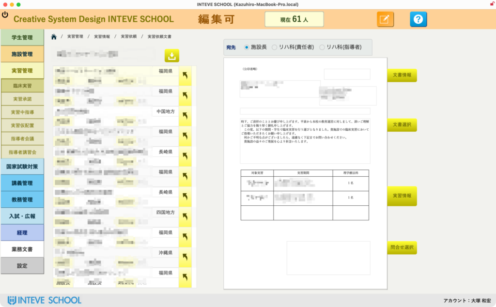
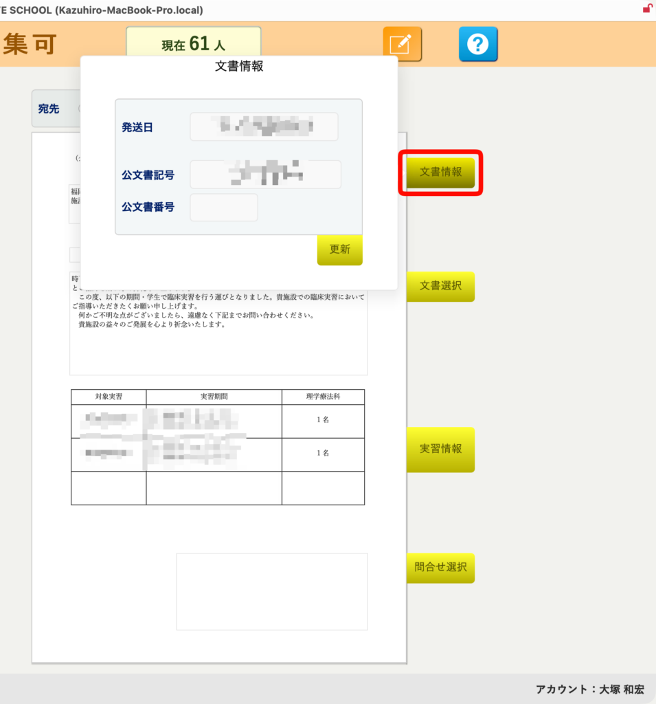
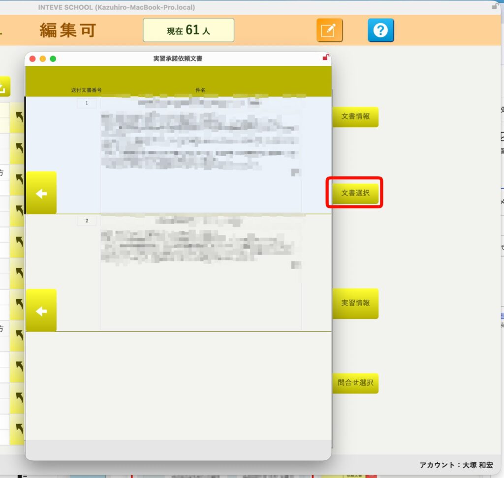
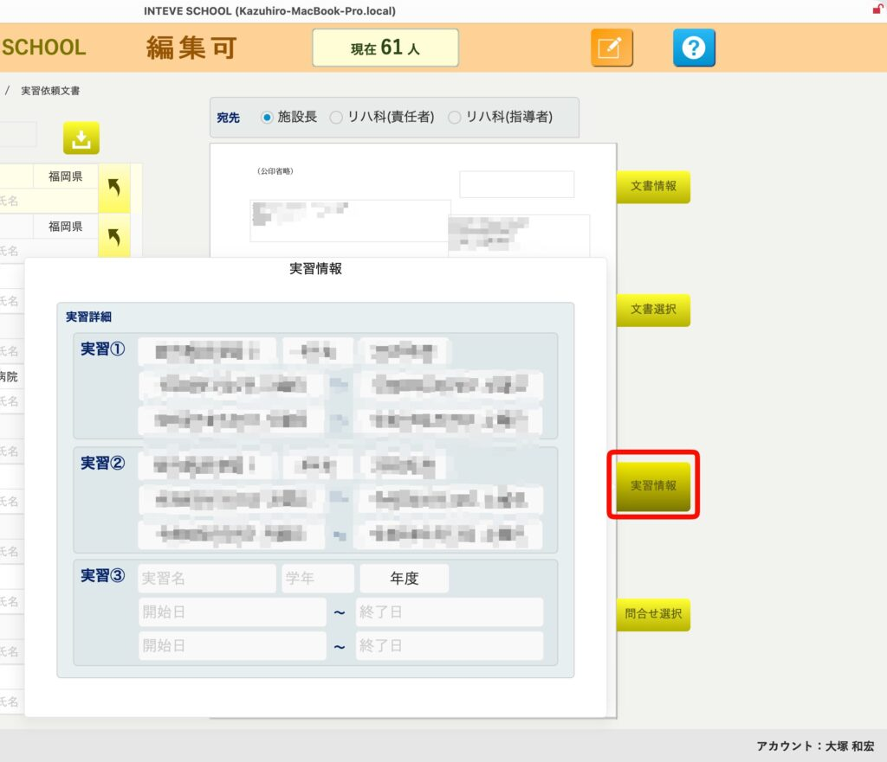
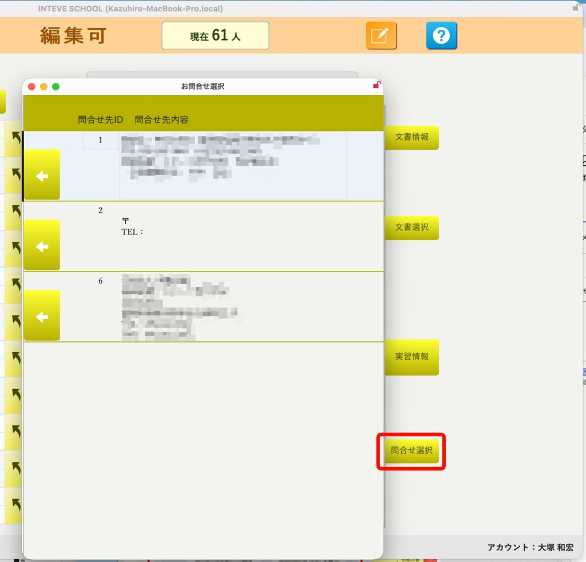
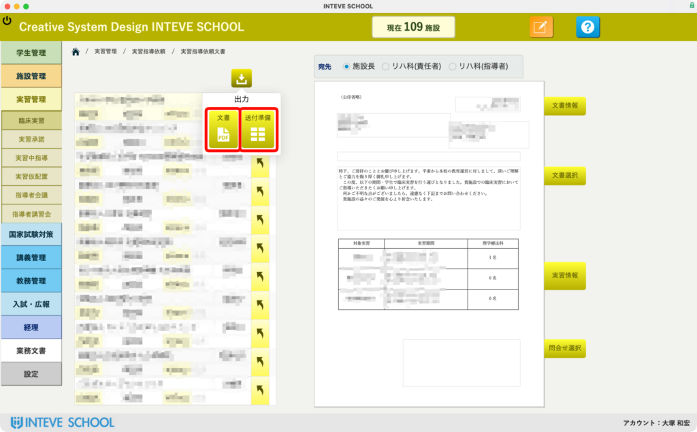

[← 実習管理ポータルに戻る](実習管理ポータル.md) | [メインページ](top.md)

# 実習情報 指導依頼文書

# ✉️ 実習情報：実習指導依頼文書の編集・マスタ設定機能

### 🔍 5. 文書の編集とプレビュー連動

一覧から「実習指導依頼文書」をクリックすると、詳細な編集・プレビュー画面が開きます。

- **宛先切り替え連動:** 左側の施設一覧から施設名をクリックするだけで、右側の文書プレビューの宛名・挨拶文・対象学生数などの情報がリアルタイムに切り替わります。

### ⚙️ 6. テンプレートを活用した各部マスタ設定（右側メニュー）

右側の各種設定ボタンから、文書の細部を簡単な操作でカスタマイズ・固定化できます。

**📄 文書情報設定:** 送付日や公文書番号を設定します。基本となる公文書記号（学校の識別番号など）は初期設定から自動反映されるため、枝番を入力するだけで済みます。

**💬 本文テンプレート:** あらかじめ登録してある「時候の挨拶」や「本文」のテンプレートから、使用したい文章を【矢印（◀）】ワンクリックで一発挿入できます。

**📅 実習情報確認:** 選択されている実習の学年、期間、対象者などの詳細データを手元でいつでも確認できます。

**📞 問合せ先設定:** 担当教員名や連絡先マスタから、今回の文書に記載する問合せ先を【矢印（◀）】で簡単に流し込めます。

💡 **ポイント:** 「施設ごとに書類を1枚ずつ作って、コピペして、番号を打って……」という不毛な転記作業は一切不要です。ベースとなる実習期を選び、テンプレートをパチパチとはめ込んでいくだけで、100施設でも200施設でも、完璧に統制された公文書が瞬時に完成します。

### 📄 文書出力と送付準備への遷移

作成した文書の確認画面上部にある「出力」ボタンをクリックすると、目的に合わせた2つの出力アクションを選択できます。

- **📄 文書（PDFアイコン）：** 対象施設向けの各種文書が**PDF形式で一括出力**されます。そのまま印刷やファイル保存が可能です。
- **📮 送付準備（グリッドアイコン）：** 封筒やハガキなどの宛名印刷を行うための「送付準備レイアウト」へ移動します。

さらに、各種型式での送付準備が行えます。詳しくは[こちら](業務文書-送付文書.md)。

---
[← 実習管理ポータルに戻る](実習管理ポータル.md) | [メインページ](top.md)
