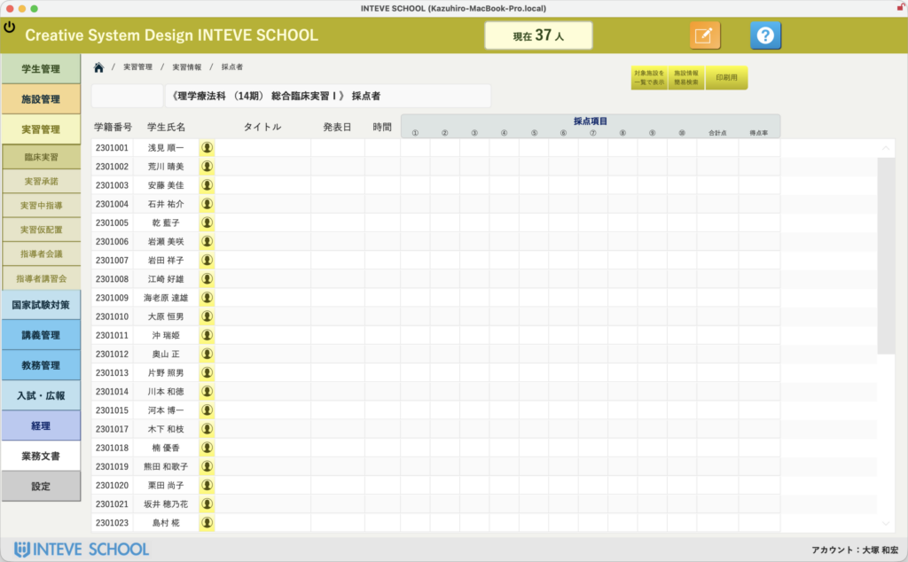

[← 実習管理ポータルに戻る](実習管理ポータル.md) | [メインページ](top.md)

# 実習情報 採点者

# 📝 実習情報：採点者（OSCE・CBT評価）管理機能

現代の理学療法士・作業療法士養成において、臨床実習終了後の客観的臨床能力試験（OSCE）および共用試験（CBT）の実施は、実習・評価の質を担保するための極めて重要なプロセスです。INTEVE SCHOOLでは、各養成校が独自に行うこれら高度な試験評価をシームレスに統合し、複雑な成績管理を一元化する土台を提供します。

> **💡 指定規則と業界の動向について** 理学療法士作業療法士学校養成施設指定規則の改正に伴い、臨床実習前後の「客観的評価（OSCE等による実践能力の確認）」は必須（義務化）となっています。また、業界全体（協会・養成施設協会など）としても、理学療法士の社会的信頼とクオリティ維持のためにOSCEの標準化・厳格化には非常に力を入れています。

### 🎛️ 1. 学校独自の評価割合（OSCE × CBT）を柔軟にカスタマイズ

実習の最終評価をどう算出するかは、学校ごとの教育方針によって多種多様です。本システムでは、評価項目の設計から配分までを完全にオーダーメイドで構築できます。

- **配分カスタマイズ:** 「OSCEの点数を〇割、CBTの点数を〇割」といった比率計算をあらかじめ設定し、自動算出させることが可能です。
- **他項目の追加:** 試験データだけでなく、実習地からの評価点など、それ以外の任意の評価項目を組み合わせて「最終的な実習成績」として合算するロジックも自由に組み込めます。

### 🔄 2. 既存データ・他機能とのスムーズな連携

- **CBTデータのインポート:** 本システム内の「国家試験対策機能」で実施したCBT模擬試験のデータを、そのままこの採点管理画面へボタン一つでインポートできます。
- **ミスのない自動集約:** あらゆる評価軸の点数が1箇所に集約されるため、手作業での転記ミスや、Excelでの計算式エラーによるトラブルを完全にゼロにします。

### 🚀 3. 将来的な展望：iPadを活用した完全ペーパーレス採点

現在はデータ集約の「土台」としての画面ですが、以下のような次世代の試験運用システムへの機能拡張が「楽勝で」可能です。

- **iPad採点システム:** 試験会場で教員がiPadを持って受験生（学生）を採点。入力したデータはリアルタイムでFileMaker Serverへ送信されます。（使用するiPad台数分のFileMakerライセンスが必要です。）
- **即時集計:** 試験が終了し、教員が自席のデスクに戻る頃には、すべての採点・集計がすでに完了している……という圧倒的にスマートな試験環境をつくることができます（※実装をご希望の際はお気軽にご相談ください）。

💬 **学校関係者の皆様へ：要望を募集しています** OSCEの試験項目管理や、試験そのものの構築機能についても対応可能です。現在はベースとなる土台のレイアウトを公開していますが、「うちの学校ではこういう評価シートを使っている」「この手順で採点業務を行っている」といった実際の運用方法をぜひお聞かせください。 学校のやり方に完璧にフィットさせ、余計な資料作成の手間をすべて省く「完全ペーパーレスな評価システム」へと仕上げてまいります。遠慮なくご要望をお寄せください！

---
[← 実習管理ポータルに戻る](実習管理ポータル.md) | [メインページ](top.md)
