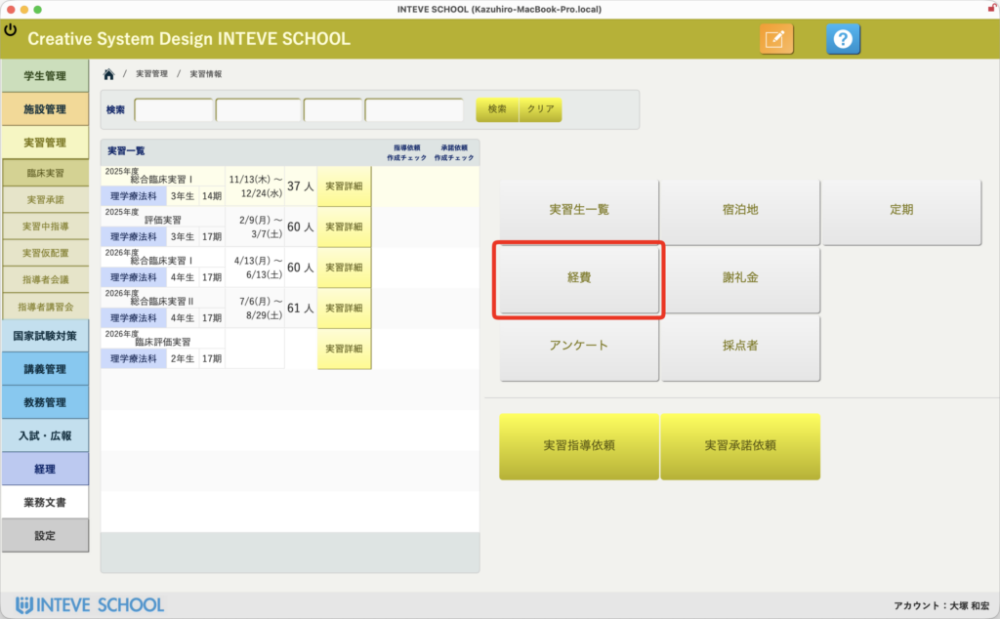
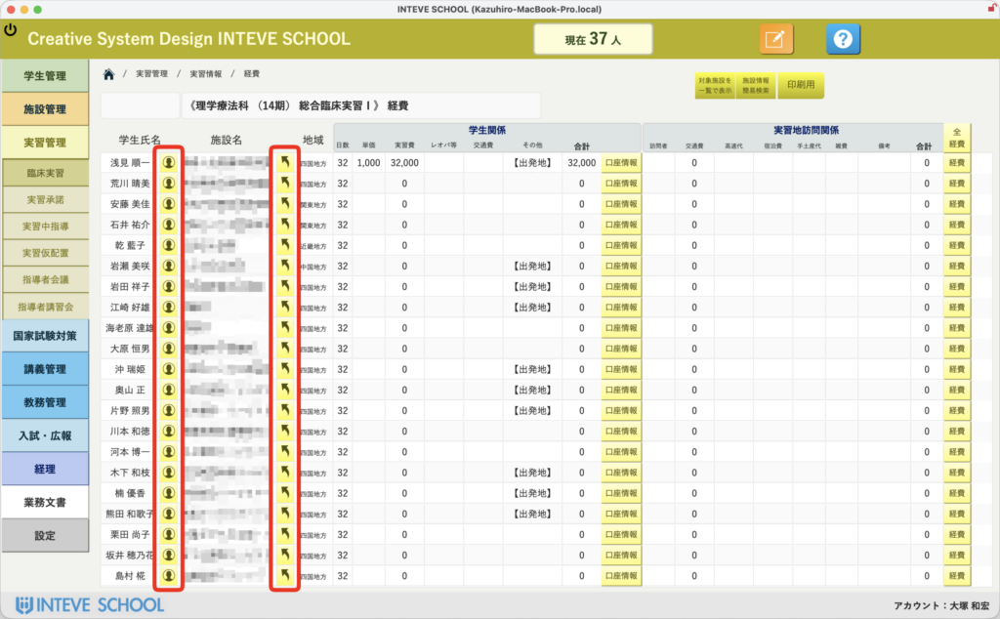
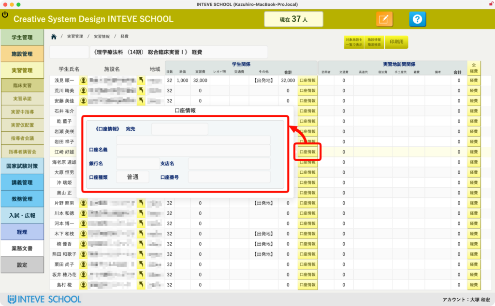

[← 実習管理ポータルに戻る](実習管理ポータル.md) | [メインページ](top.md)

# 実習情報 経費

# 💴 実習情報 経費の使い方

実習ポータルのメニューから「経費」ボタンを押すと、学生が実習期間中に使用する各種経費（交通費、宿泊費、その他経費）の算出データ、および実習施設への支払い状況を一元管理する画面が開きます。

> 💡 **実習情報 経費の使いかた** 施設への謝礼金や経費など、実習にまつわるお金の動きを校内で漏れなく共有・管理する画面です。 🔒 **\[編集\] 業務を行う際の必須操作：** 右上にある「[編集ボタン（歯車マーク）](編集モードへ.md)」をクリックして、編集可能状態に切り替えてから入力を行ってください。

### 👤① 学生・施設詳細へのダイレクト遷移

一覧画面に並ぶ各学生の左側にあるアイコン、および施設名の横にあるアイコンをクリックすることで、それぞれの詳細ページへ一瞬でジャンプできます。

- **学生詳細アイコン：** 対象学生の個別情報ページへ遷移し、実習の進捗や基本情報を確認できます。
- **施設詳細アイコン：** 配属先となっている実習施設の詳細情報ページへ遷移し、受入条件や施設情報をその場で確認できます。

### 🏢② 対象施設の口座情報管理（ポップオーバー入力）

各施設への謝礼金や経費の振り込みに必要な口座情報を、画面を切り替えることなくその場でスマートに管理できます。

- **口座情報ポップオーバー：** 一覧内の「口座情報」ボタンをクリックすると、口座名義、金融機関名、支店名、口座種別、口座番号を入力する専用のポップオーバー画面が展開します。
- 画面を移動せずにその場で入力が完結するため、事務方との連携やデータ入力の作業効率が劇的に向上します。
- ここで入力された口座情報は施設マスターへ安全に蓄積され、次年度以降もそのまま引き継がれます。

### 🚀 将来のカスタマイズと事務連携へのアドバイス

実習に伴う経費精算や公文書作成は、教員だけで抱え込むには負担が大きく、本来は事務方とのスムーズな連携が不可欠な領域です。

本画面を活用し、学校全体の運用に合わせて以下のようなさらなる業務効率化（カスタマイズ）を実装することも可能です。ご希望の際はいつでもお気軽にご相談ください。

- **🏦 銀行振込データ（FBデータ／全銀協フォーマット）の自動生成** 一通り入力が完了した経費・口座データを元に、ネットバンキングにそのまま吸い込ませることができる振込用ファイルを一撃で出力。手入力での銀行振込作業をゼロにします。
- **🖨️ 施設向け「精算書・支払通知書」の一括発行** FileMakerに蓄積された経費データから、各施設宛ての支払通知書や精算書をボタン一つでPDF出力・印刷可能にします。
- **🔒 事務方専用のアクセス権限・閲覧制限の設定** 「お金にまつわるデリケートなデータは、事務担当者と特定の教員だけが編集できるようにしたい」といった、役割に応じたフィールドレベルのアクセスセキュリティ設定も柔軟に構築可能です。

---
[← 実習管理ポータルに戻る](実習管理ポータル.md) | [メインページ](top.md)
