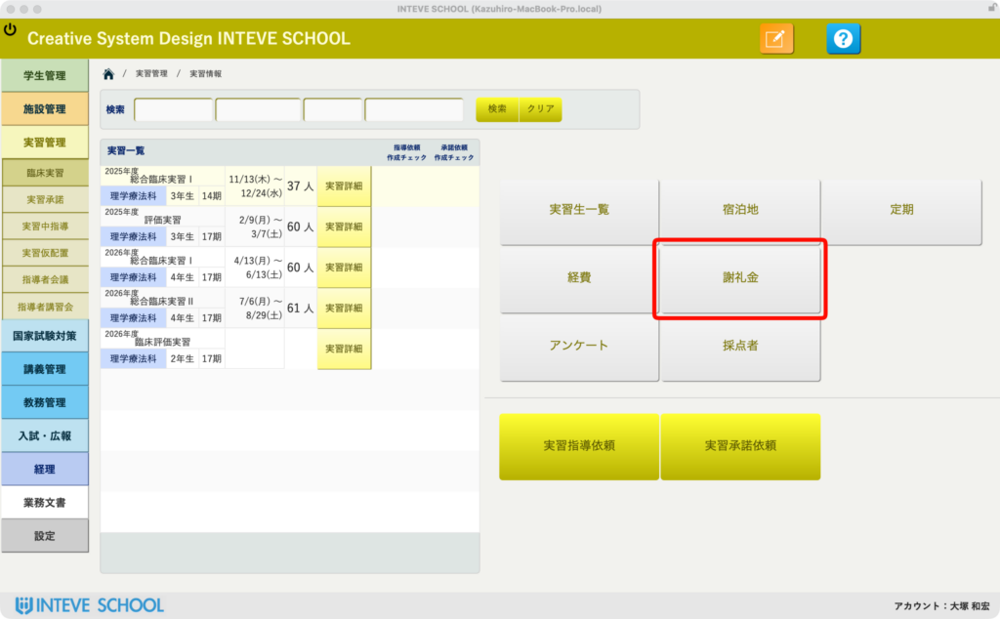
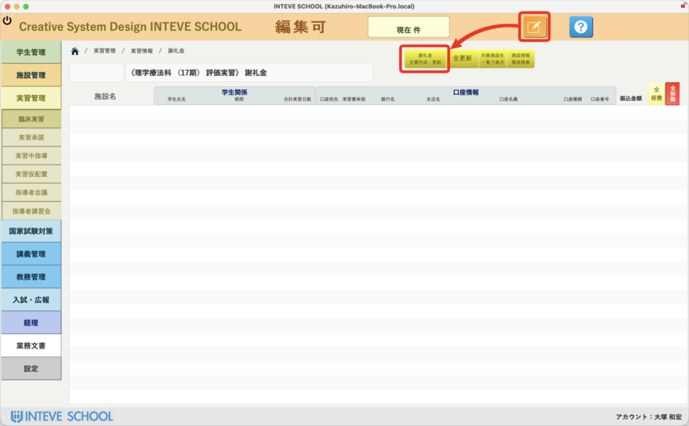
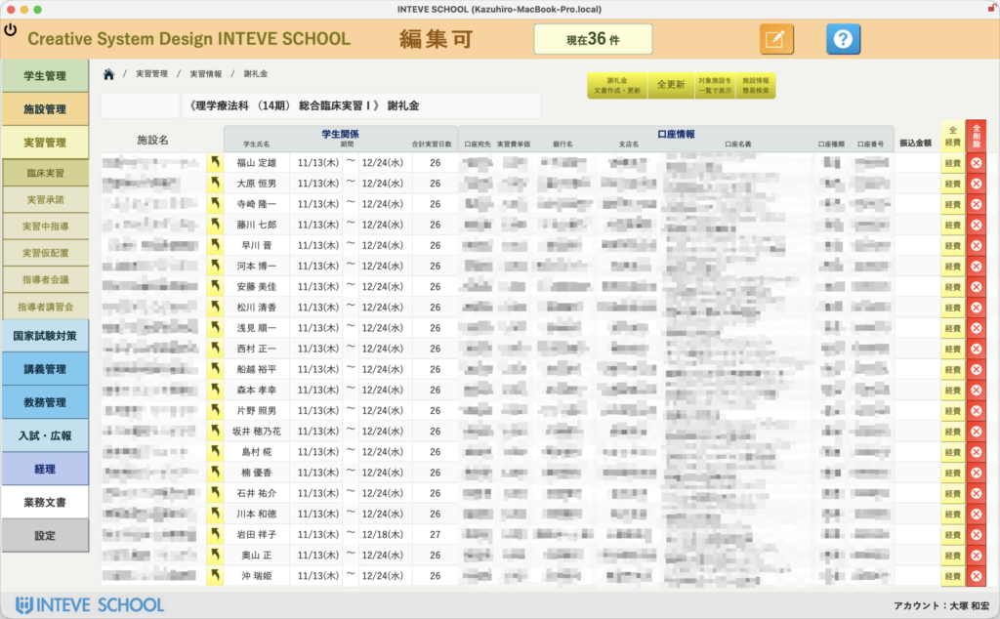
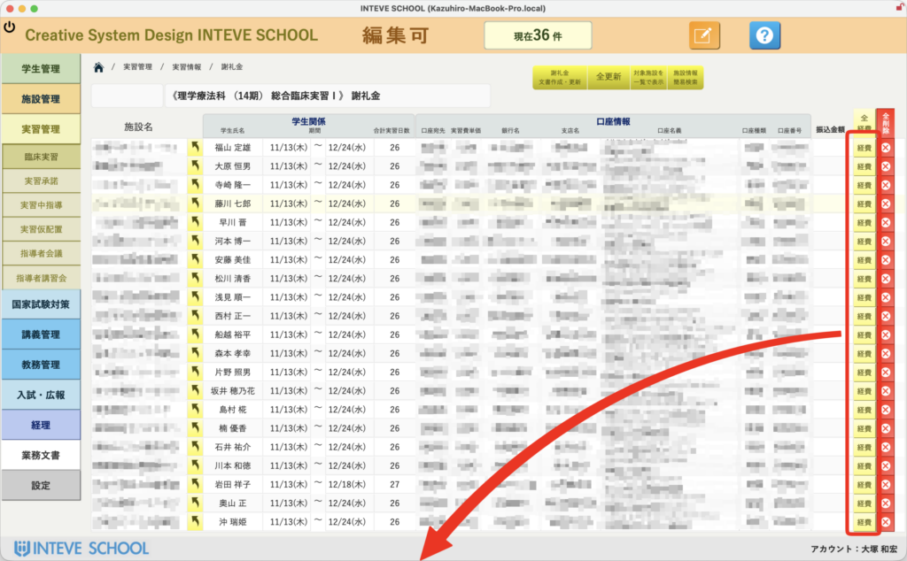
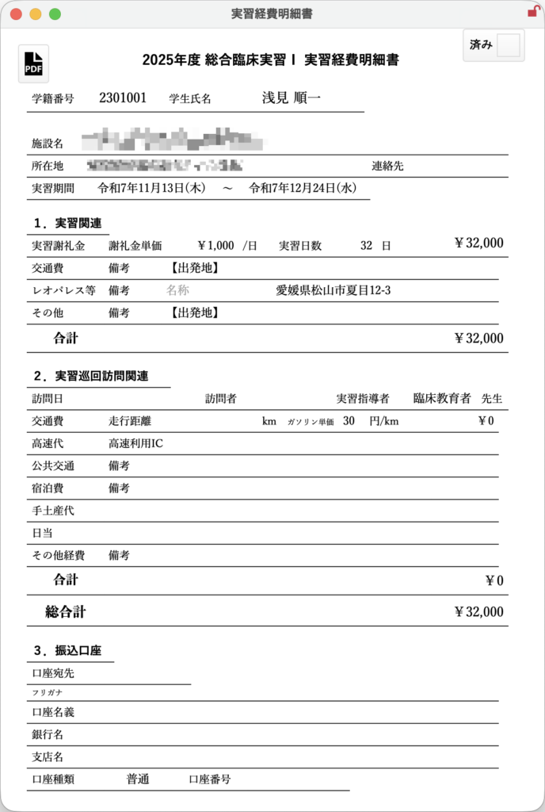

[← 実習管理ポータルに戻る](実習管理ポータル.md) | [メインページ](top.md)

# 実習情報 謝礼金

# 💰 実習情報：謝礼金の自動作成・管理機能

実習に伴う「謝礼金」の計算や帳票作成は、通常は事務部門が多くの時間を割いて行う非常に煩雑な業務です。INTEVE SCHOOLでは、実習データと連動して謝礼金の対象者を自動抽出し、ドキュメント作成から経費処理までをわずか数クリックで完結できるよう設計されています。

### 📥 1. 謝礼金管理画面を開く

メニューまたは実習情報の管理画面から、**「謝礼金」ボタン**をクリックします。 この一歩で、該当する実習に関連する謝礼金対象者の抽出準備が整います。

### 📝 2. 編集モードの起動とドキュメントの作成・更新

画面が切り替わったら、まずは画面上部の「編集」ボタン（ノートと鉛筆のアイコン）**をクリックして[編集許可状態](編集モードへ.md)にします。 編集可になると、新たに**「謝礼金文書作成・更新」というボタンが現れますので、こちらをクリックしてください。裏でシステムが最新の実習データを参照し、必要な情報を一括で組み立て始めます。

### 🤖 3. 重複の自動集約とデータの自動マッピング

ボタンを押すと、システムが自動的に**重複する学生をスマートに1つにまとめ上げ、リスト化**します。

- **自動入力項目:** 「学生氏名」や「実習日」などの基本情報は、実習データから100%自動で正確にマッピングされます。
- **口座情報について:** 事前にリンク先のマスタ等で[口座情報を編集・登録](施設情報-年次情報.md)しておけば、このタイミングで対応する口座情報もすべて自動で綺麗に流し込まれます。手入力による転記ミスを完全にゼロに抑えることができます。

### 📋 4. 経費確認と帳票出力（カスタマイズ対応）

データの自動生成が完了したら、生成されたリストの右端にある「経費」ボタン**をクリックします。 クリックすると、出力可能な各種帳票（振込依頼書や経費精算書類など）の一覧が表示されます。これらの帳票レイアウトは**用途に合わせて自由に変更・カスタマイズが可能ですので、各学校の運用ルールや指定フォーマットに柔軟にフィットさせることができます。

💡 **ポイント:** これまで教員や事務員の手を煩わせていた「データを突き合わせて、重複を省いて、口座を確認して、書類を作る」という一連の作業が、画面の指示に従ってボタンをポン、ポンと押していくだけで完了します。業務負担を劇的に軽減する強力な機能です。

---
[← 実習管理ポータルに戻る](実習管理ポータル.md) | [メインページ](top.md)
