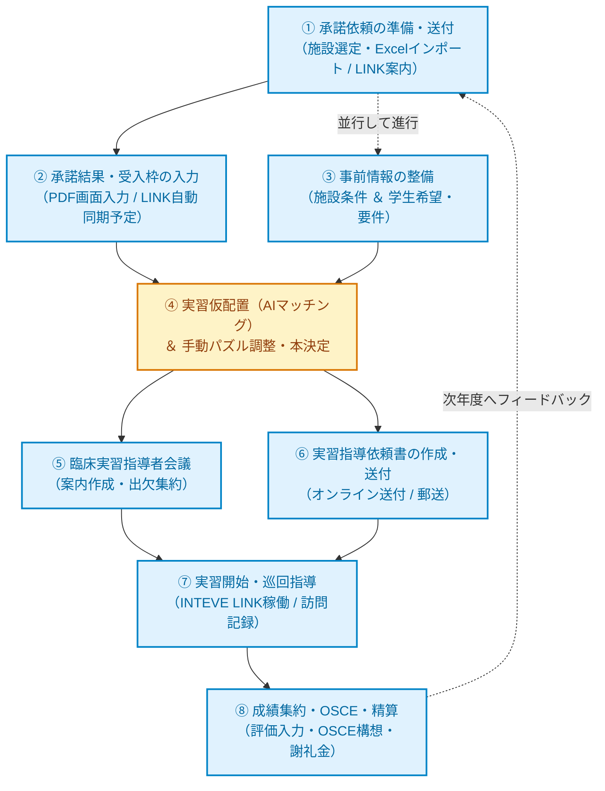

[← 実習管理ポータルに戻る](実習管理ポータル.md) | [メインページ](top.md)

# 🗺️ 実習調整者のための実習業務 年間運用フロー＆スケジュールガイド

各養成校に1名配置される**「実習調整者（実習委員長・担当教員）」**の業務は、施設との渉外、受入枠の確保、学生の希望聴取、複雑なマッチング（仮配置）、指導者会議、指導依頼、実習中の巡回フォロー、成績集約まで、極めて多岐にわたり年間を通して途切れることがありません。

「INTEVE SCHOOL」の一連の実習機能はこれらを劇的に効率化しますが、機能が豊富であるがゆえに「**今、どの画面で何をするべきか**」が把握しづらい面もあります。

本ガイドでは、**年間を通した業務の流れ（1年間のタイムライン）**を整理し、各フェーズで使うべき機能と操作マニュアルへのリンクを1枚のページに集約しました。日々の実習調整業務のコンパスとしてご活用ください。

---

## 📅 年間業務タイムライン＆全体フローチャート

実習業務は、前年度の準備から実習終了後の評価まで、以下のようなステップで循環していきます。  
（💡 **図の中の各枠をクリックすると、該当ステップの詳細解説へジャンプします**）

### 🗓️ 年間進行スケジュール概要

> 💡 **操作のヒント:** 各行をクリックすると、該当ステップの詳細解説へ直接ジャンプします。

| 時期（目安） | フェーズ・主な実習業務 | 使用する主要機能 | LINK連携 |
| :--- | :--- | :--- | :---: |
| [**春（4〜6月）**](#step-1) | [**【STEP 1】実習承諾依頼の準備・送付** 次年度受入を施設へ打診、LINK案内状同封](#step-1) | [承諾依頼、承諾依頼文書、送付文書](#step-1) | [案内状送付](#step-1) |
| [**初夏（6〜8月）**](#step-2) | [**【STEP 2】承諾結果の集約・受入枠入力** 返送された承諾書から受入可能人数を入力](#step-2) | [施設実習承諾（PDF画面入力）](#step-2) | [自動同期（※予定）](#step-2) |
| [**夏（7〜9月）**](#step-3) | [**【STEP 3】事前条件の入力・データ整備** 出揃うまでに施設条件（診療科・車・宿舎）と学生希望を入力](#step-3) | [施設仮配置事前入力、学生仮配置事前入力](#step-3) | [フォーム連携可](#step-3) |
| [**秋（9〜10月）**](#step-4) | [**【STEP 4】AI実習仮配置＆パズル調整** 自動マッチング実行後、画面上で手動微調整して本決定](#step-4) | [実習仮配置、仮配置詳細、実習生一覧](#step-4) | [—](#step-4) |
| [**秋〜冬（10〜12月）**](#step-5) | [**【STEP 5】臨床実習指導者会議の開催** 招待状の一括生成・発送、出欠管理](#step-5) | [指導者会議、会議詳細、参加者管理](#step-5) | [オンライン出欠](#step-5) |
| [**冬（12〜1月）**](#step-6) | [**【STEP 6】実習指導依頼書の作成・送付** 配属決定施設へ正式依頼状を一括発行・送付](#step-6) | [指導依頼、指導依頼文書](#step-6) | [オンライン送付](#step-6) |
| [**実習期（1〜3月等）**](#step-7) | [**【STEP 7】実習開始・INTEVE LINK本格始動** 日報・コンディション確認、巡回指導記録の入力](#step-7) | [INTEVE LINK、実習中指導（全体/個別）](#step-7) | [日常運用・サイン](#step-7) |
| [**実習後（3〜4月）**](#step-8) | [**【STEP 8】成績集約・OSCE・経費精算** 実習評価の回収、OSCE実施、指導謝礼金の計算](#step-8) | [採点者管理、実習履歴、経費、謝礼金](#step-8) | [OSCE（※開発予定）](#step-8) |

---

## 📌 各ステップの詳細手順＆マニュアルリンク

---

### 【STEP 1】実習承諾書を送る施設の設定・準備
次年度に実習生を受け入れてもらう候補施設を選定し、承諾依頼書を作成・送付します。

1. **実習承諾書を送る施設の選定・設定**
   - 既存の施設マスターから対象施設を選択、または年度初めにExcelデータ等から一括インポートして設定します。
2. **承諾依頼データの作成**
   - 複数の実習期（評価実習・総合実習など）を1通の公文書へ自動集約します。
3. **初年度・随時：INTEVE LINK登録の案内文書を同封・送付**
   - 承諾書を送るタイミングで、クラウド型実習プラットフォーム「INTEVE LINK」の利用登録案内を同封します。
   - 💡 **柔軟な運用ポイント:** 学校や施設によって導入検討のタイミングは異なります。そのため、LINKの案内文書は承諾時だけでなく**年間のどのタイミングでも随時送付可能**な仕組みになっています。

> 📖 **関連マニュアル:**
> - [実習情報 承諾依頼](実習情報-承諾依頼.md) — 複数実習期をまとめた承諾依頼の新規作成
> - [実習情報 承諾依頼文書](実習情報-承諾依頼文書.md) — 承諾依頼公文書の一括印刷・レイアウト確認
> - [施設情報 一覧](施設情報-一覧.md) — 対象施設の検索・抽出
> - [施設情報 情報整備](施設情報-情報整備.md) — 施設マスターの更新とデータ整備
> - [施設情報 送付文書](施設情報-送付文書.md) / [業務文書 送付文書](業務文書-送付文書.md) — 案内状・添え状の一括作成
> - [《INTEVE LINK》プラットフォーム概要](inteve-link.md) — INTEVE LINKの特長と全体像

[↑ スケジュール概要に戻る](#schedule-summary)

---

### 【STEP 2】承諾書返送の集約・受入可能人数の入力
施設から返送された実習承諾書の内容（受入可否・受入期・受入可能人数）をシステムに記録します。

1. **紙で返送された場合（PDFスキャン画面入力機能：実装済み）**
   - 返送された紙書類をスキャナー等で1つのPDFにまとめ、システムにドラッグ＆ドロップで取り込みます。
   - システムが自動でページ分割し、**画面の左側で承諾書PDFを確認しながら、右側で受入人数をサクサク転記・入力**できます。バラバラの紙をめくるストレスをゼロにします。
2. **INTEVE LINK利用施設の場合（※オンライン自動同期・今後の機能）**
   - 施設側がINTEVE LINK上で受入可否・人数を入力すると、本システムにリアルタイムで自動同期される仕組みを構築予定です（現在叩き台として準備中）。

> 📖 **関連マニュアル:**
> - [施設情報 実習承諾](施設情報-実習承諾.md) — 承諾書PDF取り込み・分割プレビュー＆受入人数入力
> - [実習情報 承諾履歴](実習情報-承諾履歴.md) — 年度別受入実績・承諾枠の推移確認

[↑ スケジュール概要に戻る](#schedule-summary)

---

### 【STEP 3】出揃うまでの事前情報整備（施設条件 ＆ 学生希望・要件）
承諾書が各施設から出揃うのを待つ期間を活用して、AI仮配置に必要な「施設側の受入条件」と「学生側の希望・条件」を入力しておきます。

1. **施設側の条件入力（施設仮配置事前入力）**
   - **診療分野・期:** 急性期、回復期、慢性期、維持期などの対応分野
   - **受入環境:** 🚗 自動車通勤の可否（可/不可）、🏠 宿舎・宿泊施設の利用可否（有/無）
2. **学生側の希望・要件入力（学生仮配置事前入力）**
   - **通学環境:** 出発元住所（自宅・実家・親戚宅など居候先）、自動車使用の可否
   - **希望分野:** 学生が希望する診療分野・領域
   - **マッチング要件:** 抗体検査のクリア状況、成績、個別配慮事項
3. 💡 **Googleフォーム連携オプション**
   - 学生へのアンケートをGoogleフォームで行う場合、回答結果を本システムへ一括取込する連携カスタマイズも可能です。

> 📖 **関連マニュアル:**
> - [施設情報 施設仮配置事前入力](施設情報-施設仮配置事前入力.md) — 施設の診療科・車・宿舎条件の設定
> - [学生情報 学生仮配置事前入力](学生情報-学生仮配置事前入力.md) — 学生の希望分野・出発元住所・車利用の設定
> - [実習情報 宿泊地](実習情報-宿泊地.md) — 遠隔地実習用の宿泊地・寮の管理

[↑ スケジュール概要に戻る](#schedule-summary)

---

### 【STEP 4】実習仮配置機能の実行（AIマッチング）＆ 手動パズル調整
すべての承諾枠、施設条件、学生希望が揃ったら、実習配置を実行します。

1. **AI自動マッチングの実行**
   - 通学距離・通勤手段（車/公共交通）・診療分野・宿舎・抗体条件・学生適性などの膨大な変数をシステムが瞬時に網羅し、**ワンクリックで最適な配置の「叩き台」を自動生成**します。
2. **システム上での手動パズル（微調整）**
   - 生成された叩き台をもとに、教員間の会議で画面を見ながらドラッグ＆ドロップ感覚で微調整（パズル）を行います。
3. **配置学生の決定**
   - 最終確定を行い、実習生一覧やチェックリストで抜け漏れがないか確認します。

> 📖 **関連マニュアル:**
> - [実習管理 実習仮配置](実習管理-実習仮配置.md) — 仮配置シミュレーションの概要と条件設定
> - [実習管理 実習仮配置 詳細](実習仮配置詳細.md) — 配置結果の確認、手動入替（パズル）と確定操作
> - [実習情報 実習生一覧](実習情報-実習生一覧.md) — 確定した実習生の配属一覧と絞り込み
> - [実習管理 チェックリスト](実習管理-チェックリスト.md) — 実習前準備の進捗ステータス管理

[↑ スケジュール概要に戻る](#schedule-summary)

---

### 【STEP 5】臨床実習指導者会議の招待文書作成・出欠集約
配属決定後、受入施設の指導者を招いて開催する「臨床実習指導者会議」の案内状作成と出欠管理を行います。

1. **新規会議枠の作成と参加施設の一括登録**
   - 年度・学科を選択し、受入決定施設を一発で一括抽出・自動登録します。
2. **招待文書の作成・送付**
   - **紙・郵送の場合:** システムから宛名付き招待公文書・出欠票を一括印刷。極めてスムーズに発送準備が完了します。
   - **INTEVE LINK利用の場合:** オンライン上で直接案内を送付可能。
3. **出欠の集約**
   - 郵送返送分もシステム画面で素早くチェック。
   - オンライン返信なら、**ボタン操作だけで出欠データが自動集約**されます。

> 📖 **関連マニュアル:**
> - [実習管理 指導者会議](実習管理-指導者会議.md) — 会議マスター作成、参加施設の一括抽出とID登録
> - [実習管理 指導者会議 詳細](実習管理-指導者会議-詳細.md) — プログラム・案内文面の編集
> - [実習管理 指導者会議 参加者](実習管理-指導者会議-参加者.md) — 出席・欠席・参加者名簿の管理
> - [実習管理 指導者会議 一覧](実習管理-指導者会議-一覧.md) — 過去の指導者会議一覧
> - [施設情報 指導者会議](施設情報-指導者会議.md) — 施設側カルテからの会議履歴確認

[↑ スケジュール概要に戻る](#schedule-summary)

---

### 【STEP 6】実習指導依頼書の作成・送付
実習開始に向けて、各施設へ正式な「実習指導依頼書」を作成・送付します。

1. **複数実習をまとめた新規指導依頼の作成**
   - 対象学年・実習期を選ぶだけで、施設ごとに最大3つの実習日程を1通の公文書へ自動集約します。
2. **指導依頼文書の発行・送付**
   - **INTEVE LINK登録施設:** オンラインで依頼文書を直接送付・通知。ペーパーレスかつ即座に届きます。
   - **未登録施設:** テンプレートを活用してワンクリックで美麗な依頼公文書を印刷・送付できます。

> 📖 **関連マニュアル:**
> - [実習情報 指導依頼](実習情報-指導依頼.md) — 複数実習を集約した指導依頼の新規作成
> - [実習情報 指導依頼文書](実習情報-指導依頼文書.md) — 指導依頼公文書の一括印刷・レイアウト調整

[↑ スケジュール概要に戻る](#schedule-summary)

---

### 【STEP 7】実習期間中の運用（INTEVE LINK本格始動 ＆ 実習中指導）
いよいよ実習がスタート。学生・施設・教員の三者が連携しながら日々の指導をサポートします。

1. **INTEVE LINKの本格始動（三者連携プラットフォーム）**
   - **コンディション把握:** 学生の日々の体調・メンタルを5段階で可視化（教員のみ閲覧可能で早期離脱を防止）。
   - **出席管理:** 実習時間の自動算出と、実習最終日の指導者手書きサイン（電子サイン）。
   - **デイリーノート（日誌）:** Web入力だけでなく手書きノート写真のアップロードにも対応。指導者の赤入れ・承認印。
   - **チェックリスト:** 自校仕様の到達度項目（見学・模倣・実施）をリアルタイム承認。
2. **LINK未利用施設への対応**
   - 電話やFAX、従来の訪問巡回等で丁寧にフォローアップを行います。
3. **実習地訪問・巡回指導の記録入力**
   - **学内入力機能（完成済み）:** 巡回訪問・電話面談・オンライン面談の指導記録を一元登録・検索・個別PDF出力可能。
   - **オンライン現地入力（※未完成・今後の開発予定）:** 訪問先から直接スマホやタブレットで指導報告を即時入力できる機能を準備中。

> 📖 **関連マニュアル:**
> - [《INTEVE LINK》プラットフォーム](inteve-link.md) — 日誌・出欠・コンディション・チェックリスト
> - [実習管理 実習中指導](実習管理-実習中指導.md) — 指導報告書の全体検索・絞り込み・PDF出力
> - [実習管理 実習中指導 個別画面](実習管理-実習中指導-個別.md) — 学生個別の指導進捗・面談記録詳細
> - [実習情報 実習中指導（参加票）](実習情報-実習中指導-参加票.md) — 訪問指導計画・教員割当
> - [実習情報 定期](実習情報-定期.md) — クールごとのスケジュール管理

[↑ スケジュール概要に戻る](#schedule-summary)

---

### 【STEP 8】実習成績の集約・OSCE・経費精算
実習終了後、評価データの回収、能力評価、そして指導謝礼金の支払い精算を行います。

1. **実習成績の集約・採点者管理**
   - 施設から提出された評価表をもとに採点結果を集約し、学生カルテに反映します。
   - 実習後アンケートを集計し、次年度の受入調整の参考データとして蓄積します。
2. **【開発予定・構想中】OSCE（客観的臨床能力試験）管理機能**
   - 実習前・実習後のOSCE（実技試験）評価をシステム上で集約・分析できる機能を新設予定です。実習評価とOSCE成績をクロス集計し、教育効果の客観的検証を可能にします。
3. **経費・謝礼金の一括精算**
   - 実習受け入れに対する施設・指導者への謝礼金計算、旅費・経費の清算書類を自動作成します。

> 📖 **関連マニュアル:**
> - [実習情報 採点者](実習情報-採点者.md) — 評価担当者・採点結果の管理
> - [実習情報 アンケート](実習情報-アンケート.md) — 学生・施設向け実習アンケートの集計
> - [学生情報 実習履歴](学生情報-実習履歴.md) — 学生ごとの過去の実習評価・履歴蓄積
> - [実習情報 経費](実習情報-経費.md) — 実習に伴う交通費・宿泊費等の経費管理
> - [実習情報 謝礼金](実習情報-謝礼金.md) — 指導謝礼金の自動算出と支払い管理

[↑ スケジュール概要に戻る](#schedule-summary)

---

## ❓ 実習調整者のよくある質問（FAQ）

### Q1. 全部の施設に「INTEVE LINK」を使ってもらう必要がありますか？
**A. いいえ、従来の紙・郵送運用との「ハイブリッド運用」が可能です。**  
多くの養成校では、LINKを使ってくれる先進的な施設と、従来の紙運用を希望する施設が混在します。INTEVE SCHOOLは、オンライン送信と紙の公文書印刷の両方に完全対応しているため、施設ごとの運用に合わせて柔軟に使い分けることができます。

### Q2. INTEVE LINKの案内文書は承諾書を送るときしか送れませんか？
**A. どのタイミングでも自由に送付可能です。**  
初年度の承諾書と同封して案内するのが一般的ですが、学校の導入スケジュールや施設の事情に合わせて、指導者会議の案内時、指導依頼時、あるいは年度途中の任意のタイミングで案内文書を出力・送付できます。

### Q3. AI仮配置の結果はそのまま確定しなければいけませんか？
**A. いいえ、AI仮配置はあくまで「叩き台（ベース案）」です。**  
ボタン1つで人間では考慮しきれない条件を網羅した高精度の叩き台が作られますが、最終的には実習調整者の先生が画面上で手動のパズル調整（微調整）を行い、学内会議で承認されたものを正式決定とします。

---

## 🚀 今後の機能アップデート・ロードマップ（叩き台）

現在、実習調整者の先生方の負担をさらに軽減するため、以下の機能拡張を順次進めています。

| 開発項目 | 開発ステータス | 実装予定の内容 |
| :--- | :---: | :--- |
| **INTEVE LINK 承諾書オンライン自動同期** | 🚧 開発中 | 施設がWeb上で受入可否・人数を回答すると、本システムの受入枠に即座に反映される機能 |
| **実習地訪問・巡回指導のオンライン入力** | 🚧 開発中 | 訪問先で教員がスマートフォンやタブレットから巡回指導報告書を直接入力できる機能 |
| **OSCE（客観的臨床能力試験）評価管理** | 💡 構想・設計中 | 実習前後の実技試験（OSCE）のステーション別採点・集計、実習評価との相関分析機能 |
| **INTEVE LINK 詳細マニュアルの拡充** | 📝 順次追加 | 各機能の操作キャプチャ画像や指導者向け・学生向け解説ページのさらなる追加 |

---
[← 実習管理ポータルに戻る](実習管理ポータル.md) | [メインページ](top.md)
