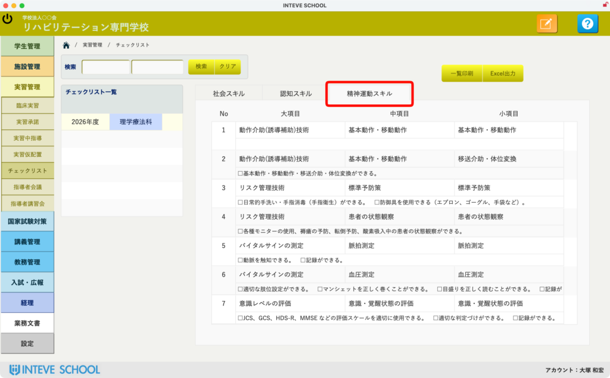
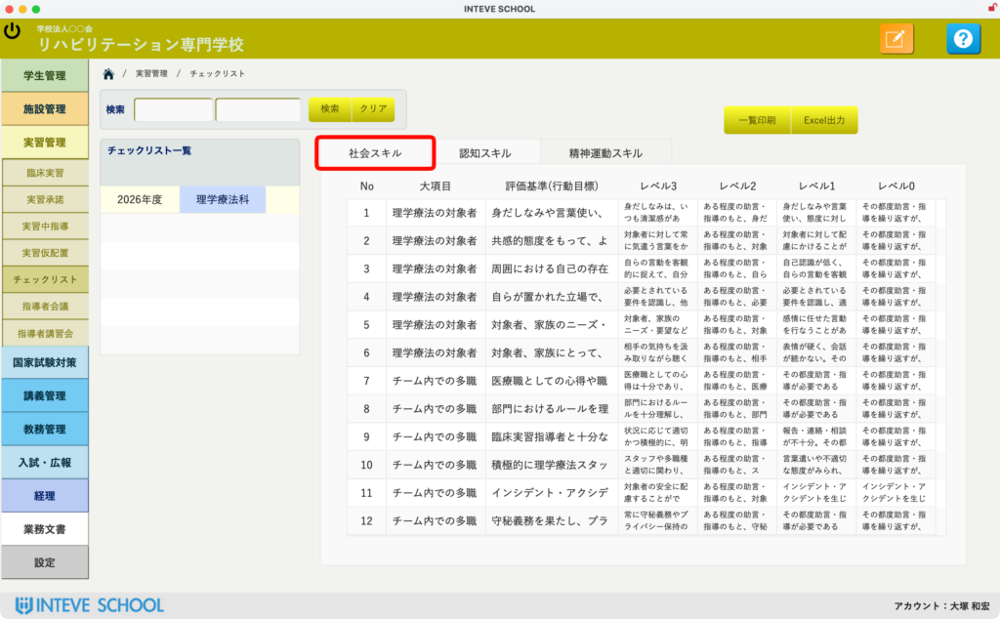
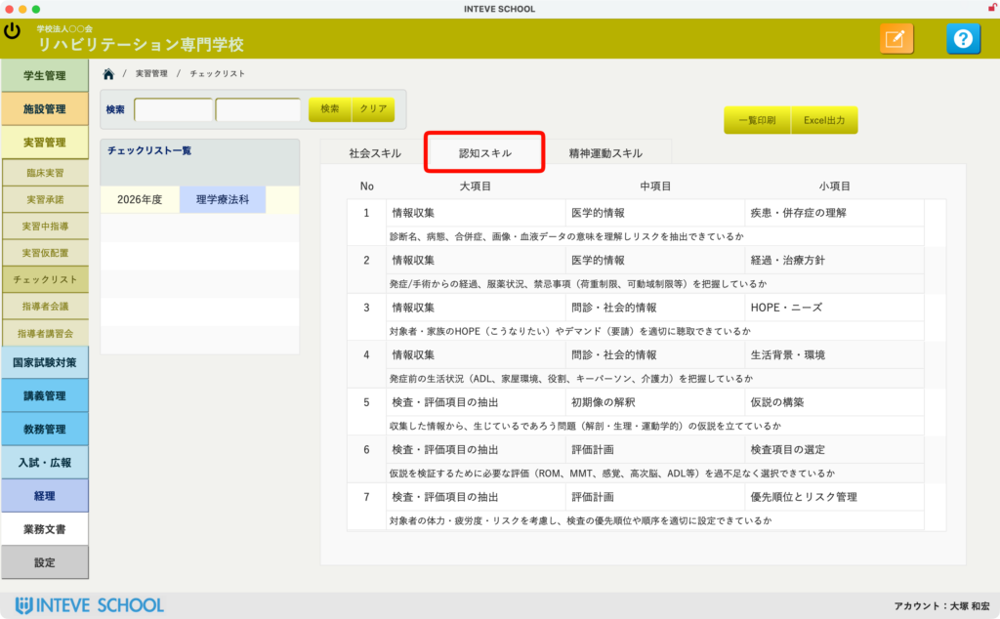
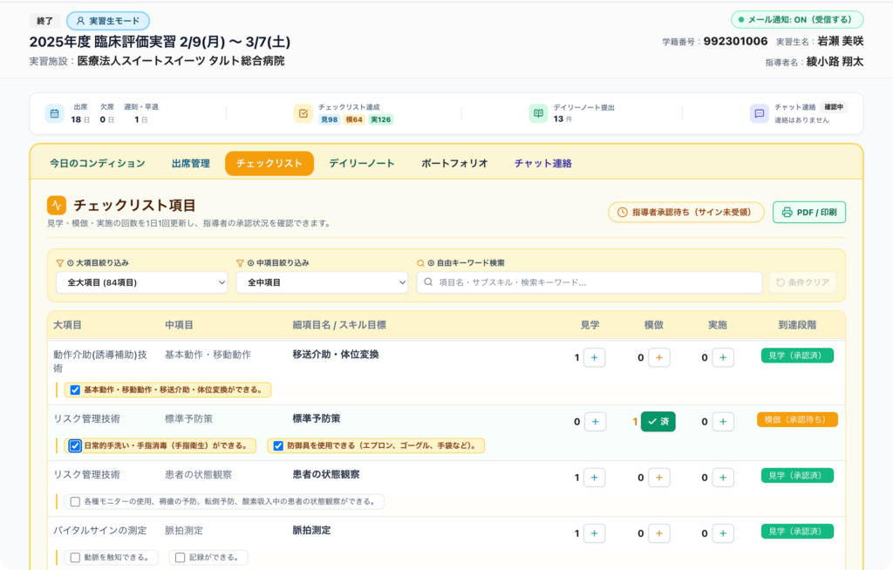

[← 実習管理ポータルに戻る](実習管理ポータル.md) | [メインページ](top.md)

# 実習管理 チェックリスト

## 💡 チェックリストの概要・役割

臨床実習において、**「学生がどこまで経験や学びを深めてきたか」を可視化するチェックリストは極めて重要なツール**です！

学生が複数の実習施設を巡る際、前の施設でどのような経験を積んできたかという情報は、**次に受け入れる施設の指導者にとって「これからどういう経験や課題を与えてあげようか」という指導計画を立てるための貴重な指標**となります。

日本理学療法士協会（PT協会）等のサンプル項目を標準ベースにしつつも、**学校単位で異なる独自の評価項目やカリキュラムに自由に対応・カスタマイズ**できるよう設計されています。

## ✨ 主な機能と特徴

- 🏫 **自校仕様への完全カスタマイズ**学校独自で定めている評価項目を自由に追加・編集・登録できます。
- 🧩 **3つのスキル（領域）別分類**「精神運動スキル」「社会スキル」「認知スキル」に整理して管理が可能です。
- 📄 **PDF・Excelでの一括出力**登録したデータは、学内会議や提出用書類としてワンクリックで書類化（PDF/Excel）できます。
- 🔄 **INTEVE LINKとのリアルタイム連動**設定したマスタデータは、学生・指導者・教員が同時にアクセスするポータル画面へ即座に反映されます。

## 🛠️ 画面構成と機能解説

### 1️⃣ 精神運動スキル（技術領域のチェック）

- 🖐️ **概要**: 患者様への評価・治療技術、リスク管理、バイタル測定など、臨床現場で実践する具体的な「技術・手技」を管理します。
- 🎯 **ポイント**: 大項目・中項目・小項目に整理されており、学生がどの手技を「見学・模倣・実施」できたかを段階的に評価・追跡できます。

### 2️⃣ 社会スキル（情意領域のチェック）

- 🤝 **概要**: 身だしなみ、言葉遣い、態度、チーム医療における協調性、守秘義務など、医療人としての「人間性・社会性・マナー」を管理します。
- 🎯 **ポイント**: レベル0〜レベル3などの行動目標基準を細かく設定でき、定性的な「態度・姿勢」を客観的に評価する指標として活用できます。

### 3️⃣ 認知スキル（認知領域／知識・思考のチェック）

- 🧠 **概要**: 疾患の理解、情報収集、評価計画の立案、仮説検証など、臨床思考過程（クリニカル・リーズニング）や「知識・考え方」を管理します。
- 🎯 **ポイント**: 単に「知っているか」だけでなく、情報から統合・解釈を行い、優先順位をつけて検査を選択できているかという深い思考プロセスをチェックできます。

### 4️⃣ INTEVE LINKでのリアルタイム運用・承認

- 📲 **概要**: 臨床実習ポータル「INTEVE LINK」上で、学生・指導者・教員の三者が同じデータをリアルタイムで共有・更新する画面です。
- 🚀 **実際のステップ**:
    1. 🎓 **学生**: 実習中に経験した項目（見学・模倣・実施）に対し、スマホやタブレットからサクッとチェックを入力！
    2. 👨‍⚕️ **指導者**: 指導者画面に届いた申請内容を確認し、その場でタップして「承認」！
    3. 🏫 **教員**: 双方の入力・承認状況をリアルタイムで追跡し、遠隔から進行具合の把握やフォローを実施！

---
[← 実習管理ポータルに戻る](実習管理ポータル.md) | [メインページ](top.md)
