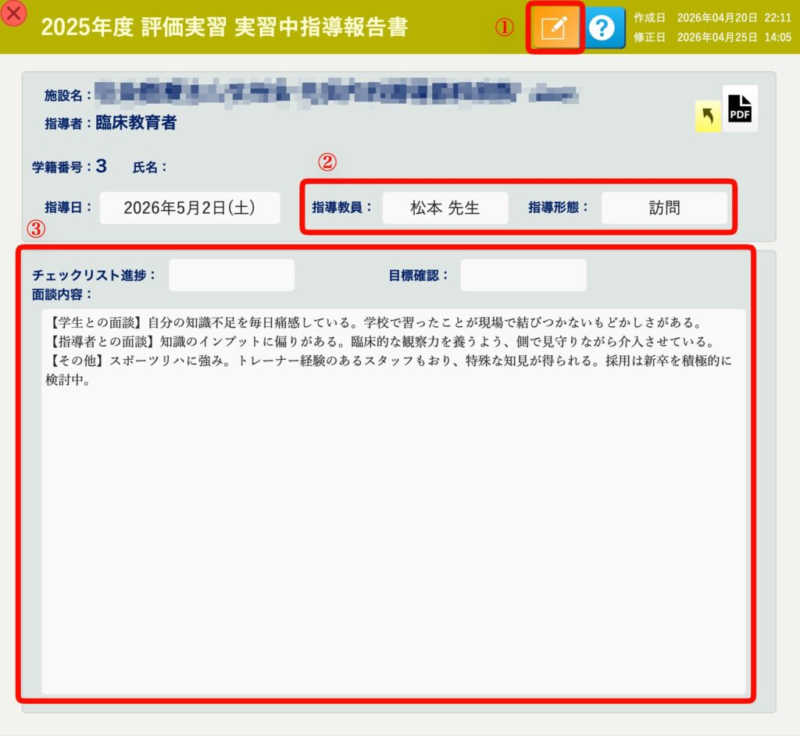

[← 実習管理ポータルに戻る](実習管理ポータル.md) | [メインページ](top.md)

# 実習管理 実習中指導 個別画面

## 📋 実習管理：実習中指導（個別報告書の詳細と編集）

個別報告書の詳細画面では、実習形態の選択や、具体的な面談内容・指導内容の記録および編集が行えます。学校ごとの運用に合わせた柔軟なカスタマイズにも対応しています。

### 📝 1. 各機能と入力エリアの解説

- **① 編集モードへの切り替え** 画面上部にある **\[[編集（鉛筆アイコン）](編集モードへ.md)\]** ボタンをクリックすると、編集モードに切り替わり、各項目の入力や修正が可能になります。
- **👔 ② 指導教員・指導形態の選択（ドロップダウン連携）** 指導を行った教員名や指導形態（訪問・電話等）を選択します。 
    - **💡 便利な事前連携機能：** 実習先（病院・施設など）のスタッフや指導者様を事前にシステム内へ登録しておくことで、**「指導教員（または現地指導者）」の欄からドロップダウンで一瞬で選択・入力できるようになります。** 毎回手入力をする手間が省け、表記の揺れも防げます。

    🔗 **実習先スタッフの事前登録方法は[こちら](施設情報-スタッフ.md)**
- **🛠️ ③ チェックリスト・目標確認・面談内容の入力** 日々の学生の様子や、面談を通じて得られた具体的な指導内容をテキストで細かく記録しておけるメインエリアです。
    - **カスタマイズ柔軟に対応します：** 「チェックリスト進捗」や「目標確認」の項目・選択肢は、学校様の評価基準に合わせて**自由に項目をカスタマイズ（変更・追加）可能です。**
    - **テンプレート対応も可能：** 面談内容の入力欄に「【学生との面談】」「【指導者との面談】」「【その他】」といった固定の文章枠（テンプレート）をあらかじめ用意しておきたい、といったご要望にも柔軟に対応いたします。お気軽にご相談ください。

---
[← 実習管理ポータルに戻る](実習管理ポータル.md) | [メインページ](top.md)
