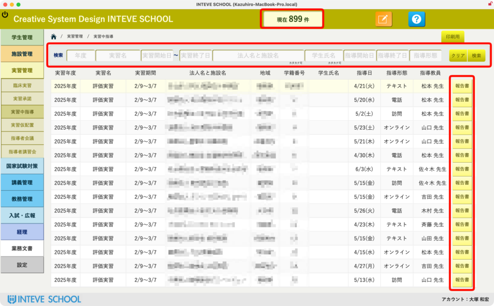
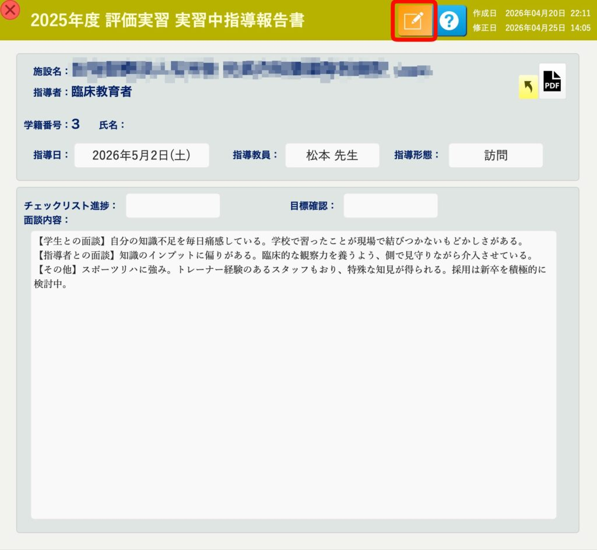

[← 実習管理ポータルに戻る](実習管理ポータル.md) | [メインページ](top.md)

# 実習管理 実習中指導

## 📋 実習管理：実習中指導（全体一覧・検索機能）

本画面では、全学生を対象に行われた「実習中指導報告書」を横断的に一元管理・検索できます。 実習先への訪問、電話、オンライン面談などの全記録がここに集約されるため、学年全体や特定の期間における指導状況を俯瞰して確認・分析する際に役立ちます。

### 🔍 【事前準備】表示範囲の切り替え

画面左側のサイドメニューより **\[実習管理\]** ＞ **\[実習中指導\]** を選択し、全体一覧画面を表示させておきます。

### 📊 1. 現在の総報告書数の自動カウント

一覧画面の中央上部には、現在システム内に登録されている、または検索条件に合致した「報告書の総数（例：現在 ○○件）」がリアルタイムで自動表示されます。

### 🔍 2. 検索フィールドによる自動絞り込み

総数カウントの下部には、目的の報告書を瞬時に見つけ出すための柔軟な「検索・絞り込みフィールド」が用意されています。

- 担当教員名、実習期間（開始日・終了日）、学生氏名などの各項目にテキストを入力するか、プルダウンから選択するだけで、**ボタンを押すことなく自動でリストが瞬時に絞り込まれます。**
- 「特定の教員が今週行った指導記録だけを確認したい」「特定の学生の記録だけを追いかけたい」といった状況にスピーディに対応可能です。

### 📝 3. 個別報告書への遷移と内容確認

一覧リストの右端にある **\[報告書\]** ボタンをクリックすると、選択した日付・学生の「実習中指導報告書」の詳細ダイアログ（2枚目の画像）が一瞬で開きます。

開いた詳細ページでは、以下の操作や確認がその場で行えます。

- **内容の確認と編集：** 実習地での指導形態（訪問・電話・オンライン等）や、面談内容、指導内容（テキスト）を詳細に確認できます。画面上部の **\[[編集（鉛筆アイコン）](編集モードへ.md)\]** ボタンをクリックすることで、内容の修正や追記が可能です。
- **項目のカスタマイズ：** 「チェックリスト進捗」や「目標確認」の項目は、学校様の運用方法に合わせて**自由に項目名や選択肢をカスタマイズ（変更・追加）の要望を承ります。**
- **PDF出力：** 右上の **\[PDFアイコン\]** ボタンから、この報告書単体を綺麗なフォーマットで帳票出力し、印刷やデータ保存が可能です。学校指定の書式に合わせた**レイアウト変更の要望も柔軟に承ります。**

---
[← 実習管理ポータルに戻る](実習管理ポータル.md) | [メインページ](top.md)
