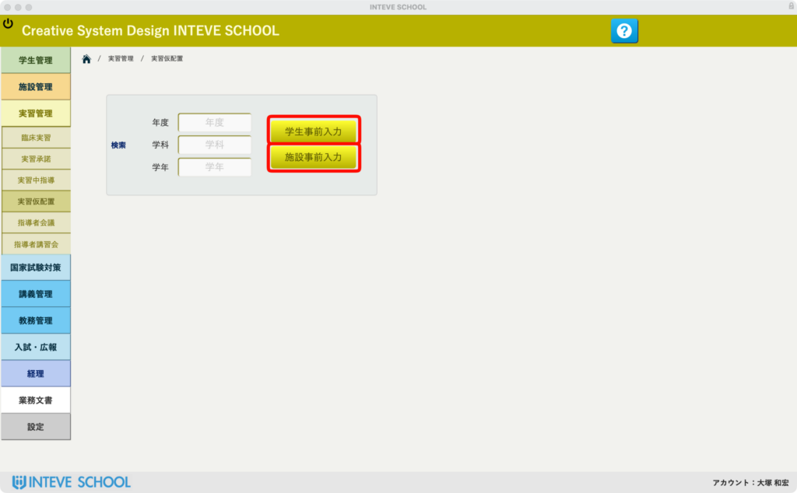
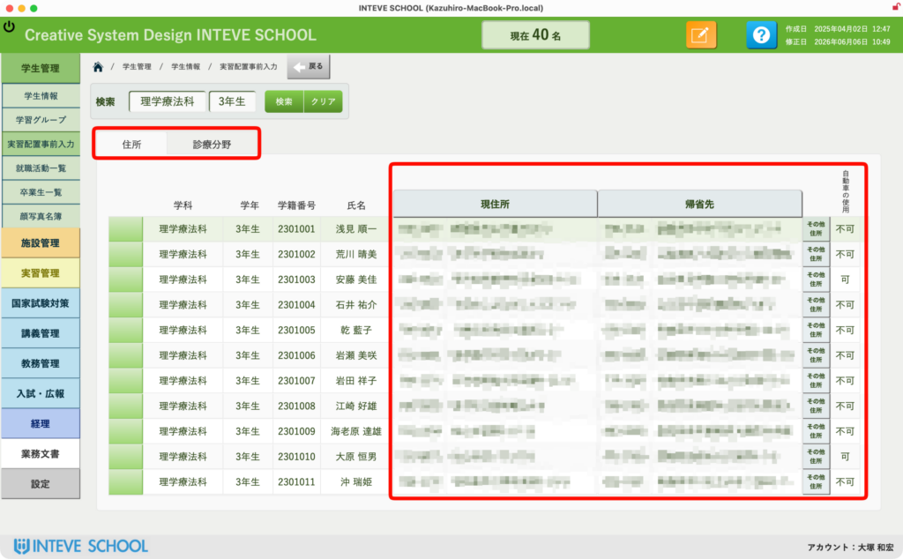
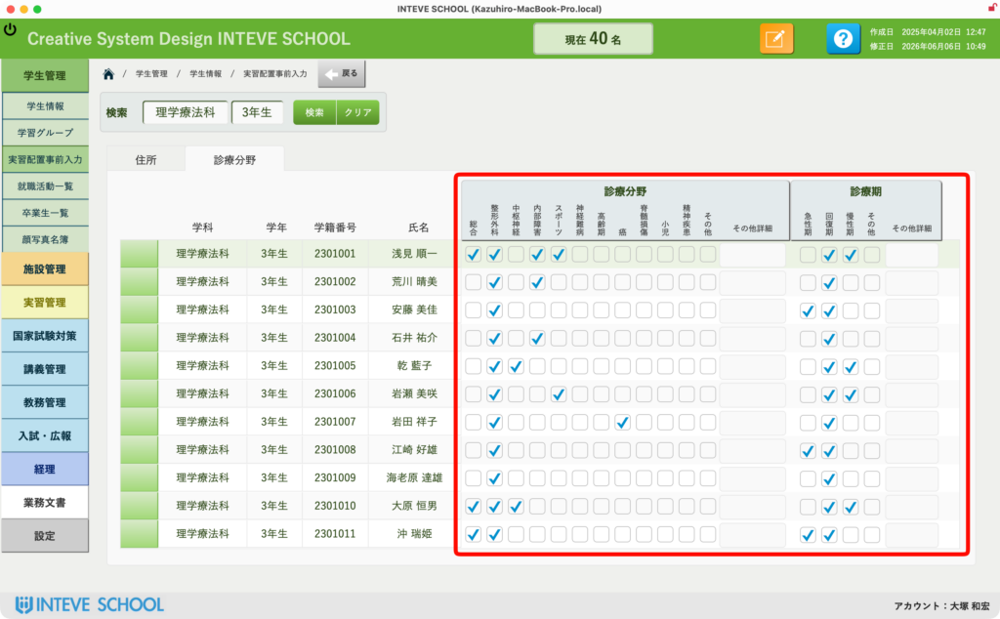
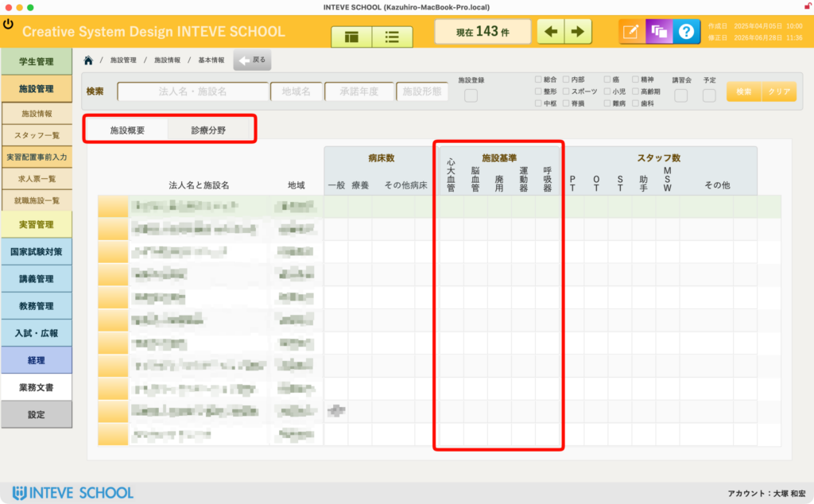
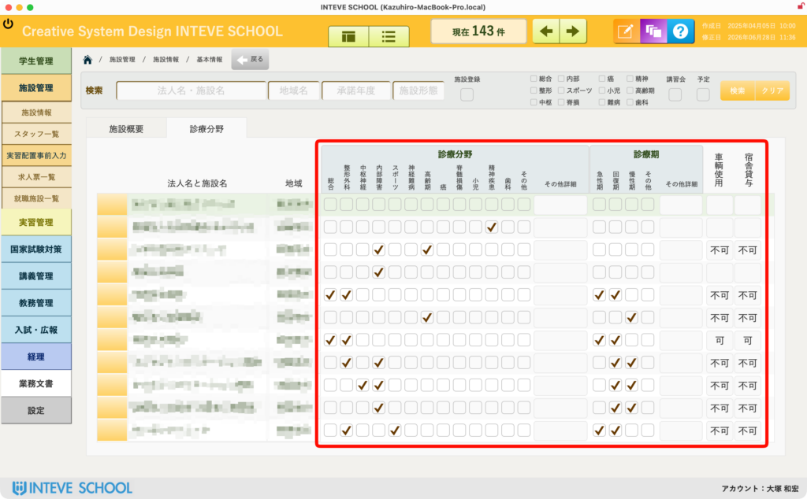
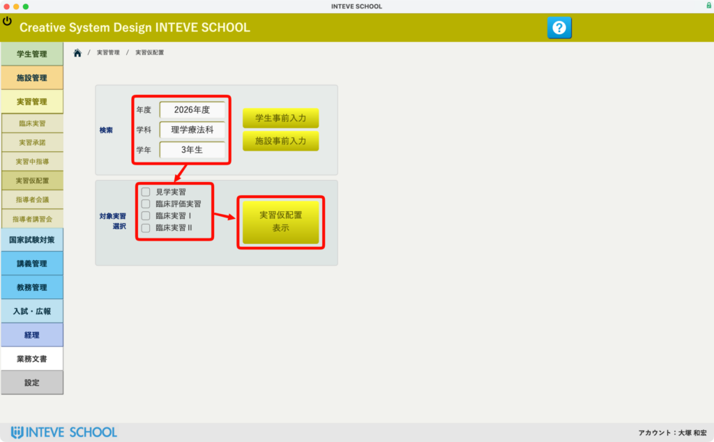

[← 実習管理ポータルに戻る](実習管理ポータル.md) | [メインページ](top.md)

# 実習管理 実習仮配置

## 📅 実習管理：実習仮配置（概要・事前準備編）

実習運営において、教員が最も頭を悩ませ、最も膨大な時間を費やすのが「どの学生を、どの実習施設へ割り当てるか」という配置のパズルです。 学生の自宅からの距離、施設の受け入れ要件、抗体検査の有無、学生の希望や成績など、考慮すべき変数が多すぎて、これまでは教員の経験と勘を頼りに手作業で何時間もかけて叩き台を作っていました。

INTEVE SCHOOLの「実習仮配置機能」は、デジタルデータとして扱えるあらゆる条件をシステムが網羅し、**ボタン一つで最適な配置の「叩き台」を自動生成する特許級の超強力な機能**です。 あとは生成された叩き台をベースに、微調整を行うだけで配置作業が完了します。

この奇跡のような自動配置を実現するために、まずはシステムに学習させる「学生」と「施設」の2つの事前情報（マッチング要件）を登録しておきます。

### 🚀 1. 実習仮配置ポータル（初期画面）

画面左側のサイドメニューより **\[実習管理\]** ＞ **\[実習仮配置\]** を選択すると、仮配置のコントロール画面が開きます。 ここで「対象の期」や「実習種別（評価実習など）」「クール（期間）」を選択し、配置ロジックを動かすためのスタート地点となります。

自動配置を100%の精度で発揮させるため、以下の2〜5枚目の画面を使って、事前に「学生情報」と「施設情報」の各種要件・希望データを入力しておきます。

### 👤 2. 学生の事前情報入力（通学環境・希望の網羅）

学生が「どこから実習に通うのか」「どういった環境を希望しているか」といった基本スタンスを入力・管理する画面です。

- 学生ごとの自宅住所や実家住所、移動に使える交通手段（公共交通機関、車、バイクなど）に基づき、「現実的に通学が可能な範囲（エリア・所要時間）」をシステムが判定するための基礎データを蓄積します。
- 🏠 **「その他住所」ボタンの活用（居候通勤への対応）：** 画面内にある **\[その他住所\]** ボタンからは、学生の実家・自宅以外に「親戚の家」や「兄弟の家」などの住所を登録しておくことができます。 「実習期間中だけその家に居候（一時滞在）して、そこから実習地へ通勤する」という変則的なパターンにも完全対応。これにより、遠方の優良な施設も通学圏内として自動マッチングの選択肢に含めることが可能になります。
- 🔗 **詳しい入力手順はこちら：** \[[学生情報 学生仮配置事前入力](学生情報-学生仮配置事前入力.md)\]

### 🎯 3. 学生のマッチング要件チェック（個別対応要件）

学生ごとのさらに細かい個別事情や、クリアすべき条件、成績・適性などのマッチング要件をチェックボックス形式で網羅する画面です。

- 抗体検査のクリア状況や、学生の得意・不得意な分野、特別な配慮が必要な事項などをデータ化しておくことで、「この施設には、この条件をクリアした学生しか配置しない」という高度なフィルタリングを可能にします。
- 🔗 **詳しい入力手順はこちら：** \[[学生情報 学生仮配置事前入力](学生情報-学生仮配置事前入力.md)\]

### 🏠 4. 施設の事前情報入力（受け入れキャパ・環境の網羅）

実習先となる施設側が「どのような環境で、どれだけの学生を受け入れられるか」というキャパシティを管理する画面です。

- 施設ごとの所在地はもちろん、「宿泊施設の用意・手配が可能か」「過去の受け入れ実績や傾向はどうだったか」など、配置を決める上で絶対に外せない施設の受け入れ環境データを網羅します。
- 🔗 **詳しい入力手順はこちら：** \[[施設情報 施設仮配置事前入力](施設情報-施設仮配置事前入力.md)\]

### 🛠️ 5. 施設のマッチング要件チェック（求める学生条件）

施設側が「今回、どのような学生・条件を求めているか」という詳細な受入要件をチェックボックス形式で網羅する画面です。

- 診療科の属性、指導者（バイザー）の体制、施設側が指定する必須の抗体検査項目や成績基準などを細かくデータ化します。
- ここにチェックを入れておくことで、ステップ3で入力した「学生側のデータ」とシステム内部でガチッと歯車が噛み合い、完璧なマッチングが行われます。
- 🔗 **詳しい入力手順はこちら：** \[[施設情報 施設仮配置事前入力](施設情報-施設仮配置事前入力.md)\]

### 💡 開発者（大塚）からのワンポイント・メッセージ

一見、事前のチェックや入力項目が多く感じるかもしれませんが、「一度データを入れてしまえば、毎年やってくるあの地獄の配置パズルがボタン一つで終わる」という圧倒的な未来が待っています。 まずは学校独自の要件に合わせて、これらの項目をセットアップしていきましょう！

### 🎬 6. 運命の「実習仮配置表示」ボタン（自動マッチングの実行）

学生と施設のすべての事前情報・マッチング要件の入力が完了したら、いよいよ仮配置ポータル画面へ移ります。

『年度』『学科』『学年』を選択すると、下に「実習名」が表示されますので、配置を検討する実習を選択した上で、画面中央にある **\[実習仮配置表示\]** ボタン（赤枠部分）をクリックしてください！

続きのマニュアルは[こちら](実習仮配置詳細.md)。

---
[← 実習管理ポータルに戻る](実習管理ポータル.md) | [メインページ](top.md)
