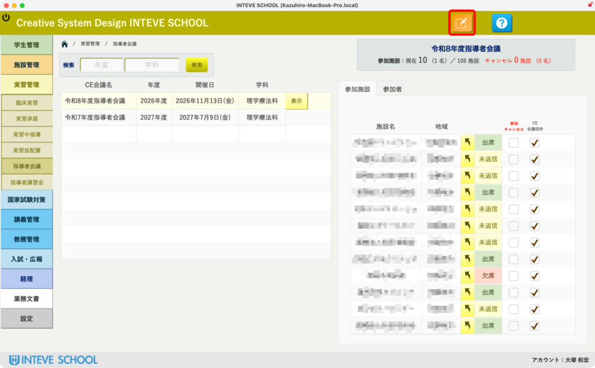
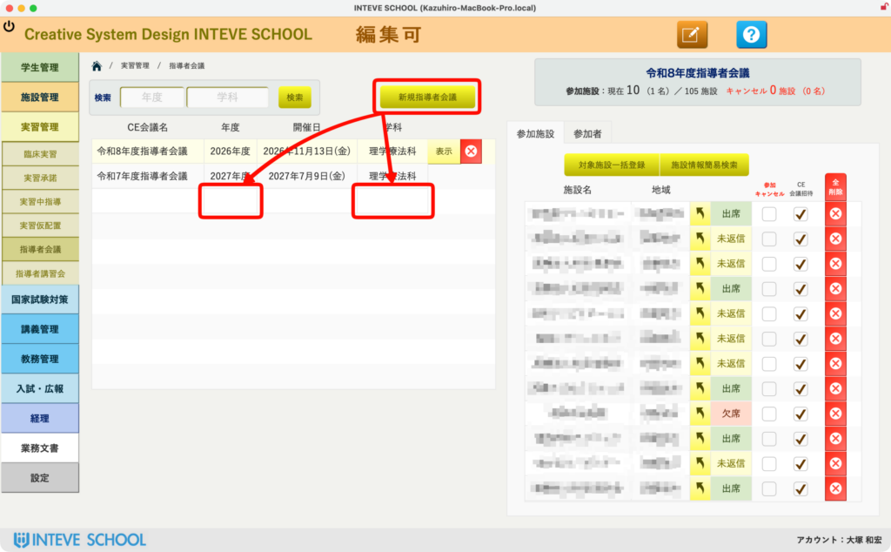
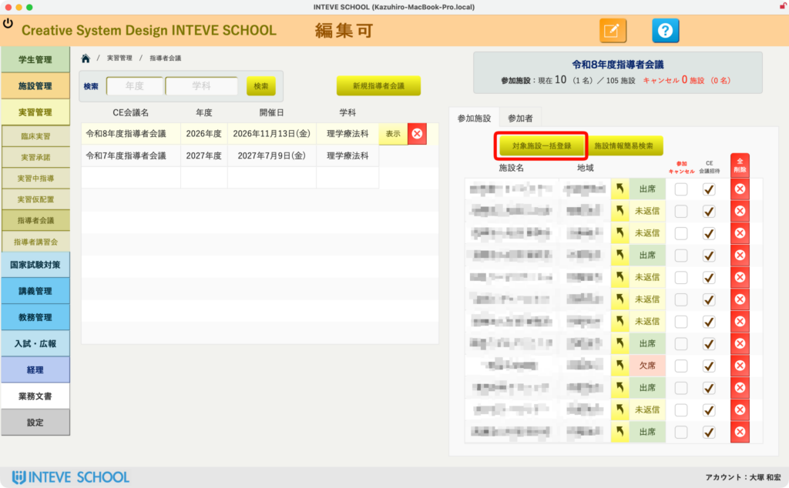
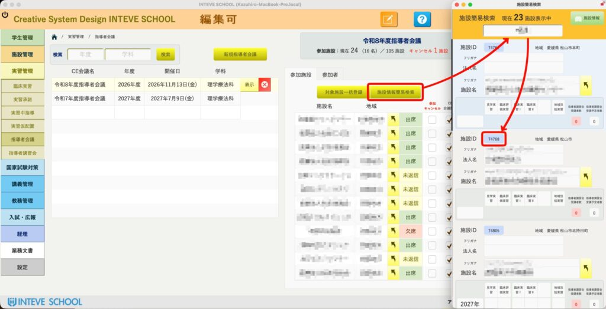
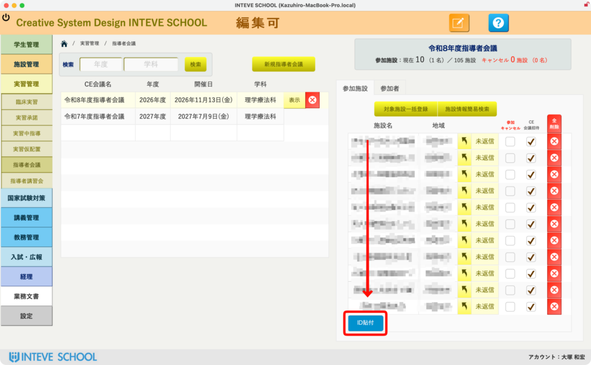
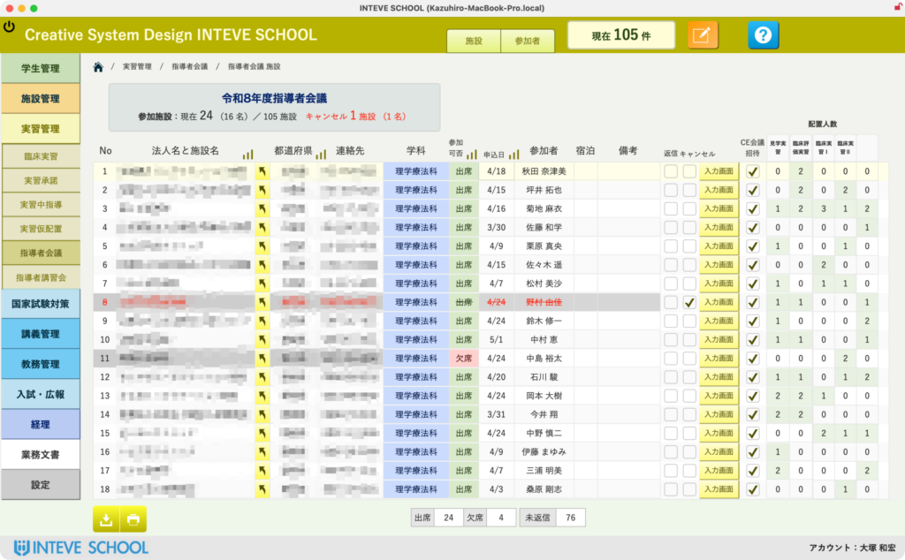

[← 実習管理ポータルに戻る](実習管理ポータル.md) | [メインページ](top.md)

# 実習管理 指導者会議

### 📂 1. 指導者会議ポータル画面へのアクセス

これまでに登録された会議データや、参加施設・参加者の一覧をまとめて確認できるベース画面です。

- **📄 操作方法**
    - 過去の会議データや、現在登録されている参加施設・参加者の情報を確認します。
- **💡 注意点・補足**
    - 新しく指導者会議を作成したり、データを編集したりする場合は、画面右上にあるオレンジ色の **［編集モードへ］** ボタンをクリックして切り替えます。
    - 🔗 ※編集モードへの切り替え方法については、［[編集モードの基本操作](編集モードへ.md)］ページをご参照ください。

### ⚙️ 2. 新規指導者会議の一覧の作成

新しい指導者会議の枠組み（マスターレコード）を新規に起ち上げます。

- **📄 操作方法**
    - 画面内の新規作成ボタンをクリックします。
    - 会議の対象となる **「年度」** と **「学科」** をそれぞれ入力・選択します。
- **💡 注意点・補足**
    - ここで指定した「年度」と「学科」を基準にして、この後のステップで施設が一括抽出されます。入力間違いのないよう確認を行ってください。

### 🤝 3. 参加施設の一括登録

指定した「年度」と「学科」の条件に合致する施設を、システムからまとめて自動登録します。

- **📄 操作方法**
    - **［一括登録］** ボタンをクリックします。
    - ステップ2で入力した条件を元に、該当する施設がポータル内に一括で自動登録されます。

### 🔍 4. 施設情報簡易検索による施設IDの取得

一括登録から漏れてしまった施設や、個別で追加したい施設がある場合は、「簡易検索機能」を使って施設の固有IDを取得します。

- **📄 操作方法**
    - 画面内にある **［施設情報簡易検索］** ボタンをクリックします。
    - メイン画面とは別に、小さな別ウィンドウ（検索専用画面）が開きます。
    - 検索画面の上部にあるキーワード入力欄に、探したい施設名を入れて検索します。
    - リスト表示された検索結果から、該当する施設の **「施設ID」** （青いリンク）をクリックします。クリックすると、自動的にIDがクリップボードにコピーされます。

### 📋 5. 施設IDの貼り付けと個別追加

コピーした施設IDをポータルに貼り付けて、施設を手動で追加します。

- **📄 操作方法**
    - 元のメインウィンドウに戻り、参加者ポータルを **一番下までスクロール** します。
    - ポータルの最下行にある **［ID貼付］** ボタンをクリックします。コピーした施設IDが自動で入力され、施設が追加されます。
- **⚠️ ここがポイント！**
    - 🚨 **重要：** 個別追加ができるのは、**該当する「年度」および「学科」において、実際に臨床実習の受け入れ実績（または受け入れ予定）がある施設に限られます。** 受入データがない施設はIDを貼り付けても追加されませんのでご注意ください。

### 🚀 6. 詳細画面（参加者票）への移行

参加施設がすべて揃ったら、各施設ごとのさらに詳細な出席者情報の入力フェーズへと進みます。

- **📄 操作方法**
    - 登録された施設の一覧を確認し、問題がなければ **［表示］** ボタンをクリックします。
    - クリックすると、次のステップである「詳細ページ（施設指導者会議 参加者票画面）」に移行します。
- **💡 注意点・補足**
    - 次のページでは、具体的な参加者名の入力方法や、綺麗に名前を表示させるための操作手順について詳しく解説します。

以下のページの説明は[こちらのリンク](実習管理-指導者会議-一覧.md)から。

---
[← 実習管理ポータルに戻る](実習管理ポータル.md) | [メインページ](top.md)
